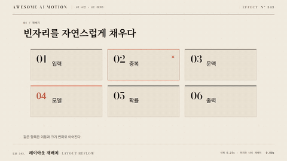

# Nº 343 레이아웃 재배치 · Layout Reflow



[MP4](clip.mp4) · [HTML](index.html)

**목록이나 격자의 요소가 새 위치와 크기로 부드럽게 옮겨가고 삭제된 항목의 빈자리를 메운다.**

Elements retain their identity as a layout changes position and size.

| Family | Level | Purpose | Media | Runtime |
|---|---|---|---|---|
| UI 시연 · UI DEMO | 고급 | 순서·흐름 | 설명 영상, 제품 시연, 웹 UI | gsap |

다른 이름 / Also known as: FLIP, Animated reordering, Collapsing gap exit, 빈자리 접히는 퇴장

## 선택 기준 / Selection

요소의 동일성과 새 배열을 이해하게 한다. / Preserves spatial continuity through reordering and gap closure.

- 격자를 필터링하거나 정렬할 때 / Filter or sort a grid.
- 항목 삭제 후 빈자리를 메울 때 / Close a gap after removing an item.

좋은 예 / Good: 같은 ID의 카드가 기존 상자에서 새 상자로 500ms 이동한다
나쁜 예 / Bad: 리스트를 다시 생성해 카드의 동일성이 사라진다
주의 / Avoid: 요소 ID와 시작 및 끝 상자를 안정적으로 유지한다

## 파라미터 / Parameters

| Parameter | Default | Range | Note |
|---|---|---|---|
| 재배치 | 500ms | 350~700ms | 역변환 해제 |
| 삭제 퇴장 | 250ms | 180~350ms | 측정 전 완료 |
| 이징 | power2.inOut | power2.inOut~power3.inOut | 위치 연속성 |
| 항목 간격 | 24px | 16~40px | 최종 레이아웃 여백 |

## 구현 / Implementation (GSAP)

```js
const items = gsap.utils.toArray('.reflow-item');
const first = items.map(el=>el.getBoundingClientRect());
container.classList.add('reordered');
items.forEach((el,i)=>{
  const last=el.getBoundingClientRect(), f=first[i];
  tl.fromTo(el,{x:f.left-last.left,y:f.top-last.top,scaleX:f.width/last.width,scaleY:f.height/last.height,transformOrigin:'0 0'},
    {x:0,y:0,scaleX:1,scaleY:1,duration:0.5,ease:'power2.inOut'},0);
});
```

## 프롬프트 / Prompts

### 한국어 · Claude Code
```text
<파일>의 <대상>에 레이아웃 재배치을 적용한다. 시작과 끝 상자를 한 번 측정하고 플러그인 없이 역변환을 500ms에 제거한다. 삭제 항목은 250ms 먼저 퇴장시킨다. 초기 상태를 명시한 paused 타임라인으로 만들고 고정 좌표와 시간만 사용해 seek를 재현한다.
```

### 한국어 · Codex
```text
<파일>에서 <대상>의 레이아웃 재배치 장면에 적용한다. 시작과 끝 상자를 한 번 측정하고 플러그인 없이 역변환을 500ms에 제거한다. 삭제 항목은 250ms 먼저 퇴장시킨다. 0.12초·0.33초·0.70초 시점을 캡처해 시작 상태, 중간 관계, 최종 정착과 겹침 여부를 확인한다.
```

### English · Claude Code
```text
Apply Layout Reflow to <target> in <file>. Measure first and last bounds once and remove the inverse transform over 500ms using GSAP core. Exit a removed item over 250ms before measuring the remaining layout. Define the initial state and use a paused timeline with fixed coordinates and timings for repeatable seeking.
```

### English · Codex
```text
Implement Layout Reflow in the scene for <target> in <file>. Measure first and last bounds once and remove the inverse transform over 500ms using GSAP core. Exit a removed item over 250ms before measuring the remaining layout. Capture at 0.12s, 0.33s, 0.70s to verify the initial state, intermediate relationships, final settling, and unwanted overlap.
```

예시 / Example: 레이아웃 재배치를 `.hero`에 적용해. / Apply Layout Reflow to `.hero`.

## 적용 / Application

- HyperFrames: paused 타임라인에 레이아웃 재배치의 초기 상태와 종료 상태를 함께 기록하고 0.50초까지 seek로 재현한다.
- ReelForge: 씬 워커 브리프에 레이아웃 재배치 대상 선택자와 재배치 500ms, 삭제 퇴장 250ms, 이징 power2.inOut를 싣고 최종 상태 유지 시간을 지정한다.
- Scrolline Deck: 진행률 0~1을 0.50초 구간에 매핑하고 scrub에서는 스프링 대신 power3.out으로 위치를 계산한다.

조합 / Pair with: [드래그 앤 드롭 · Drag and Drop](../drag-and-drop/) · [아코디언 펼치기 · Accordion Expansion](../accordion-expand/)

출처 / Sources: [greensock/GSAP](https://gsap.com/docs/v3/Plugins/Flip/) (GSAP Standard License) · [motiondivision/motion](https://motion.dev/docs/react-layout-animations) (MIT) · [juliangarnier/anime](https://animejs.com/documentation/layout) (MIT) · [pmndrs/react-spring](https://www.react-spring.dev/examples) (MIT) · [motiondivision/motion](https://motion.dev/docs/react-animate-presence) (MIT)

[목록 / Catalog](../../references/catalog.md) · [index.json](../../index.json)
