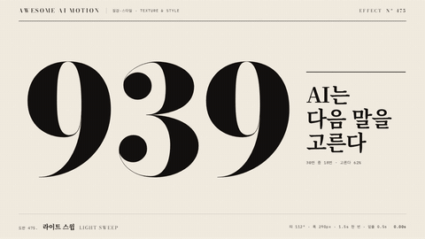

# Nº 475 라이트 스윕 · Light Sweep



[MP4](clip.mp4) · [HTML](index.html)

**기울어진 빛 띠가 큰 숫자와 제목 글자 안쪽만 한 번 훑고 지나가 인쇄된 금속 광택처럼 보이게 한다.**

A tilted band of light passes once through a giant number and title, only inside the glyphs, like a metallic print sheen.

| Family | Level | Purpose | Media | Runtime |
|---|---|---|---|---|
| 질감·스타일 · TEXTURE & STYLE | 중급 | 주목 끌기, 강조, 브랜딩 | 숏폼, 발표, 설명 영상, 웹 UI | css |

다른 이름 / Also known as: 빛 훑기, 광택 스윕, CC Light Sweep, Shine sweep, Metallic sheen

## 선택 기준 / Selection

대상이 단단하고 값진 물건이라는 느낌. 빛이 지나간 뒤의 정지가 완성·확정 신호로 읽힌다. / The subject feels solid and valuable. The stillness after the light passes reads as a finished, confirmed state.

- 큰 숫자·로고·표지 제목을 확정하며 보여줄 때 / Present a big number, logo, or cover title as settled.
- 정적인 타이틀 카드에 한 번의 생기를 줄 때 / Give a static title card a single moment of life.

좋은 예 / Good: 112도로 기운 폭 290px 띠가 1.5초에 걸쳐 939와 제목 위를 왼쪽 밖에서 오른쪽 밖으로 한 번 지나가고, 이어서 "다음 말" 아래 주홍 밑줄이 0.5초에 그어진다.
나쁜 예 / Bad: 흰색에 가까운 넓은 띠가 빠르게 여러 번 지나가 화면이 깜박이거나, 글자 밖 종이까지 밝아져 조명 사고처럼 보인다.
주의 / Avoid: 띠 밝기는 종이색(--paper) 이하로(번쩍임 금지) · 한 장면에 한 번만 지나간다 · 띠가 글자보다 넓으면 광택이 아니라 색 바뀜으로 읽힌다

## 파라미터 / Parameters

| Parameter | Default | Range | Note |
|---|---|---|---|
| 띠 각도 | 112deg | 100~125deg | linear-gradient 각도 |
| 띠 폭 | 290px (배경의 9%) | 200~360px | 가운데 144px만 밝은 심 |
| 지나가는 시간 | 1.5s | 0.8~1.8s | power1.inOut, 한 번 |
| 배경 크기·이동 | 250% · 96.4% → 3.6% | 200~300% | 띠 중심 x -250px → 1530px |

이징 / Ease: `power1.inOut`

## 구현 / Implementation (GSAP)

```js
.sheen{color:transparent;background-clip:text;background-size:250% 100%;
  background-image:linear-gradient(112deg,transparent 45.5%,var(--ink2) 47.8%,var(--ink3) 49.2%,var(--paper) 50%,var(--ink3) 50.8%,var(--ink2) 52.2%,transparent 54.5%)}
tl.fromTo('.sheen', {backgroundPosition: '96.4% 0%'}, {backgroundPosition: '3.6% 0%', duration: 1.5, ease: 'power1.inOut'}, 0.3);
tl.to('#ul', {scaleX: 1, duration: 0.5, ease: 'power3.out'}, 1.85);
```

## 프롬프트 / Prompts

### 한국어 · Claude Code
```text
<파일>의 <대상>(큰 숫자와 제목)에 라이트 스윕을 넣어줘. 같은 글자를 한 겹 더 겹치고 color transparent, background-clip:text에 112도 그라디언트(투명 45.5%, --ink2 47.8%, --paper 50%, --ink2 52.2%, 투명 54.5%)와 background-size 250%를 줘. backgroundPosition을 96.4%에서 3.6%로 1.5초 power1.inOut, 한 번만. 빛이 지나간 뒤 핵심어 아래 주홍 밑줄을 0.5초 power3.out으로 긋고 0.6초 이상 홀드해.
```

### 한국어 · Codex
```text
<파일>의 타이틀 카드에 light sweep을 구현해. 기본 글자 레이어 위에 같은 마크업의 .sheen 레이어를 겹치고 background-clip:text로 띠를 글자 안에만 보이게 한다. 띠 가장 밝은 색은 --paper를 넘지 않게 하고, backgroundPosition '96.4% 0%'→'3.6% 0%' 1.5s power1.inOut 한 번. 0.8초·1.2초·2.9초를 캡처해 띠가 글자 안에서만 보이는지, 종이가 밝아지지 않는지, 끝 홀드에 띠가 남아 있지 않은지 확인해.
```

### English · Claude Code
```text
Add a light sweep to <target> (a big number and title) in <file>. Duplicate the text layer with color transparent and background-clip:text, using a 112deg gradient (transparent 45.5%, --ink2 47.8%, --paper 50%, --ink2 52.2%, transparent 54.5%) and background-size 250%. Tween backgroundPosition from 96.4% to 3.6% over 1.5s with power1.inOut, once. After the light passes, draw a vermilion underline under the key word in 0.5s with power3.out and hold for at least 0.6s.
```

### English · Codex
```text
Implement a light sweep on the title card in <file>. Stack a .sheen layer with the same markup over the base text and use background-clip:text so the band shows only inside the glyphs. Keep the brightest stop at --paper or darker, and tween backgroundPosition '96.4% 0%' to '3.6% 0%' over 1.5s with power1.inOut, once. Capture at 0.8s, 1.2s, 2.9s to verify the band appears only inside the letters, the paper never brightens, and no band remains during the final hold.
```

예시 / Example: 라이트 스윕를 `.hero`에 적용해. / Apply Light Sweep to `.hero`.

## 적용 / Application

- HyperFrames: 같은 글자 레이어를 한 겹 더 깔고 background-clip:text에 기울어진 그라디언트를 넣어 backgroundPosition만 tween한다. 카메라는 scale 0.965→1로 느리게
- ReelForge: 타이틀 씬의 마무리 비트로 띠 각도 112도·폭 290px·1.5초를 파라미터로 두고, 광택이 끝난 시점에 강조 밑줄 비트를 잇는다
- Scrolline Deck: 진행률 0.1~0.6에 backgroundPosition을 매핑한다. 스크롤을 멈추면 띠가 글자 위에 머무르니 홀드 구간에는 띠가 화면 밖에 있게 둔다

조합 / Pair with: [밑줄 드로우 · Underline Draw](../underline-draw/) · [하이라이트 스윕 · Highlight Sweep](../highlight-sweep/) · [푸시인 · Push-in](../push-in/) · [단어 강조 · Word Emphasis](../word-emphasis/)

출처 / Sources: [helpx.adobe.com](https://helpx.adobe.com/after-effects/desktop/apply-effects-and-animation-presets/list-of-effects/generate-effects.html) (unknown) · [airbnb/lottie-web](https://github.com/airbnb/lottie-web) (MIT) · [cycorefx.com](https://cycorefx.com/downloads/cfx_hd_std/CycoreFX%201.6%20Manual.pdf) (unknown) · [MDN background-clip](https://developer.mozilla.org/en-US/docs/Web/CSS/background-clip) (CC-BY-SA 2.5)

[목록 / Catalog](../../references/catalog.md) · [index.json](../../index.json)
