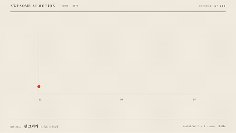

# Nº 244 선 그리기 · Line Draw



[MP4](clip.mp4) · [HTML](index.html)

**선의 시작부터 끝까지 경로를 순서대로 드러내는 표현**

An animation that progressively reveals a path from start to finish.

| Family | Level | Purpose | Media | Runtime |
|---|---|---|---|---|
| 데이터 · DATA | 중급 | 설명, 데이터 증명 | 설명 영상, 데이터 스토리, 발표 | gsap |

다른 이름 / Also known as: 경로 드로잉, Stroke reveal, Checkmark Tick, 성공 체크 그리기, checkmark-success-tick, Animated Check Mark, 체크 표시 그리기, Path tracing / Draw-on

## 선택 기준 / Selection

시간에 따른 값의 변화와 진행 방향 / Shows how values change over time and the direction of progression.

- 시간에 따른 값의 변화와 진행 방향를 보여줄 때 / When showing changes in value over time and the direction of progression
- 시간 순서의 꺾은선을 그리고 점으로 현재 진행 위치를 보여준다와 같은 장면을 만들 때 / When drawing a chronological line chart with a dot marking the current position

좋은 예 / Good: 시간 순서의 꺾은선을 그리고 점으로 현재 진행 위치를 보여준다
나쁜 예 / Bad: 범주형 자료를 연속된 선으로 연결해 추세처럼 보이게 한다
주의 / Avoid: 최종 상태를 0.5초 이상 유지한다 · 동일 화면에서 불필요한 주홍 강조를 추가하지 않는다

## 파라미터 / Parameters

| Parameter | Default | Range | Note |
|---|---|---|---|
| 선 길이 정규화 | 1 | 1 | pathLength로 dash 단위 고정 |
| 지속 | 1.85s | 1.2~2.2s | 좌측부터 연속 진행 |
| 점 반지름 | 8px | 5~10px | 현재 선 끝 표시 |
| 출발 | 0.30s | 0.2~0.4s | 빈 경로 준비 상태 |

이징 / Ease: `none`

## 구현 / Implementation (GSAP)

```js
const path=document.querySelector('#graph'), tip=document.querySelector('#tip');
const length=path.getTotalLength(), progress={value:0};
gsap.set(path,{strokeDasharray:1,strokeDashoffset:1});
const start=path.getPointAtLength(0);gsap.set(tip,{x:start.x,y:start.y});
tl.to(path,{strokeDashoffset:0,autoRound:false,duration:1.85,ease:'none'},.3);
tl.to(progress,{value:1,duration:1.85,ease:'none',onUpdate:()=>{const p=path.getPointAtLength(progress.value*length);gsap.set(tip,{x:p.x,y:p.y});}},.3);
```

## 프롬프트 / Prompts

### 한국어 · Claude Code
```text
<대상>에 선 그리기 효과를 적용해. 시간 순서의 꺾은선을 그리고 점으로 현재 진행 위치를 보여준다. 선 길이 정규화 1; 지속 1.85s; 점 반지름 8px; 출발 0.30s로 만들고 이징은 none를 써. GSAP 타임라인 하나로 제어하고 2.5초부터 3초까지 완성 상태를 유지해.
```

### 한국어 · Codex
```text
<파일>의 데이터 장면에 선 그리기 효과를 구현해. 선 길이 정규화 1; 지속 1.85s; 점 반지름 8px; 출발 0.30s를 적용하고 이징은 none로 지정해. 0초, 0.75초, 1.75초, 2.9초를 캡처해서 시작 상태와 진행 변화, 최종 상태의 잘림과 겹침을 확인해. Math.random과 타이머 없이 타임라인으로 재생하고 마지막 0.5초 이상 정지해.
```

### English · Claude Code
```text
Apply Line Draw to <target>. Draw a chronological line chart and use a dot to mark the current drawing position. Use these settings: normalized path length 1; duration 1.85s; dot radius 8px; start 0.30s; ease none. Control everything with a single GSAP timeline and hold the completed state from 2.5 to 3 seconds.
```

### English · Codex
```text
Implement Line Draw in the data scene in <file>. Use these settings: normalized path length 1; duration 1.85s; dot radius 8px; start 0.30s; ease none. Capture at 0, 0.75, 1.75, and 2.9 seconds to check the initial state, progression, and any clipping or overlap in the final state. Play using a timeline without Math.random or timers, and hold still for at least the final 0.5 seconds.
```

예시 / Example: 선 그리기를 `.hero`에 적용해. / Apply Line Draw to `.hero`.

## 적용 / Application

- HyperFrames: 하나의 paused GSAP 타임라인에 모든 동작을 넣고 3초 seek 가능한 장면으로 만든다
- ReelForge: 데이터 도형과 라벨을 분리하고 동일 시작 시각과 지속 시간을 씬 타임라인에 연결한다
- Scrolline Deck: 시간을 스크롤 진행률로 매핑하고 마지막 구간에서 최종값과 주석을 유지한다

조합 / Pair with: [주석 등장 · Annotation Callout](../annotation-callout/) · [막대 성장 · Bar Grow](../bar-grow/) · [타이밍과 간격 · Timing & Spacing](../timing-spacing/)

출처 / Sources: [GSAP Timeline 공식 문서](https://gsap.com/docs/v3/GSAP/Timeline/) (문서 참조) · [shadcn-ui/ui](https://github.com/shadcn-ui/ui) (MIT) · [DavidHDev/react-bits](https://github.com/DavidHDev/react-bits) (MIT + Commons Clause v1.0) · [LottieFiles/Patrick Rigor](https://lottiefiles.com/free-animation/loading-animation-with-success-and-error-K2tYPTbs5Q) (Lottie Simple License) · motion dictionary 1-principles.md#7. 연속성·공간 모델·시선 유도 (own) · [heygen-com/hyperframes](https://raw.githubusercontent.com/heygen-com/hyperframes/main/registry/blocks/mk-line-graph/registry-item.json) (Apache-2.0) · [heygen-com/hyperframes](https://raw.githubusercontent.com/heygen-com/hyperframes/main/registry/blocks/data-chart/registry-item.json) (Apache-2.0) · [heygen-com/hyperframes](https://raw.githubusercontent.com/heygen-com/hyperframes/main/registry/components/svg-stroke-trace/registry-item.json) (Apache-2.0)

[목록 / Catalog](../../references/catalog.md) · [index.json](../../index.json)
