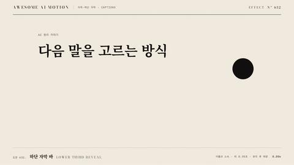

# Nº 632 하단 자막 바 · Lower Third Reveal



[MP4](clip.mp4) · [HTML](index.html)

**화자 이름과 소속이 하단에서 배경 띠와 함께 나타나 잠시 머문 뒤 사라지는 자막 띠**

A speaker name and role slide in on a background bar at the lower part of the frame, hold, then leave.

| Family | Level | Purpose | Media | Runtime |
|---|---|---|---|---|
| 자막·하단 자막 · CAPTIONS | 기본 | 설명, 브랜딩 | 설명 영상, 발표, 제품 시연 | gsap |

다른 이름 / Also known as: Lower Third Speaker Caption, 하단 화자 자막 등장, Lower Third Bar Reveal, 하단 자막 바 리빌, Name strap, Aston, Super, Lower Third Reverse Exit

## 선택 기준 / Selection

지금 말하는 사람이 누구인지, 어떤 맥락인지 조용히 알려 준다 / It quietly tells viewers who is speaking and in what context.

- 인터뷰·강연 영상에서 화자를 처음 소개할 때 / Introducing a speaker for the first time in interviews or talks
- 인물이나 장소 이름표를 화면 하단에 놓을 때 / Placing a name tag for a person or location at the bottom of the frame

좋은 예 / Good: 배경 띠가 350ms에 밀려 들어오고 이름이 100ms, 소속이 180ms 뒤에 올라오며 3.5초 유지된 뒤 250ms에 사라진다
나쁜 예 / Bad: 띠가 화면 하단 6% 이하로 붙어 방송 안전 영역을 벗어나거나 이름과 소속이 동시에 튀어나온다
주의 / Avoid: 하단 안전 영역(화면 높이 10% 위)에 놓는다 · 유지 시간은 이름 길이에 따라 3~5초. 첫 등장 후 같은 화자에게 반복하지 않는다

## 파라미터 / Parameters

| Parameter | Default | Range | Note |
|---|---|---|---|
| 배경 띠 | 0.35s | 0.3~0.5s | 좌에서 우로 scaleX |
| 이름 지연 | 0.1s | 0.05~0.2s | 띠 시작 기준 |
| 소속 지연 | 0.18s | 0.12~0.3s | 이름 뒤 |
| 유지 | 3.5s | 3~5s | 퇴장 0.25s |

이징 / Ease: `power3.out`

## 구현 / Implementation (GSAP)

```js
tl.fromTo('.bar', {scaleX:0}, {scaleX:1, duration:0.35, ease:'power3.out', transformOrigin:'left center'}, 0.3)
  .fromTo('.name', {x:-24, opacity:0}, {x:0, opacity:1, duration:0.3, ease:'power3.out'}, 0.4)
  .fromTo('.role', {x:-24, opacity:0}, {x:0, opacity:1, duration:0.3, ease:'power3.out'}, 0.48)
  .to('.lt', {opacity:0, x:-40, duration:0.25, ease:'power2.in'}, 3.8);
```

## 프롬프트 / Prompts

### 한국어 · Claude Code
```text
<대상> 영상에 이름 자막 띠를 넣어줘. 화면 왼쪽 하단(하단 안전 영역 위)에 배경 띠가 0.35초 power3.out으로 밀려 들어오고 이름이 0.1초, 소속이 0.18초 뒤 x -24에서 올라와. 3.5초 유지 후 0.25초에 x -40으로 사라지게 해.
```

### 한국어 · Codex
```text
<파일>에 lower third reveal을 적용해. .bar scaleX 0에서 1을 0.3초부터 0.35초 power3.out, .name과 .role은 0.4초, 0.48초에 x -24에서 0으로 0.3초, 3.8초에 .lt 퇴장 0.25초. 0.7초·2.0초·4.1초를 캡처해 등장 중, 유지, 퇴장 중을 확인하고 띠가 하단 10% 안전 영역 위인지 검사해.
```

### English · Claude Code
```text
Add a lower third to the video in <target>. At bottom left above the safe zone, a background bar wipes in over 0.35s power3.out, the name rises from x -24 after 0.1s and the role after 0.18s. Hold 3.5s, then exit over 0.25s to x -40.
```

### English · Codex
```text
Apply lower third reveal in <file>. .bar scaleX 0 to 1 from 0.3s over 0.35s power3.out; .name and .role x -24 to 0 at 0.4s and 0.48s over 0.3s; .lt exit at 3.8s over 0.25s. Capture at 0.7s, 2.0s and 4.1s (entering, holding, leaving) and check the bar sits above the 10% bottom safe zone.
```

예시 / Example: 하단 자막 바를 `.hero`에 적용해. / Apply Lower Third Reveal to `.hero`.

## 적용 / Application

- HyperFrames: 하단 안전 영역 좌표를 상수로 두고 세 요소를 한 타임라인에 배치한다. 화자 전환마다 서브컴포지션으로 복제하지 말고 데이터로 채운다
- ReelForge: 브리프에 이름, 소속, 등장 시각, 유지 3.5초, 색상 토큰을 싣는다. 여러 화자는 배열로 받아 시각만 바꾼다
- Scrolline Deck: 진행률 구간 하나에 등장·유지·퇴장을 묶는다. 유지 구간을 진행률 30% 이상으로 잡아 스크롤 중에도 이름이 읽힌다

조합 / Pair with: [제목 카드 컷 리듬 · Title Card Rhythm](../title-card-rhythm/) · [자막 페이지 교체 · Caption Page Swap](../caption-page-swap/) · [주석 등장 · Annotation Callout](../annotation-callout/)

출처 / Sources: [jschr/textillate](https://github.com/jschr/textillate) (MIT) · [motion-canvas/motion-canvas](https://github.com/motion-canvas/motion-canvas) (MIT) · [schoolofmotion.com](https://schoolofmotion.com/blog/sports-lower-thirds) (unknown) · [airbnb/lottie-web](https://github.com/airbnb/lottie-web) (MIT) · [schoolofmotion.com](https://schoolofmotion.com/blog/automation-in-after-effects) (unknown)

[목록 / Catalog](../../references/catalog.md) · [index.json](../../index.json)
