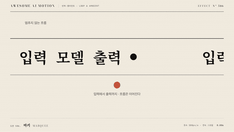

# Nº 586 마키 · Marquee



[MP4](clip.mp4) · [HTML](index.html)

**콘텐츠가 화면 밖으로 나간 뒤 반대편에서 이어져 끊임없이 흐른다.**

Duplicated content flows continuously across the viewport.

| Family | Level | Purpose | Media | Runtime |
|---|---|---|---|---|
| 반복·앰비언트 · LOOP & AMBIENT | 기본 | 피드백, 분위기 | 설명 영상, 웹 UI, 숏폼 | gsap |

다른 이름 / Also known as: Infinite ticker wrap, 무한 티커 순환, Seamless carousel, Infinite conveyor, Infinite Marquee, 무한 흐름 띠, Ticker Loop, Infinite Slider

## 선택 기준 / Selection

계속되는 목록과 활기를 전달한다. / Suggests an ongoing stream and activity.

- 브랜드 로고 목록을 흐르게 할 때 / Use when presenting marquee in a waiting or ambient scene.
- 짧은 공지 문구를 연속 표시할 때 / Use for a compact status indicator with a stable surrounding layout.

좋은 예 / Good: 960px 로고 스트립 두 개가 12초에 한 묶음씩 이동한다.
나쁜 예 / Bad: 복제 경계의 간격이 달라 매 주기 화면이 튄다.
주의 / Avoid: 복제 경계의 간격이 달라 매 주기 화면이 튄다. · 정보를 읽는 동안 반복 진폭을 키우지 않는다.

## 파라미터 / Parameters

| Parameter | Default | Range | Note |
|---|---|---|---|
| 주기 | 12s | 8.4~16.8s | 유한 구간을 호스트 시간으로 반복 |
| 속도 | 80px/s | 40~120px/s | 스트립 길이로 지속 계산 |
| 항목 간격 | 24px | 16~48px | 복제 경계에도 동일 간격 |
| 복제 수 | 2 | 2~3 | 뷰포트를 채우는 길이 확보 |
| 이징 | none | none | 움직임의 가속과 감속 |

## 구현 / Implementation (GSAP)

```js
const strip = document.querySelector('.strip');
const width = strip.getBoundingClientRect().width;
const clone = strip.cloneNode(true);
clone.setAttribute('aria-hidden', 'true');
strip.parentElement.append(clone);
tl.fromTo([strip, clone], {x:0}, {x:-width, duration:width/80, ease:'none'}, 0);
```

## 프롬프트 / Prompts

### 한국어 · Claude Code
```text
<파일>에서 <대상>에 마키을 적용해. 12초, 속도 80px/s; 항목 간격 24px; 복제 수 2, 이징 none로 구현해. paused 타임라인으로 seek 가능하게 하고 반복은 유한 구간의 지역 시간으로 계산해.
```

### 한국어 · Codex
```text
<파일>의 <대상> 레이어에 마키을 적용해. 12초, 속도 80px/s; 항목 간격 24px; 복제 수 2, none를 사용하고 0초, 6초, 12초 캡처로 시작값, 중간 변화, 완료 자세를 확인해. 동일 시점을 두 번 seek해 같은 결과인지 검증해.
```

### English · Claude Code
```text
Apply Marquee to <target> in <file>. Use a 12s segment with none; implement these explicit settings: Speed: 80px/s, Item gap: 24px, Strip copies: 2. Use a paused, seekable timeline and repeat through local timeline time.
```

### English · Codex
```text
Apply Marquee to the <target> layer in <file> with Speed: 80px/s, Item gap: 24px, Strip copies: 2, using the supplied core snippet and a 12s segment with none. Capture at 0s, 6s, and 12s to verify the initial pose, intermediate change, and final pose. Seek to the same timestamp twice and confirm identical output.
```

예시 / Example: 마키를 `.hero`에 적용해. / Apply Marquee to `.hero`.

## 적용 / Application

- HyperFrames: paused 타임라인에 12초 구간을 넣고 seek로 자세를 계산한다. 반복은 호스트의 지역 시간으로 환산한다.
- ReelForge: 씬 워커 브리프에 마키, 12초, 속도 80px/s; 항목 간격 24px; 복제 수 2, none를 싣고 대상 레이어를 지정한다.
- Scrolline Deck: 진행률 0~1을 12초 구간에 매핑한다. scrub에서는 스프링 대신 선형 이동과 ease-out을 용도별로 나눈다.

조합 / Pair with: [페이드 슬라이드 · Fade Slide](../fade-slide/) · [상태 보간 · State Tween](../state-tween/) · [스케일 팝 · Scale Pop](../scale-pop/)

출처 / Sources: [greensock/GSAP](https://gsap.com/docs/v3/GSAP/CorePlugins/Modifiers/) (GSAP Standard License) · [greensock/GSAP](https://gsap.com/docs/v3/GSAP/UtilityMethods/) (GSAP Standard License) · [motion.dev Motion+](https://motion.dev/docs/react-ticker) (unknown) · [motion.dev examples](https://motion.dev/examples/react-ticker) (unknown) · [demos.gsap.com](https://demos.gsap.com/demo/infinite-card-slider) (unknown) · [schoolofmotion.com](https://schoolofmotion.com/blog/sports-lower-thirds) (unknown) · [airbnb/lottie-web](https://github.com/airbnb/lottie-web) (MIT) · [codrops/CSSMarqueeMenu](https://github.com/codrops/CSSMarqueeMenu) (MIT)

[목록 / Catalog](../../references/catalog.md) · [index.json](../../index.json)
