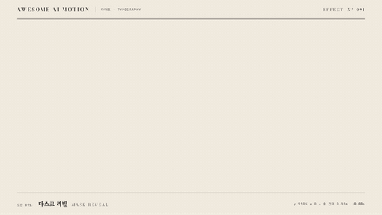

# Nº 091 마스크 리빌 · Mask Reveal



[MP4](clip.mp4) · [HTML](index.html)

**숨겨진 창 아래의 제목을 위로 올려 줄마다 드러내는 효과**

A title rises into clipped windows to reveal one line at a time.

| Family | Level | Purpose | Media | Runtime |
|---|---|---|---|---|
| 타이포 · TYPOGRAPHY | 기본 | 주목 끌기, 순서·흐름 | 설명 영상, 숏폼, 발표 | gsap |

다른 이름 / Also known as: 줄 마스크, Line reveal, Directional Menu Image Reveal, 메뉴 이미지 방향 리빌, Mask text reveal, 마스크 글자 공개, Line mask typography, 줄 마스크 타이포

## 선택 기준 / Selection

문장이 차례로 등장하며 제목의 시작을 알린다 / Introduces a title through a sequential reveal of its lines.

- 두 줄 제목을 순서대로 소개할 때 / Introduce a two-line title in sequence.
- 문단 시작에 시선을 모을 때 / Focus attention on the start of a paragraph.

좋은 예 / Good: AI는 다음 말을 고른다를 두 줄로 나눠 0.35초 간격으로 올린다
나쁜 예 / Bad: 마스크 없이 글자를 움직여 다음 줄과 겹친다
주의 / Avoid: 본문 전체에 반복 적용하지 않는다 · 줄 높이보다 작은 창으로 글자를 자르지 않는다

## 파라미터 / Parameters

| Parameter | Default | Range | Note |
|---|---|---|---|
| 시작 이동 | 110% | 100~120% | 줄 높이를 기준으로 완전히 숨긴다 |
| 지속 | 1.05s | 0.6~1.2s | 한 줄이 올라오는 시간 |
| 줄 간격 | 0.35s | 0.15~0.45s | 두 번째 줄의 출발 지연 |
| 시작 | 0.3s | 0.2~0.4s | 준비 구간 |

이징 / Ease: `power3.out`

## 구현 / Implementation (GSAP)

```js
const tl = Motion.timeline();
tl.fromTo('.line', {yPercent:110}, {yPercent:0, duration:1.05, stagger:0.35, ease:'power3.out'}, 0.3);
tl.to('.lead', {opacity:1, duration:0.25}, 1.8);
Motion.ready();
```

## 프롬프트 / Prompts

### 한국어 · Claude Code
```text
<대상>의 두 줄 제목에 마스크 리빌을 적용해. 각 줄을 높이 116px의 overflow hidden 창에 넣고 내부 글자를 0.3초부터 yPercent 110에서 0으로 1.05초 동안 power3.out으로 이동해. 두 번째 줄은 0.35초 늦게 시작하고 3초까지 완성 상태를 유지해.
```

### 한국어 · Codex
```text
<파일>의 제목 영역에 줄마다 overflow hidden 창과 내부 .line을 배치해. 0.3초부터 yPercent 110에서 0으로 duration 1.05초, stagger 0.35초, ease power3.out을 적용해. 0.23초, 0.73초, 1.23초, 2.9초를 캡처해 첫 준비 상태, 줄별 마스크 경계, 완성 홀드와 글자 잘림을 확인해.
```

### English · Claude Code
```text
Apply a mask reveal to the two-line title in <target>. Place each line inside a 116px-high overflow hidden window. Starting at 0.3 seconds, animate the inner text from yPercent 110 to 0 over 1.05 seconds with power3.out. Start the second line 0.35 seconds later and hold the completed state until 3 seconds.
```

### English · Codex
```text
In the title area of <file>, give each line an overflow hidden window and an inner .line element. Starting at 0.3 seconds, animate yPercent from 110 to 0 with duration 1.05 seconds, stagger 0.35 seconds, and ease power3.out. Capture at 0.23, 0.73, 1.23, and 2.9 seconds to check the initial state, per-line mask boundaries, completed hold, and text clipping.
```

예시 / Example: 마스크 리빌를 `.hero`에 적용해. / Apply Mask Reveal to `.hero`.

## 적용 / Application

- HyperFrames: 줄마다 overflow hidden 창을 두고 내부 span의 yPercent를 하나의 타임라인으로 움직인다
- ReelForge: 제목 비트의 줄마다 마스크를 분리하고 0.35초 출발 간격을 유지한다
- Scrolline Deck: 스크롤 진행률에 두 줄의 yPercent를 연결하고 완료 이후 정지 구간을 둔다

조합 / Pair with: [스태거 · Stagger](../stagger/) · [글자별 스태거 · Per-character Rise](../char-stagger/) · [밑줄 드로우 · Underline Draw](../underline-draw/)

출처 / Sources: [GSAP fromTo()](https://gsap.com/docs/v3/GSAP/Timeline/fromTo()) (공식 문서 참조) · [tympanus.net/codrops](https://tympanus.net/codrops/2020/07/01/creating-a-menu-image-animation-on-hover/) (unknown) · [ui.aceternity.com](https://ui.aceternity.com/components/direction-aware-hover) (unknown) · [DavidHDev/react-bits](https://github.com/DavidHDev/react-bits) (MIT + Commons Clause v1.0) · [heygen-com/hyperframes](https://raw.githubusercontent.com/heygen-com/hyperframes/main/registry/components/caption-clip-wipe/registry-item.json) (Apache-2.0) · [heygen-com/hyperframes](https://raw.githubusercontent.com/heygen-com/hyperframes/main/registry/components/line-by-line-slide/registry-item.json) (Apache-2.0) · [heygen-com/hyperframes](https://raw.githubusercontent.com/heygen-com/hyperframes/main/registry/components/svg-mask-reveal/registry-item.json) (Apache-2.0) · [heygen-com/hyperframes](https://raw.githubusercontent.com/heygen-com/hyperframes/main/registry/components/testimonial-card/registry-item.json) (Apache-2.0)

[목록 / Catalog](../../references/catalog.md) · [index.json](../../index.json)
