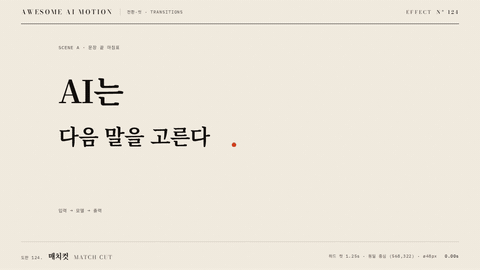

# Nº 124 매치컷 · Match Cut



[MP4](clip.mp4) · [HTML](index.html)

**컷 앞뒤에서 같은 위치와 크기의 형태를 이어 두 장면을 연결하는 전환**

Matching shapes at the same position and size connect two scenes across a cut.

| Family | Level | Purpose | Media | Runtime |
|---|---|---|---|---|
| 전환·컷 · TRANSITIONS | 기본 | 전환, 순서·흐름 | 설명 영상, 숏폼, 발표, 스크롤덱 | gsap |

다른 이름 / Also known as: Graphic Match, 형태 매치, 매치 컷, match-cut-position-carry, match-cut-graphic-analogy, object-scale-continuity, Matched dissolve

## 선택 기준 / Selection

문장 끝 점이 차트의 점으로 이어져 문장과 데이터를 연결한다 / Connects a sentence to data by matching its final period to a chart dot.

- 모양이 같은 대상을 통해 서로 다른 장면을 연결할 때 / Connect different scenes through objects with matching shapes.
- 설명에서 데이터로 넘어가며 시선 위치를 유지할 때 / Keep the viewer's gaze in place when moving from explanation to data.

좋은 예 / Good: 문장 끝 주홍 마침표를 지름 48px로 키운 뒤 같은 중심과 크기의 차트 점으로 하드 컷한다
나쁜 예 / Bad: 컷 뒤 점의 위치나 크기가 달라져 연결 형태가 튄다
주의 / Avoid: 컷 시점에 디졸브를 섞지 않는다 · 대응하는 형태의 중심과 크기를 바꾸지 않는다

## 파라미터 / Parameters

| Parameter | Default | Range | Note |
|---|---|---|---|
| 마침표 확대 | scale 0.25→1 | 0.2~1 | 최종 지름 48px |
| 확대 지속 | 0.5s | 0.3~0.7s | 컷 전 형태를 보여준다 |
| 컷 시각 | 1.25s | 1.0~1.6s | 순간적으로 장면 교체 |
| 형태 일치 | 중심 (568,322), 지름 48px | 컷 전후 동일 | 장면 좌표 기준 |

이징 / Ease: `확대 power2.out, 컷은 tl.set`

## 구현 / Implementation (GSAP)

```js
tl.to('#period', {scale:1, duration:0.5, ease:'power2.out'}, 0.35);
tl.set('#A', {visibility:'hidden'}, 1.25);
tl.set('#B', {visibility:'visible'}, 1.25);
tl.to('.lead', {opacity:1, duration:0.2}, 1.6);
```

## 프롬프트 / Prompts

### 한국어 · Claude Code
```text
<대상>의 문장 끝 주홍 마침표와 차트 점을 연결하는 매치컷을 만들어줘. 마침표를 0.35초부터 0.5초 동안 scale 0.25에서 1로 power2.out 확대하고 최종 중심 (568,322), 지름 48px를 유지해. 1.25초에 A를 숨기고 B를 즉시 보이게 하며 B 점도 같은 중심과 크기로 두고 1.8초부터 3초까지 정지해.
```

### 한국어 · Codex
```text
<파일>에 문장 마침표에서 차트 점으로 이어지는 하드 매치컷을 구현해. 두 점은 left 544px, top 298px, width와 height 48px로 두고 A 점만 0.35초부터 0.5초 동안 scale 0.25→1로 확대해. 1.25초에 visibility를 동시에 교체하고 1.233초와 1.267초를 캡처해 주홍 원 중심 (568,322)과 지름 48px가 같고 배경 장면만 바뀌는지 확인해. 2.9초 캡처로 완성 홀드도 확인해.
```

### English · Claude Code
```text
Create a match cut for <target> connecting the sentence's vermilion period to a chart dot. Starting at 0.35 seconds, enlarge the period from scale 0.25 to 1 over 0.5 seconds with power2.out, maintaining final center (568,322) and diameter 48px. At 1.25 seconds, hide A and immediately show B, with B's dot at the same center and size. Hold from 1.8 to 3 seconds.
```

### English · Codex
```text
Implement a hard match cut from a sentence period to a chart dot in <file>. Set both dots to left 544px, top 298px, width 48px, and height 48px. Enlarge only A's dot from scale 0.25 to 1 starting at 0.35 seconds over 0.5 seconds. Switch visibility simultaneously at 1.25 seconds. Capture at 1.233 and 1.267 seconds to verify identical vermilion circle center (568,322) and diameter 48px, with only the background scene changing. Capture at 2.9 seconds to verify the completed hold.
```

예시 / Example: 매치컷를 `.hero`에 적용해. / Apply Match Cut to `.hero`.

## 적용 / Application

- HyperFrames: 장면 둘을 같은 좌표에 배치하고 하나의 paused GSAP 타임라인으로 전환한다. 전환 뒤 완성 장면을 홀드한다
- ReelForge: 전환 비트의 시작 시각과 지속 시간을 고정하고 장면 레이어 두 개를 함께 렌더한다
- Scrolline Deck: 전환 구간의 진행률을 하나의 타임라인에 연결하고 양 끝에 읽기 위한 정지 구간을 둔다

조합 / Pair with: [모프 전환 · Morph](../shape-morph/) · [크로스페이드 · Crossfade](../crossfade/) · [좌표 줌 · Zoom to Detail](../zoom-to-detail/)

출처 / Sources: [Match cut](https://en.wikipedia.org/wiki/Match_cut) (개념 인용) · [heygen-com/hyperframes](https://raw.githubusercontent.com/heygen-com/hyperframes/main/registry/components/match-cut/registry-item.json) (Apache-2.0) · [heygen-com/hyperframes](https://raw.githubusercontent.com/heygen-com/hyperframes/main/registry/components/text-match-cut/registry-item.json) (Apache-2.0) · [Adobe](https://www.adobe.com/creativecloud/video/post-production/cuts-in-film/match-cut.html) (unknown) · [CapCut](https://www.capcut.com/resource/dissolve-transition-in-video) (unknown) · motion dictionary 1-principles.md#7. 연속성·공간 모델·시선 유도 (own)

[목록 / Catalog](../../references/catalog.md) · [index.json](../../index.json)
