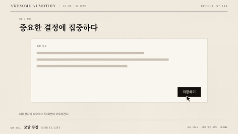

# Nº 346 모달 등장 · Modal Lift



[MP4](clip.mp4) · [HTML](index.html)

**대화상자가 떠오르면서 뒤 화면이 어두워지거나 흐려진다.**

A dialog rises into focus as the backdrop dims.

| Family | Level | Purpose | Media | Runtime |
|---|---|---|---|---|
| UI 시연 · UI DEMO | 기본 | 전환 | 설명 영상, 제품 시연, 웹 UI | gsap |

다른 이름 / Also known as: Modal lift and backdrop, 모달 상승과 배경 암전, Modal Entrance

## 선택 기준 / Selection

현재 작업 영역을 분명히 한다. / Defines the current working area and visual priority.

- 중요한 확인 대화상자를 열 때 / Open an important confirmation dialog.
- 현재 작업의 보조 입력을 받을 때 / Request supporting input for the current task.

좋은 예 / Good: 모달이 아래 32px에서 올라오며 배경이 250ms에 어두워진다
나쁜 예 / Bad: 배경 암전이 늦어 모달과 기존 화면의 우선순위가 충돌한다
주의 / Avoid: 본문 위에 과도한 블러를 동시에 적용하지 않는다

## 파라미터 / Parameters

| Parameter | Default | Range | Note |
|---|---|---|---|
| 모달 등장 | 400ms | 250~550ms | 상승과 확대 |
| 배경 암전 | 250ms | 180~350ms | 모달보다 먼저 정착 |
| 상승 거리 | 32px | 16~48px | 짧은 부상 |
| 배경 투명도 | 0.45 | 0.3~0.6 | 내용 대비 |
| 시작 배율 | 0.96 | 0.94~1 | 최종 배율 1 |

이징 / Ease: `power3.out`

## 구현 / Implementation (GSAP)

```js
tl.fromTo('.modal',{y:32,scale:0.96,opacity:0},{y:0,scale:1,opacity:1,duration:0.4,ease:'power3.out'},0);
tl.fromTo('.backdrop',{opacity:0},{opacity:0.45,duration:0.25,ease:'power2.out'},0);
tl.to({}, {duration:1},0.4);
```

## 프롬프트 / Prompts

### 한국어 · Claude Code
```text
<파일>의 <대상>에 모달 등장을 적용한다. 모달을 32px 아래와 0.96배에서 400ms에 올리고 배경은 250ms에 opacity 0.45로 맞춘다. 초기 상태를 명시한 paused 타임라인으로 만들고 고정 좌표와 시간만 사용해 seek를 재현한다.
```

### 한국어 · Codex
```text
<파일>에서 <대상>의 모달 등장 장면에 적용한다. 모달을 32px 아래와 0.96배에서 400ms에 올리고 배경은 250ms에 opacity 0.45로 맞춘다. 0.10초·0.26초·0.60초 시점을 캡처해 시작 상태, 중간 관계, 최종 정착과 겹침 여부를 확인한다.
```

### English · Claude Code
```text
Apply Modal Lift to <target> in <file>. Lift the modal from 32px below at scale 0.96 over 400ms and fade the backdrop to 0.45 opacity over 250ms. Define the initial state and use a paused timeline with fixed coordinates and timings for repeatable seeking.
```

### English · Codex
```text
Implement Modal Lift in the scene for <target> in <file>. Lift the modal from 32px below at scale 0.96 over 400ms and fade the backdrop to 0.45 opacity over 250ms. Capture at 0.10s, 0.26s, 0.60s to verify the initial state, intermediate relationships, final settling, and unwanted overlap.
```

예시 / Example: 모달 등장를 `.hero`에 적용해. / Apply Modal Lift to `.hero`.

## 적용 / Application

- HyperFrames: paused 타임라인에 모달 등장의 초기 상태와 종료 상태를 함께 기록하고 0.40초까지 seek로 재현한다.
- ReelForge: 씬 워커 브리프에 모달 등장 대상 선택자와 모달 등장 400ms, 배경 암전 250ms, 상승 거리 32px를 싣고 최종 상태 유지 시간을 지정한다.
- Scrolline Deck: 진행률 0~1을 0.40초 구간에 매핑하고 scrub에서는 스프링 대신 power3.out으로 위치를 계산한다.

조합 / Pair with: [드로어 슬라이드 · Drawer Slide](../drawer-slide/) · [스포트라이트 · Spotlight](../spotlight/)

출처 / Sources: [motiondivision/motion](https://motion.dev/docs/react-animate-presence) (MIT) · [motion.dev examples](https://motion.dev/examples/react-modal) (unknown) · [motion.dev examples](https://motion.dev/examples/react-sheet-modal) (unknown) · [shadcn-ui/ui](https://github.com/shadcn-ui/ui) (MIT) · [ui.aceternity.com](https://ui.aceternity.com/components/animated-modal) (unknown)

[목록 / Catalog](../../references/catalog.md) · [index.json](../../index.json)
