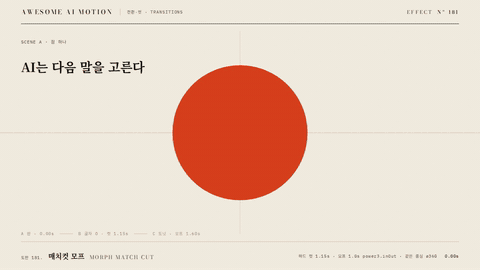

# Nº 181 매치컷 모프 · Morph Match Cut



[MP4](clip.mp4) · [HTML](index.html)

**주홍 원이 같은 자리·같은 크기의 글자 O로 한 프레임에 컷되고, 그 O가 도넛 차트로 모프된다.**

A vermilion circle hard-cuts to a serif letter O at the same position and size, then the O morphs into a 62% donut chart.

| Family | Level | Purpose | Media | Runtime |
|---|---|---|---|---|
| 전환·컷 · TRANSITIONS | 고급 | 전환, 주목 끌기, 데이터 증명 | 설명 영상, 숏폼, 발표, 데이터 스토리 | svg |

다른 이름 / Also known as: 모양 매치컷, Shape match cut, Graphic match, 컷 후 모프, Match cut into morph

## 선택 기준 / Selection

장면이 셋으로 바뀌어도 모양이 이어져 하나의 생각으로 읽힌다. 컷은 또렷하고 모프는 매끈해 흐름이 끊기지 않는다. / Three different scenes read as one idea because the shape carries across. The cut is crisp and the morph is smooth, so the flow never breaks.

- 개념 도입 장면에서 수치 장면으로 넘어가며 같은 도형을 이어 붙이고 싶을 때 / Use when moving from a concept scene to a data scene while keeping the same shape on screen.
- 로고·글자·차트처럼 윤곽이 닮은 대상 셋을 한 흐름으로 묶을 때 / Use when a logo, letter, and chart share a similar outline and should read as one continuous thought.

좋은 예 / Good: 지름 360px 주홍 원이 1.15초에 같은 중심의 디돈 O로 컷되고, 1.6초부터 1초 동안 O가 굵기 60px 링으로 바뀐 뒤 끝이 62%까지 되감긴다.
나쁜 예 / Bad: 컷 순간 도형 중심이 수십 px 어긋나거나 크기가 달라 튀어 보이고, 모프를 크로스페이드로 대신해 두 모양이 겹쳐 흐려진다.
주의 / Avoid: 컷 전후 도형의 중심·높이 차이 4px 초과 금지 · 점 구성이 다른 경로끼리 보간 금지(모양이 뒤틀림) · 컷에 페이드·번쩍임 금지(한 프레임에 바꾼다)

## 파라미터 / Parameters

| Parameter | Default | Range | Note |
|---|---|---|---|
| 컷 시점 | 1.15s | 0.9~1.5s | 원이 자리 잡고 0.2초 뒤 |
| 도형 크기 | ø360px | ø280~420px | 장면 높이의 60% 안팎, 세 장면 공통 |
| 모프 길이 | 1.0s | 0.7~1.3s | power3.inOut, 바깥·안쪽 타원 반지름 보간 |
| 카메라 | scale 1→1.06, x -170px | 1.03~1.10, 120~220px | 밀기는 전 구간, 패닝은 모프 동안만 |
| 호 되감기 | 0.65s | 0.5~0.9s | dashoffset 0→0.38, autoRound:false |

이징 / Ease: `power3.inOut`

## 구현 / Implementation (GSAP)

```js
const ell = (rx, ry) => `M${CX-rx},${CY}A${rx},${ry} 0 1 1 ${CX+rx},${CY}A${rx},${ry} 0 1 1 ${CX-rx},${CY}Z`;
const S = { orx: 135, ory: 180, irx: 92, iry: 162 };
const drawO = () => morph.setAttribute('d', ell(S.orx, S.ory) + ell(S.irx, S.iry));
tl.set('#A, #disk', { visibility: 'hidden' }, 1.15).set('#B, #morph', { visibility: 'visible' }, 1.15);
tl.to(S, { orx: 180, ory: 180, irx: 120, iry: 120, duration: 1.0, ease: 'power3.inOut', onUpdate: drawO }, 1.6);
tl.set('#morph', { visibility: 'hidden' }, 2.6).set('#arc', { visibility: 'visible' }, 2.6);
tl.to('#arc', { strokeDashoffset: 0.38, autoRound: false, duration: 0.65, ease: 'power2.inOut' }, 2.65);
```

## 프롬프트 / Prompts

### 한국어 · Claude Code
```text
<대상> 장면을 매치컷 모프로 이어줘. 지름 360px 주홍 원을 중심 (640,290)에 0.7초 power3.out으로 키우고, 1.15초에 한 프레임 만에 같은 중심·같은 높이의 세리프 글자 O(바깥 타원 135x180, 안쪽 92x162, evenodd 경로)로 컷해. 1.6초부터 1초 동안 power3.inOut으로 바깥 반지름 180, 안쪽 120까지 보간해 도넛으로 모프하고, 굵기 60px 선 원으로 바꾼 뒤 stroke-dashoffset 0→0.38(autoRound:false)로 62%까지 되감아. 월드 래퍼는 scale 1→1.06으로 밀고 모프 동안 x -170px 패닝, 마지막 0.6초는 정지.
```

### 한국어 · Codex
```text
<파일>에 매치컷 모프를 구현해. 원·글자 O·도넛을 모두 같은 중심의 SVG로 두고, O와 도넛은 바깥·안쪽 타원 호 2개씩으로 된 같은 구조의 경로라 반지름 4개만 GSAP 프록시로 보간한다(MorphSVG 금지). 컷은 1.15초 tl.set visibility, 모프 1.6~2.6초 power3.inOut, 호 되감기 2.65초 0.65초. 1.10초·1.17초를 캡처해 도형 중심과 높이가 같은지, 2.0초에 O와 링의 중간 모양이 매끈한지, 3.9초에 62% 호와 숫자가 완성 정지인지 확인해.
```

### English · Claude Code
```text
Connect the <target> scenes with a morph match cut. Grow a 360px vermilion circle centered at (640,290) over 0.7s with power3.out, then at 1.15s cut in a single frame to a serif letter O with the same center and height (outer ellipse 135x180, inner 92x162, evenodd path). From 1.6s, interpolate over 1s with power3.inOut to outer radius 180 and inner 120 to morph into a donut, swap to a 60px stroked circle, and rewind it to 62% with stroke-dashoffset 0 to 0.38 (autoRound:false). Push the world wrapper from scale 1 to 1.06, pan x by -170px during the morph, and hold still for the last 0.6s.
```

### English · Codex
```text
Implement a morph match cut in <file>. Place the circle, letter O, and donut as SVG on one shared center; build the O and the donut from the same structure of two ellipses with two arcs each, and interpolate only the four radii through a GSAP proxy (no MorphSVG). Cut at 1.15s with tl.set visibility, morph from 1.6s to 2.6s with power3.inOut, rewind the arc at 2.65s over 0.65s. Capture 1.10s and 1.17s to confirm the shape center and height match, 2.0s to confirm the in-between shape is smooth, and 3.9s to confirm the 62% arc and number are in a still final hold.
```

예시 / Example: 매치컷 모프를 `.hero`에 적용해. / Apply Morph Match Cut to `.hero`.

## 적용 / Application

- HyperFrames: 세 장면과 도형 SVG를 월드 래퍼 하나에 넣고 scale 1→1.06, 모프 구간에만 x -170px. 컷은 tl.set visibility 한 줄, 모프는 프록시 객체 tween + onUpdate로 d 속성을 다시 쓴다.
- ReelForge: 씬 브리프에 공통 중심(640,290)·지름 360px·컷 시점 1.15s를 계약값으로 싣고, 모프 경로는 바깥·안쪽 타원 반지름 4개만 파라미터로 노출한다.
- Scrolline Deck: 진행률 0.29에서 컷, 0.40~0.65에서 모프로 매핑한다. scrub에서 컷이 여러 프레임에 걸치지 않게 visibility 전환은 set으로 둔다.

조합 / Pair with: [매치컷 · Match Cut](../match-cut/) · [모프 전환 · Morph](../shape-morph/) · [도넛 다중 링 단계화 · Donut Ring Staging](../donut-ring-staging/) · [푸시인 · Push-in](../push-in/)

출처 / Sources: [Match cut (film editing)](https://en.wikipedia.org/wiki/Match_cut) (개념 인용) · [SVG path elliptical arc commands (MDN)](https://developer.mozilla.org/en-US/docs/Web/SVG/Tutorial/Paths) (CC-BY-SA)

[목록 / Catalog](../../references/catalog.md) · [index.json](../../index.json)
