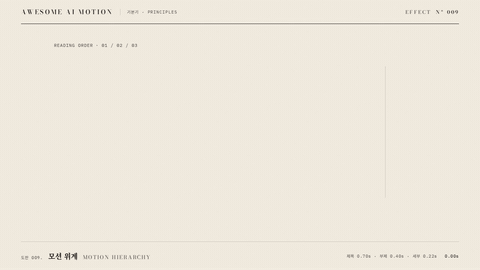

# Nº 009 모션 위계 · Motion Hierarchy



[MP4](clip.mp4) · [HTML](index.html)

**중요한 정보부터 크기와 등장 시간을 달리해 읽는 순서를 만드는 움직임**

Differences in scale and entrance timing establish a reading order that prioritizes important information.

| Family | Level | Purpose | Media | Runtime |
|---|---|---|---|---|
| 기본기 · PRINCIPLES | 기본 | 순서·흐름, 설명, 주목 끌기 | 설명 영상, 발표, 스크롤덱, 웹 UI | gsap |

다른 이름 / Also known as: 등장 위계, 정보 위계, Reading order, Negative Space Hold, 빈 공간 결론 홀드, Coherence-driven background settling, 핵심 외 움직임 정착

## 선택 기준 / Selection

제목이 먼저 주목받고 부제와 세부가 뒤따르는 정보 구조를 보여준다 / Communicates an information hierarchy in which the title draws attention first, followed by the subtitle and details.

- 제목과 근거를 단계적으로 읽게 할 때 / Guide viewers through a title and its supporting information in stages.
- 한 화면의 정보 중요도가 서로 다를 때 / Present information with different levels of importance on one screen.

좋은 예 / Good: 84px 제목은 0.3초에 0.7초 동안, 34px 부제는 1.05초에 0.4초 동안, 21px 세부는 1.5초에 0.22초 동안 등장한다
나쁜 예 / Bad: 제목과 본문이 동시에 같은 크기와 속도로 움직여 먼저 읽을 정보가 없다
주의 / Avoid: 낮은 위계의 세부가 제목보다 크게 움직이지 않게 한다 · 등장 지연으로 읽는 시간이 2초 이상 길어지지 않게 한다

## 파라미터 / Parameters

| Parameter | Default | Range | Note |
|---|---|---|---|
| 제목 시작·지속 | 0.30s / 0.70s | 0.20~0.40s / 0.50~0.80s | 84px 제목을 32px 아래에서 띄운다 |
| 부제 시작·지속 | 1.05s / 0.40s | 0.90~1.20s / 0.30~0.50s | 34px 부제를 18px 아래에서 띄운다 |
| 세부 시작·지속 | 1.50s / 0.22s | 1.30~1.70s / 0.18~0.30s | 21px 세부를 10px 아래에서 띄운다 |
| 완성 홀드 | 0.73s | 0.50~1.00s | 순번 지시선까지 표시한 뒤 정지한다 |

이징 / Ease: `power3.out / power2.out`

## 구현 / Implementation (GSAP)

```js
const tl = Motion.timeline();
tl.fromTo('#title', {y:32, opacity:0},
  {y:0, opacity:1, duration:0.70, ease:'power3.out'}, 0.30);
tl.fromTo('#sub', {y:18, opacity:0},
  {y:0, opacity:1, duration:0.40, ease:'power3.out'}, 1.05);
tl.fromTo('#detail', {y:10, opacity:0},
  {y:0, opacity:1, duration:0.22, ease:'power2.out'}, 1.50);
tl.to('.lead', {opacity:1, duration:0.18, stagger:0.07}, 1.95);
Motion.ready();
```

## 프롬프트 / Prompts

### 한국어 · Claude Code
```text
<대상>을 제목 84px, 부제 34px, 세부 21px의 세 단계로 배치해 모션 위계를 만들어줘. 제목은 0.3초에 y 32→0으로 0.7초, 부제는 1.05초에 y 18→0으로 0.4초, 세부는 1.5초에 y 10→0으로 0.22초 동안 투명에서 불투명으로 나타나게 해. 제목과 부제는 power3.out, 세부는 power2.out을 쓰고 오른쪽 1·2·3 지시선을 1.95초부터 표시하며 2.27초부터 3초까지 정지해.
```

### 한국어 · Codex
```text
<파일>의 .scene에 84px 제목, 34px 부제, 21px 세부를 배치해. 단일 paused 타임라인에서 시작 0.30/1.05/1.50초, 지속 0.70/0.40/0.22초, y 이동 32/18/10px, opacity 0→1을 적용해. 0.73초에는 제목만, 1.23초에는 제목과 부제, 1.73초에는 세 단계가 모두 보이는지 캡처하고 2.9초에 1·2·3 지시선과 완성 홀드를 확인해.
```

### English · Claude Code
```text
Create motion hierarchy for <target> with three levels: an 84px title, 34px subtitle, and 21px detail text. Reveal the title at 0.3 seconds over 0.7 seconds with y 32 to 0, the subtitle at 1.05 seconds over 0.4 seconds with y 18 to 0, and the details at 1.5 seconds over 0.22 seconds with y 10 to 0, each fading from transparent to opaque. Use power3.out for the title and subtitle and power2.out for the details. Show right-side leader lines labeled 1, 2, and 3 starting at 1.95 seconds, and hold from 2.27 to 3 seconds.
```

### English · Codex
```text
Place an 84px title, 34px subtitle, and 21px detail text in .scene in <file>. Use a single paused timeline with starts 0.30/1.05/1.50 seconds, durations 0.70/0.40/0.22 seconds, y offsets 32/18/10px, and opacity 0 to 1. Capture at 0.73 seconds to verify only the title is visible, at 1.23 seconds for the title and subtitle, and at 1.73 seconds for all three levels. At 2.9 seconds, check the leader lines labeled 1, 2, and 3 and the completed hold.
```

예시 / Example: 모션 위계를 `.hero`에 적용해. / Apply Motion Hierarchy to `.hero`.

## 적용 / Application

- HyperFrames: 제목·부제·세부를 한 타임라인의 0.30·1.05·1.50초에 배치한다
- ReelForge: 텍스트 위계별 등장 비트를 나누고 아래 단계일수록 이동 거리와 지속을 줄인다
- Scrolline Deck: 제목·부제·세부의 시작 진행률을 순서대로 벌리고 마지막 읽기 구간을 둔다

조합 / Pair with: [스태거 · Stagger](../stagger/) · [점진적 공개 · Progressive Disclosure](../progressive-disclosure/) · [마스크 리빌 · Mask Reveal](../mask-reveal/)

출처 / Sources: [Material Design, Understanding motion](https://m2.material.io/design/motion/understanding-motion.html) (개념 참조) · [heygen-com/hyperframes](https://raw.githubusercontent.com/heygen-com/hyperframes/main/registry/components/beat-timeline/registry-item.json) (Apache-2.0) · [greensock/GSAP](https://gsap.com/docs/v3/GSAP/Timeline/) (GSAP Standard License) · motion dictionary 1-principles.md#6. 모션 위계·코레오그래피 (own) · [Richard E. Mayer / Wiley](https://onlinelibrary.wiley.com/doi/10.1111/jcal.12197) (unknown)

[목록 / Catalog](../../references/catalog.md) · [index.json](../../index.json)
