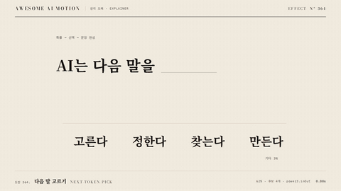

# Nº 364 다음 말 고르기 · Next-token Pick



[MP4](clip.mp4) · [HTML](index.html)

**후보 확률 막대가 자란 뒤 가장 높은 후보가 문장의 빈칸으로 이동하는 움직임**

An animation in which candidate probability bars grow, then the highest-probability candidate moves into a blank in the sentence.

| Family | Level | Purpose | Media | Runtime |
|---|---|---|---|---|
| 원리 도해 · EXPLAINER | 기본 | 설명, 순서·흐름 | 설명 영상, 발표, 스크롤덱 | gsap |

다른 이름 / Also known as: 다음 토큰 예측, Next Token Prediction, Next-token probability bars, 확률 막대, Autoregressive generation loop, 자동회귀 생성 루프

## 선택 기준 / Selection

다음 말은 후보별 확률을 비교해 선택한다 / Shows how the next word is selected by comparing candidate probabilities.

- 언어 모델의 생성 과정을 설명할 때 / When explaining language model generation
- 후보 확률과 선택 결과를 연결할 때 / When connecting candidate probabilities to the selected result

좋은 예 / Good: 62% 고른다가 선택되어 AI는 다음 말을 고른다를 완성한다
나쁜 예 / Bad: 확률이 낮은 후보를 이유 없이 1위로 표시한다
주의 / Avoid: 항상 최대 확률만 선택한다고 일반화하지 않는다 · 후보 확률의 나머지 질량을 생략하지 않는다

## 파라미터 / Parameters

| Parameter | Default | Range | Note |
|---|---|---|---|
| 후보 수 | 4 | 3~5 | 기타 3% 별도 표기 |
| 막대 성장 | 0.8s | 0.6~1s | 62% 기준 정규화 |
| 선택 시각 | 1.35s | 1.2~1.5s | 확률을 읽은 뒤 |
| 이동 | 328px, -295px | 레이아웃에 맞춤 | 빈칸 정렬 |
| 이동 지속 | 0.7s | 0.5~0.8s | 완성 홀드 확보 |

이징 / Ease: `power2.out, power3.inOut`

## 구현 / Implementation (GSAP)

```js
const tl = Motion.timeline();
const bars=document.querySelectorAll('.bar');
[1,21/62,9/62,5/62].forEach((v,i)=>tl.to(bars[i],{scaleY:v,duration:.8,ease:'power2.out'},.3+i*.08));
tl.to('.prob',{opacity:1,duration:.25,stagger:.08},.65);
tl.to('#pick',{color:'var(--verm)',duration:.25},1.35);
tl.to('#pick',{x:328,y:-295,scale:56/44,duration:.7,ease:'power3.inOut'},1.6);
tl.to('.other',{opacity:.3,duration:.3},1.6);
tl.to('.blank',{opacity:0,duration:.25},2.05);
```

## 프롬프트 / Prompts

### 한국어 · Claude Code
```text
<대상> 문장 끝에 빈칸을 두고 후보 고른다 62%, 정한다 21%, 찾는다 9%, 만든다 5%를 배치한다. 0.3초부터 막대를 0.8초 power2.out으로 키우고 1.35초에 고른다만 주홍으로 바꾼다. 1.6초에 선택 단어를 x 328px, y -295px, scale 56/44로 0.7초 power3.inOut 이동시켜 문장을 완성한다. 3초 타임라인 하나로 만들고 마지막 0.6초는 정지한다.
```

### 한국어 · Codex
```text
<파일>의 <대상>에 <대상> 문장 끝에 빈칸을 두고 후보 고른다 62%, 정한다 21%, 찾는다 9%, 만든다 5%를 배치한다. 0.3초부터 막대를 0.8초 power2.out으로 키우고 1.35초에 고른다만 주홍으로 바꾼다. 1.6초에 선택 단어를 x 328px, y -295px, scale 56/44로 0.7초 power3.inOut 이동시켜 문장을 완성한다. 0.24초, 1.25초, 2.9초를 캡처해 확률 막대 비율, 선택 단어의 이동, 문장 정렬을 확인한다. 시간은 GSAP 타임라인만 사용한다.
```

### English · Claude Code
```text
Leave a blank at the end of the <target> sentence and place the candidates "picks 62%", "decides 21%", "finds 9%", and "makes 5%". Starting at 0.3 seconds, grow the bars over 0.8 seconds with power2.out. At 1.35 seconds, change only "picks" to vermilion. At 1.6 seconds, move the selected word to x 328px, y -295px, scale 56/44 over 0.7 seconds with power3.inOut to complete the sentence. Use a single 3-second timeline and hold still for the final 0.6 seconds.
```

### English · Codex
```text
In <target> in <file>, Leave a blank at the end of the <target> sentence and place the candidates "picks 62%", "decides 21%", "finds 9%", and "makes 5%". Starting at 0.3 seconds, grow the bars over 0.8 seconds with power2.out. At 1.35 seconds, change only "picks" to vermilion. At 1.6 seconds, move the selected word to x 328px, y -295px, scale 56/44 over 0.7 seconds with power3.inOut to complete the sentence. Capture at 0.24, 1.25, and 2.9 seconds to check probability bar proportions, the selected word movement, and sentence alignment. Use only a GSAP timeline for timing.
```

예시 / Example: 다음 말 고르기를 `.hero`에 적용해. / Apply Next-token Pick to `.hero`.

## 적용 / Application

- HyperFrames: 3초 paused GSAP 타임라인 하나로 구성하고 Motion.ready()로 seek를 노출한다. 막대를 scaleY로 성장시키고 같은 후보 요소를 x/y/scale로 문장 끝에 옮긴다.
- ReelForge: 3초 장면 안의 요소를 분리하고 transform과 opacity 트랙으로 같은 순서를 구현한다. 막대를 scaleY로 성장시키고 같은 후보 요소를 x/y/scale로 문장 끝에 옮긴다.
- Scrolline Deck: 0.3~2.4초 동작을 스크롤 진행률 10~80%로 매핑하고 끝 20%를 완성 상태로 둔다. 막대를 scaleY로 성장시키고 같은 후보 요소를 x/y/scale로 문장 끝에 옮긴다.

조합 / Pair with: [막대 성장 · Bar Grow](../bar-grow/) · [답 스트리밍 · Answer Streaming](../answer-stream/) · [토큰 쪼개기 · Token Split](../token-split/)

출처 / Sources: [Hugging Face Transformers, Generation strategies](https://huggingface.co/docs/transformers/generation_strategies) (개념 참고) · motion dictionary 3-type-data-ui.md#31. 확률 막대 · Next-token probability bars (own) · motion dictionary 3-type-data-ui.md#33. 자동회귀 생성 루프 · Autoregressive generation loop (own)

[목록 / Catalog](../../references/catalog.md) · [index.json](../../index.json)
