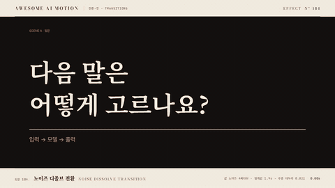

# Nº 184 노이즈 디졸브 전환 · Noise Dissolve Transition



[MP4](clip.mp4) · [HTML](index.html)

**노이즈 값이 진행률보다 낮은 픽셀부터 지워져 앞 장면에 얼룩진 구멍이 번지고 다음 장면이 드러난다**

Pixels whose noise value falls below the progress disappear first, so blotchy holes spread through the first scene and reveal the next.

| Family | Level | Purpose | Media | Runtime |
|---|---|---|---|---|
| 전환·컷 · TRANSITIONS | 고급 | 전환, 주목 끌기, 분위기 | 설명 영상, 숏폼, 발표, 데이터 스토리 | canvas |

다른 이름 / Also known as: 노이즈 디졸브, Noise Dissolve, Perlin cloud dissolve, 노이즈 구름 디졸브, Pixel noise dissolve, Burn dissolve, Pixel Dissolve

## 선택 기준 / Selection

앞 장면이 녹아 사라지고 뒤 장면이 스며 나오는 느낌. 질문이 답으로 바뀌는 순간을 부드럽지만 분명하게 끊는다 / The outgoing scene melts away while the next one seeps through, marking the switch from question to answer softly but clearly.

- 질문 장면에서 답이나 데이터 장면으로 넘어갈 때 / Move from a question scene to an answer or data scene.
- 어두운 표지에서 밝은 본문으로 크게 바꿀 때 / Make a large switch from a dark cover plate to a light body plate.
- 단순 크로스페이드보다 장면 교체를 한 번 더 강조하고 싶을 때 / Emphasize a scene change more than a plain crossfade would.

좋은 예 / Good: 먹색 질문 도판에 구름 같은 구멍이 번지며 주홍 테두리가 경계를 따라가고, 다 지워지면 1위 막대만 주홍으로 바뀐다
나쁜 예 / Bad: 노이즈 격자가 8px처럼 너무 촘촘해 잡티처럼 보이거나, 테두리를 두껍게 빛나게 해 번쩍이는 효과가 된다
주의 / Avoid: 노이즈를 매 프레임 새로 뽑지 않는다(고정 노이즈에 임계값만 이동) · 테두리 두께 0.04 초과 금지(경계가 번쩍임처럼 보임) · 두 장면 모두 밝으면 구멍이 안 보인다(명도 차 확보)

## 파라미터 / Parameters

| Parameter | Default | Range | Note |
|---|---|---|---|
| 노이즈 격자 | 190·95·48·16px | 큰 격자 120~260px | 클수록 큰 얼룩, 작은 옥타브는 가장자리 거칠기 |
| 전환 시간 | 1.9s | 0.9~2.2s | 교과서 값 0.9s, 교육용은 느리게 |
| 테두리 폭 | 0.022 | 0.01~0.04 | 노이즈 값 단위, 주홍 |
| 임계값 이징 | power1.inOut | none~power2.inOut | 히스토그램 평탄화 뒤라 면적이 이징대로 줄어듦 |

## 구현 / Implementation (GSAP)

```js
// setup: 값 노이즈 4옥타브를 픽셀마다 한 번 계산하고 순위로 평탄화
const th = -RIM - .01 + p * (1 + RIM + .02);
const e = NZ[i] - th;
if (e < 0) d[j + 3] = 0;            // 지워짐: 장면 B
else if (e < RIM) d.set(VERM, j);   // 주홍 테두리
else d.set(A.subarray(j, j + 4), j); // 장면 A
ctx.putImageData(out, 0, 0);
tl.to(pr, { p: 1, duration: 1.9, ease: 'power1.inOut', onUpdate: () => draw(pr.p) }, 0.35);
```

## 프롬프트 / Prompts

### 한국어 · Claude Code
```text
<파일>에서 <대상> 장면을 다음 장면으로 넘길 때 노이즈 디졸브 전환을 넣어줘. 앞 장면은 캔버스에 한 번 그려 두고, 값 노이즈 4옥타브(격자 190·95·48·16px, 시드 고정)를 픽셀마다 계산해 순위로 0~1 평탄화해. 진행률이 노이즈 값을 넘은 픽셀은 투명, 경계 0.022 폭은 주홍 테두리로 칠하고 전환은 1.9초 power1.inOut. 전환이 끝나면 다음 장면의 핵심 한 곳만 주홍으로 바꾸고 0.6초 홀드.
```

### 한국어 · Codex
```text
<파일>의 장면 전환을 노이즈 디졸브로 바꿔. setup에서 앞 장면 ImageData와 평탄화한 노이즈 Float32Array(1280x580)를 만들고, draw(p)는 임계값 th=-0.032+p*1.042로 픽셀을 투명·주홍 테두리·원본 셋 중 하나로 채워 putImageData 한다. GSAP 프록시 tween(0.35초 시작, 1.9초, power1.inOut) onUpdate에서만 호출. 0.7초·1.2초·1.7초·2.8초를 캡처해 얼룩 구멍이 번지고 테두리가 경계를 따라가며 마지막에 B만 남는지 확인해.
```

### English · Claude Code
```text
Add a noise dissolve transition in <file> when <target> hands off to the next scene. Draw the outgoing scene to a canvas once, compute 4-octave value noise per pixel (lattices 190, 95, 48, 16px, fixed seed) and equalize it to 0..1 by rank. Pixels whose noise is below the progress become transparent, a 0.022-wide band at the edge is painted vermilion, and the transition runs 1.9s with power1.inOut. When it ends, turn only the key element of the next scene vermilion and hold 0.6s.
```

### English · Codex
```text
Replace the scene change in <file> with a noise dissolve. In setup, build the outgoing scene ImageData and an equalized noise Float32Array (1280x580); draw(p) sets threshold th = -0.032 + p * 1.042 and fills each pixel as transparent, vermilion rim or original, then calls putImageData. Call it only from a GSAP proxy tween onUpdate (start 0.35s, 1.9s, power1.inOut). Capture 0.7s, 1.2s, 1.7s and 2.8s to verify blotchy holes spreading, the rim tracking the edge, and only scene B remaining.
```

예시 / Example: 노이즈 디졸브 전환를 `.hero`에 적용해. / Apply Noise Dissolve Transition to `.hero`.

## 적용 / Application

- HyperFrames: 장면 B는 DOM, 장면 A는 캔버스에 한 번 그려 ImageData로 보관한다. 프록시 tween onUpdate에서 임계값만 옮겨 putImageData, 노이즈 배열은 시드로 고정
- ReelForge: 전환 비트에 노이즈 격자(190px)·전환 시간(1.9s)·테두리 폭(0.022)을 파라미터로 두고, 앞 장면은 캔버스 스냅샷으로 받는다
- Scrolline Deck: 임계값을 스크롤 진행률에 묶는다. 노이즈는 한 번만 계산하므로 역스크롤에도 같은 모양으로 되돌아간다

조합 / Pair with: [번 전환 · Burn Transition](../burn-transition/) · [워프 디졸브 · Warp Dissolve](../warp-dissolve/) · [크로스페이드 · Crossfade](../crossfade/) · [막대 성장 · Bar Grow](../bar-grow/)

출처 / Sources: [heygen-com/hyperframes, domain-warp-dissolve](https://raw.githubusercontent.com/heygen-com/hyperframes/main/registry/blocks/domain-warp-dissolve/registry-item.json) (Apache-2.0) · [heygen-com/hyperframes, code-shader-dissolve](https://raw.githubusercontent.com/heygen-com/hyperframes/main/registry/blocks/code-shader-dissolve/registry-item.json) (Apache-2.0) · [iart-ai/webgl-animation-skills, shader-glsl](https://github.com/iart-ai/webgl-animation-skills/blob/HEAD/skills/shader-glsl/SKILL.md) (MIT) · [three.js examples, webgl_postprocessing_transition](https://threejs.org/examples/#webgl_postprocessing_transition) (MIT) · [gl-transitions, randomNoisex](https://github.com/gl-transitions/gl-transitions/blob/master/transitions/randomNoisex.glsl) (MIT)

[목록 / Catalog](../../references/catalog.md) · [index.json](../../index.json)
