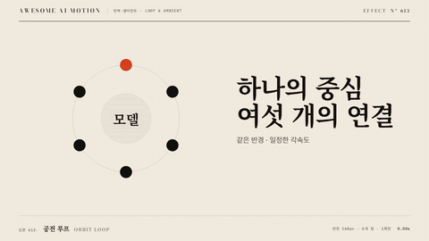

# Nº 613 공전 루프 · Orbit Loop



[MP4](clip.mp4) · [HTML](index.html)

**아이콘이나 이미지가 중심 객체 주위를 같은 또는 서로 다른 궤도로 돈다.**

Objects orbit a central subject while keeping their labels upright.

| Family | Level | Purpose | Media | Runtime |
|---|---|---|---|---|
| 반복·앰비언트 · LOOP & AMBIENT | 중급 | 피드백, 순서·흐름 | 제품 시연, 설명 영상, 웹 UI | css |

다른 이름 / Also known as: Orbiting Objects, 객체 공전, Orbiting Opposed Dots, 마주 도는 두 점

## 선택 기준 / Selection

중심과 연결된 대상들의 관계를 보여 준다. / Shows relationships organized around a shared center.

- 중앙 서비스 주위의 여섯 연동 아이콘이 방향을 유지하며 공전한다에서 지속 활동을 표시할 때 / Explain integrations around a central service.
- 짧은 반복으로 중심과 연결된 대상들의 관계를 보여 준다 때 / Use a short repeating motion to communicate shows relationships organized around a shared center.

좋은 예 / Good: 중앙 서비스 주위의 여섯 연동 아이콘이 방향을 유지하며 공전한다
나쁜 예 / Bad: 궤도가 너무 좁아 아이콘과 중앙 설명이 겹친다
주의 / Avoid: 궤도가 너무 좁아 아이콘과 중앙 설명이 겹친다 상황을 피한다 · 동작 감소 설정에서는 첫 프레임을 고정한다

## 파라미터 / Parameters

| Parameter | Default | Range | Note |
|---|---|---|---|
| 주기 | 10000ms | 7500~15000ms | 한 번의 반복에 걸리는 시간이다 |
| 반경 | 120px | 80~200px | 1920x1080 기준 중심과의 거리다 |
| 객체 수 | 6개 | 3~8개 | 아이콘이 겹치지 않게 배치한다 |
| 이징 | linear | linear \| ease-in-out | 경로 이동은 등속, 맥동은 부드러운 왕복을 쓴다 |

## 구현 / Implementation (GSAP)

```js
.fx { position:relative; width:240px; height:240px; }
.fx .orbit { position:absolute; inset:0; animation:orbit 10s linear infinite; }
.fx .item { position:absolute; left:120px; top:120px; transform:rotate(calc(var(--i)*60deg)) translateX(120px); }
.fx .icon { display:block; animation:upright 10s linear infinite; rotate:calc(var(--i)*-60deg); }
@keyframes orbit { to { transform:rotate(360deg); } }
@keyframes upright { to { transform:rotate(-360deg); } }
```

## 프롬프트 / Prompts

### 한국어 · Claude Code
```text
<대상>에 공전 루프를 적용해. 주기 10000ms, 반경 120px, 객체 수 6개, 이징 linear로 구현해. 예시 코드의 요소 구조를 함께 만들고 하나의 paused 타임라인으로 seek 가능하게 연결해. 동작 감소 설정에서는 첫 프레임을 유지해.
```

### 한국어 · Codex
```text
<파일>의 대기 표시 또는 배경 영역에 공전 루프를 적용해. 주기 10000ms, 반경 120px, 객체 수 6개, 이징 linear를 사용하고 반복 위상을 절대 시간에서 계산해. 0초, 5초, 10초를 캡처해 중간 변화와 첫 프레임으로의 연결을 확인해.
```

### English · Claude Code
```text
Apply Orbit Loop to <target>. Use a 10-second cycle, six objects on a 120px radius with counter-rotation, and linear easing. Include the required element structure and drive the effect with one paused, seekable timeline. Hold the first frame when reduced motion is enabled.
```

### English · Codex
```text
Apply Orbit Loop in the waiting indicator or background region of <file>. Use a 10-second cycle, six objects on a 120px radius with counter-rotation, and linear easing; derive loop phase from absolute time. Capture at 0, 5, and 10 seconds to verify the intermediate change and the return to the starting frame.
```

예시 / Example: 공전 루프를 `.hero`에 적용해. / Apply Orbit Loop to `.hero`.

## 적용 / Application

- HyperFrames: paused 타임라인을 만들고 seek 시 CSS 애니메이션은 일시 정지하고 currentTime을 타임라인 시간으로 맞춘다. 주기는 10000ms로 고정한다.
- ReelForge: 씬 워커 브리프에 공전 루프, 주기 10000ms, 반경 120px, 객체 수 6개를 싣고 씬 길이에서 반복을 자른다.
- Scrolline Deck: 진행률 0~1을 10초 한 주기에 매핑한다. scrub은 스프링 대신 ease-out을 쓰고 끝점의 반복 연결을 확인한다.

조합 / Pair with: [아크 · Arcs](../arc-motion/) · [그룹 이동 · Group Motion](../group-motion/) · [선 그리기 · Line Draw](../line-draw/)

출처 / Sources: [magicuidesign/magicui](https://magicui.design/docs/components/orbiting-circles) (MIT) · [DavidHDev/react-bits](https://github.com/DavidHDev/react-bits) (MIT + Commons Clause v1.0) · [tobiasahlin/SpinKit](https://github.com/tobiasahlin/SpinKit) (MIT) · [css-loaders.com](https://css-loaders.com/) (unknown)

[목록 / Catalog](../../references/catalog.md) · [index.json](../../index.json)
