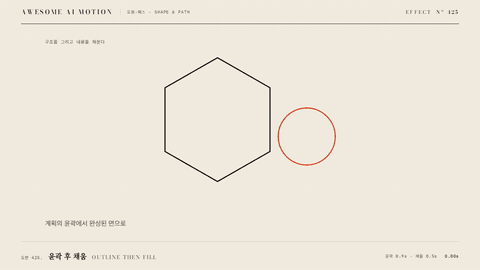

# Nº 425 윤곽 후 채움 · Outline Then Fill



[MP4](clip.mp4) · [HTML](index.html)

**윤곽선이 먼저 그려진 뒤 내부 면과 색이 채워지는 2단계 등장**

The outline or wireframe appears first, then the interior surfaces and color fill in.

| Family | Level | Purpose | Media | Runtime |
|---|---|---|---|---|
| 도형·패스 · SHAPE & PATH | 기본 | 설명, 순서·흐름 | 설명 영상, 발표, 숏폼 | svg |

다른 이름 / Also known as: Trace Fill, 윤곽 뒤 채움, trace-then-fill, svg-path-draw, outline-to-fill, Border then fill, 윤곽 뒤 채우기, DrawBorderThenFill

## 선택 기준 / Selection

구조가 먼저 보이고 내용이 나중에 확정되는 순서를 만든다. 완료와 확정의 느낌이 채움 순간에 실린다 / Shows structure before content, and lets the fill moment carry a sense of completion.

- 아이콘이나 로고를 그린 뒤 색을 입혀 완성할 때 / Draw an icon or logo, then color it in.
- 도형 다이어그램에서 뼈대를 먼저 보여 줄 때 / Show the skeleton of a shape diagram first.
- 계획 단계와 확정 단계를 시각으로 구분할 때 / Separate planning from confirmed state visually.

좋은 예 / Good: 아이콘 윤곽이 700ms에 그려지고 이어 400ms에 내부가 색으로 채워지며 stroke 2px은 그대로 남는다
나쁜 예 / Bad: 윤곽과 채움이 동시에 시작해 단계가 구분되지 않거나, 채움 후 윤곽이 사라져 형태가 무뎌진다
주의 / Avoid: 채움은 윤곽이 90% 이상 그려진 뒤에 시작한다 · stroke 폭은 도형 크기에 비례해 1.5~3px로 한다 · 여러 도형은 80ms 이상 간격을 둔다

## 파라미터 / Parameters

| Parameter | Default | Range | Note |
|---|---|---|---|
| 윤곽 시간 | 0.7s | 0.5~1.0s | dashoffset |
| 채움 시간 | 0.4s | 0.3~0.6s | fill-opacity |
| stroke 폭 | 2px | 1.5~3px | 정지 후에도 유지 |
| 도형 간격 | 0.12s | 0.08~0.2s | 여러 도형일 때 |
| 이징 | power2.out | power1~power3 | 윤곽 |

## 구현 / Implementation (GSAP)

```js
shapes.forEach((s, i) => {
  const len = s.getTotalLength();
  gsap.set(s, { strokeDasharray: len, strokeDashoffset: len, fillOpacity: 0 });
  tl.to(s, { strokeDashoffset: 0, duration: 0.7, ease: 'power2.out' }, i * 0.12)
    .to(s, { fillOpacity: 1, duration: 0.4, ease: 'power1.inOut' }, 0.65 + i * 0.12);
});
```

## 프롬프트 / Prompts

### 한국어 · Claude Code
```text
GSAP으로 <SVG>를 윤곽 후 채움으로 등장시켜 줘. stroke 2px 윤곽을 stroke-dashoffset으로 0.7초 power2.out에 그리고, 0.65초 시점부터 fill-opacity를 0에서 1로 0.4초 동안 올려. 도형이 여러 개면 0.12초 간격으로 시작하고 윤곽은 채워진 뒤에도 남겨. paused 타임라인으로 만들어.
```

### 한국어 · Codex
```text
<파일>의 SVG 도형에 outline-then-fill을 적용해. 각 경로에 getTotalLength로 dasharray와 dashoffset을 세팅하고 strokeDashoffset 0을 position i*0.12, duration 0.7, ease power2.out으로, fillOpacity 1을 position 0.65+i*0.12, duration 0.4로 건다. 0.35초에는 윤곽만 반쯤, 0.9초에는 채움 시작, 1.6초에는 윤곽과 채움이 모두 남는지 캡처로 확인해.
```

### English · Claude Code
```text
Use GSAP to reveal <SVG> as outline then fill. Draw the 2px stroke with stroke-dashoffset over 0.7 seconds with power2.out, then from 0.65 seconds raise fill-opacity from 0 to 1 over 0.4 seconds. If there are several shapes, offset each by 0.12 seconds, and keep the outline after the fill. One paused timeline.
```

### English · Codex
```text
Apply outline-then-fill to the SVG shapes in <file>. Set dasharray and dashoffset from getTotalLength; tween strokeDashoffset to 0 at position i*0.12, duration 0.7, ease power2.out, and fillOpacity to 1 at position 0.65+i*0.12, duration 0.4. Capture 0.35s (outline half drawn), 0.9s (fill starting) and 1.6s (outline and fill both present).
```

예시 / Example: 윤곽 후 채움를 `.hero`에 적용해. / Apply Outline Then Fill to `.hero`.

## 적용 / Application

- HyperFrames: getTotalLength로 경로 길이를 로드 시 계산해 dasharray를 세팅하고 dashoffset과 fillOpacity만 paused 타임라인에서 움직인다
- ReelForge: 브리프에 SVG 파일, 윤곽 0.7s, 채움 0.4s, stroke 2px, 채움 색을 싣는다
- Scrolline Deck: 진행률 0~0.6에 윤곽, 0.55~1.0에 채움을 매핑하고 되감으면 채움이 먼저 사라진다

조합 / Pair with: [선 그리기 · Line Draw](../line-draw/) · [모프 전환 · Morph](../shape-morph/) · [스태거 · Stagger](../stagger/)

출처 / Sources: gongnyang/reelforge (`gongnyang/reelforge:skills/reelforge/references/grammar/06-shapes-strokes.md#trace-then-fill`) (Apache-2.0) · [ManimCommunity/manim](https://github.com/ManimCommunity/manim/blob/main/manim/animation/creation.py) (MIT) · [oframe/ogl](https://oframe.github.io/ogl/examples/wireframe-shader.html) (unknown) · gongnyang/reelforge (`gongnyang/reelforge:skills/reelforge/references/gallery/gallery-index.json`) (Apache-2.0) · [mrdoob/three.js](https://threejs.org/examples/#webgpu_lines_fat_wireframe) (MIT) · [DavidHDev/react-bits](https://github.com/DavidHDev/react-bits) (MIT + Commons Clause v1.0) · [ui.aceternity.com](https://ui.aceternity.com/components/text-hover-effect) (unknown) · [helpx.adobe.com](https://helpx.adobe.com/after-effects/desktop/animating-text/text-animation/animating-text.html) (unknown)

[목록 / Catalog](../../references/catalog.md) · [index.json](../../index.json)
