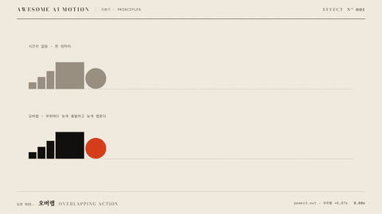

# Nº 001 오버랩 · Overlapping Action



[MP4](clip.mp4) · [HTML](index.html)

**한 물체의 부위들이 같은 방향으로 움직이되 출발과 정지 시각이 조금씩 어긋나는 움직임**

Parts of an object move in the same direction with slightly offset start and stop times.

| Family | Level | Purpose | Media | Runtime |
|---|---|---|---|---|
| 기본기 · PRINCIPLES | 기본 | 분위기, 순서·흐름 | 설명 영상, 숏폼, 웹 UI | gsap |

다른 이름 / Also known as: 시간차 동작, 드래그, Drag, Offset timing, 겹치는 동작, 겹침 동작, Time Delayed Follower

## 선택 기준 / Selection

물체에 무게와 유연함이 있다는 느낌. 한 덩어리로 딱딱하게 움직이는 것보다 살아 있고 자연스럽게 읽힌다 / Conveys weight and flexibility, making the object feel alive and natural.

- 캐릭터·아이콘·카드 묶음처럼 여러 부분이 붙은 대상을 옮길 때 / Move objects with connected parts, such as characters, icons, or groups of cards.
- 목록이나 카드 무리가 한꺼번에 이동할 때 부위별로 살짝 늦게 따라오게 할 때 / Let individual parts lag slightly as a list or group of cards moves together.

좋은 예 / Good: 카드 묶음이 오른쪽으로 옮겨질 때 제목 줄이 먼저, 본문 줄이 0.06초 늦게 도착해 한 장처럼 흐른다
나쁜 예 / Bad: 시간차를 0.3초 이상 벌려 부위가 따로 노는 것처럼 보이거나, 모든 버튼·글자마다 걸어 화면이 출렁인다
주의 / Avoid: 부위 간 시간차 0.12초 초과 금지(따로 노는 것처럼 보임) · 정보 읽기가 우선인 표·본문에는 쓰지 않는다

## 파라미터 / Parameters

| Parameter | Default | Range | Note |
|---|---|---|---|
| 부위 간 시간차 | 0.07s | 0.04~0.10s | 앞 부위가 먼저 출발 |
| 부위별 지속 증가 | +0.06s | 0.03~0.08s | 뒤 부위일수록 늦게 멈춤 |
| 기본 지속 | 1.1s | 0.6~1.4s | 이동 거리에 비례 |
| 이징 | power3.inOut | power2~power4 | 출발·정지가 모두 보이는 이동 |

## 구현 / Implementation (GSAP)

```js
const parts = ['.head', '.body', '.t1', '.t2', '.t3'];
parts.forEach((s, i) => {
  tl.to(s, { x: 820, duration: 1.1 + i * 0.06, ease: 'power3.inOut' }, 0.25 + i * 0.07);
});
```

## 프롬프트 / Prompts

### 한국어 · Claude Code
```text
GSAP 타임라인으로 <대상>(머리·몸통·꼬리처럼 부위가 나뉜 요소)을 오른쪽으로 820px 옮기는데 오버랩을 넣어줘. 앞 부위가 먼저 출발하고 뒤 부위는 0.07초씩 늦게 출발하게, 각 부위 duration은 1.1초에서 뒤로 갈수록 0.06초씩 늘려 늦게 멈추게 해. 이징은 power3.inOut, 도착 뒤 0.6초 정지. transform만 쓰고 paused 타임라인 하나로 seek 가능하게 만들어.
```

### 한국어 · Codex
```text
<파일>의 이동 장면에 오버랩(overlapping action)을 적용해. 요소를 부위 배열로 나눠 i번째 부위 tween을 position 0.25+i*0.07, duration 1.1+i*0.06, ease power3.inOut으로 건다. Math.random·setTimeout 없이 타임라인만 쓰고, 0.4초·1.0초·2.7초 시점을 캡처해 부위 간 간격이 벌어졌다가 닫히는지 확인해.
```

### English · Claude Code
```text
Use a GSAP timeline to move <target>, an element with distinct parts such as a head, body, and tail, 820px to the right with overlapping action. Start the leading part first and delay each following part by 0.07 seconds. Set each part's duration to 1.1 seconds, increasing it by 0.06 seconds for each successive part so it stops later. Use power3.inOut and hold for 0.6 seconds after arrival. Animate transforms only and use a single paused timeline that supports seeking.
```

### English · Codex
```text
Apply overlapping action to the movement scene in <file>. Divide the element into an array of parts and tween part i at position 0.25+i*0.07 with duration 1.1+i*0.06 and ease power3.inOut. Use only the timeline, without Math.random or setTimeout. Capture at 0.4, 1.0, and 2.7 seconds to verify that the spacing between parts opens up and then closes.
```

예시 / Example: 오버랩를 `.hero`에 적용해. / Apply Overlapping Action to `.hero`.

## 적용 / Application

- HyperFrames: 한 paused 타임라인 안에서 부위마다 position 인자를 0.07초씩 밀어 쓴다. 부위는 transform x/y만 움직인다
- ReelForge: 오브젝트 씬의 이동 비트에 부위 분리 마크업(data-part)을 두고 시간차만 파라미터로 노출한다
- Scrolline Deck: scrub 타임라인이라 시간차가 진행률 비율로 바뀐다. 0.07초 대신 진행률 0.02~0.03 간격으로 옮긴다

조합 / Pair with: [팔로스루 · Follow-through](../follow-through/) · [스태거 · Stagger](../stagger/) · [이징 · Easing](../easing-curves/)

출처 / Sources: [Disney 12 principles, Thomas & Johnston, The Illusion of Life (1981)](https://en.wikipedia.org/wiki/Twelve_basic_principles_of_animation) (개념 인용) · motion dictionary 1-principles.md#3.1 함께 쓰지만 구분해야 할 하위 개념 (own) · [helpx.adobe.com](https://helpx.adobe.com/after-effects/desktop/work-with-expressions/expression-examples/expression-examples.html) (unknown) · [airbnb/lottie-web](https://github.com/airbnb/lottie-web) (MIT) · [iart-ai/generative-illustration-skills](https://github.com/iart-ai/generative-illustration-skills) (unknown) · [heygen-com/hyperframes](https://github.com/heygen-com/hyperframes/blob/HEAD/skills/hyperframes-animation/adapters/lottie.md) (Apache-2.0)

[목록 / Catalog](../../references/catalog.md) · [index.json](../../index.json)
