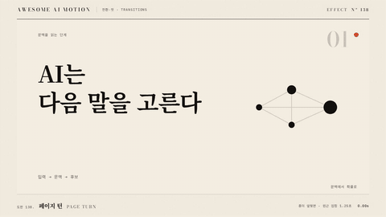

# Nº 138 페이지 턴 · Page Turn



[MP4](clip.mp4) · [HTML](index.html)

**페이지 한쪽이나 모서리가 접히고 말려 올라가 뒷면과 그림자를 드러내며 다음 화면으로 넘어간다**

A page corner curls up, exposing the back and a soft shadow, and turns to the next screen.

| Family | Level | Purpose | Media | Runtime |
|---|---|---|---|---|
| 전환·컷 · TRANSITIONS | 고급 | 전환, 순서·흐름 | 설명 영상, 발표, 스크롤덱 | webgl |

다른 이름 / Also known as: Book page turn, 책 페이지 넘기기, bookFlip(), Page curl, 페이지 말림, CC Page Turn

## 선택 기준 / Selection

책장을 넘기듯 다음 이야기로 이어진다는 감각. 순서와 진행을 부드럽게 알린다 / Evokes turning to the next page of a story. Signals order and progress gently.

- 튜토리얼 단계나 이야기 장을 책 넘기듯 나눌 때 / When splitting tutorial steps or story chapters like turning pages
- 전자책, 매뉴얼, 앨범처럼 종이 매체를 소재로 한 영상에서 화면을 바꿀 때 / When the subject is paper media such as ebooks, manuals, or albums

좋은 예 / Good: 오른쪽 모서리가 말려 올라가며 0.9초 동안 뒷면이 보이고, 말림 반경은 화면 폭의 16%, 그림자 opacity 0.25가 말림을 따라간다
나쁜 예 / Bad: 말림이 너무 작아 잘 안 보이거나, 뒷면과 그림자 없이 앞면만 접혀 평면 회전으로 보인다
주의 / Avoid: 말림 반경은 화면 폭의 10~20% 안에 둔다 · 한 영상에서 두 번 넘게 반복하지 않는다(장식으로 읽힘)

## 파라미터 / Parameters

| Parameter | Default | Range | Note |
|---|---|---|---|
| 지속 | 900ms | 700~1200ms | power2.inOut |
| 말림 반경 | 화면 폭 16% | 10~20% | 클수록 종이가 두꺼워 보임 |
| 그림자 opacity | 0.25 | 0.15~0.35 | 말림 뒤쪽에 드리움 |
| 방향 | 오른쪽에서 왼쪽 | 좌우 또는 상하 | 읽는 방향과 맞춘다 |
| 뒷면 밝기 | 0.9 | 0.8~1.0 | 뒷면은 약간 어둡게 |

이징 / Ease: `power2.inOut`

## 구현 / Implementation (GSAP)

```js
// 2D 근사: 앞면 클립을 접는 각도로 진행
const t = { p: 0 };
tl.to(t, { p: 1, duration: 0.9, ease: 'power2.inOut',
  onUpdate: () => drawCurl(t.p) }, 0); // 반경 0.16*1920, 그림자 0.25
tl.set('.prev', { autoAlpha: 0 }, 0.9);
```

## 프롬프트 / Prompts

### 한국어 · Claude Code
```text
<대상> 장면 끝에 페이지 턴 전환을 넣어줘. 오른쪽에서 왼쪽으로 900ms, power2.inOut으로 진행하고 말림 반경은 화면 폭의 16%, 말림 뒤에 opacity 0.25 그림자를 깔아줘. 뒷면은 앞면보다 10% 어둡게. 진행률 p 하나로 그리는 함수로 만들어 paused 타임라인에서 seek해도 같은 프레임이 나오게 해.
```

### 한국어 · Codex
```text
<파일>에 페이지 턴 전환을 구현해. p를 0에서 1로 0.9초 power2.inOut, drawCurl(p)에서 반경 0.16*1920px, 그림자 0.25. 0.3초, 0.45초, 0.6초, 0.9초 시점을 캡처해 말림이 점점 커지는지, 뒷면이 보이는지, 0.9초에 이전 페이지가 완전히 사라졌는지 확인해. 난수와 setTimeout은 쓰지 마.
```

### English · Claude Code
```text
Add a Page Turn transition at the end of <target>. Run it right to left over 900ms with power2.inOut, curl radius 16% of frame width, and a 0.25 opacity shadow behind the curl. Make the back side 10% darker. Drive it with one progress value p and a drawCurl(p) function so seeking a paused timeline yields identical frames.
```

### English · Codex
```text
Implement Page Turn in <file>. Tween p from 0 to 1 over 0.9s with power2.inOut; drawCurl(p) uses radius 0.16*1920px and shadow 0.25. Capture at 0.3s, 0.45s, 0.6s, and 0.9s to confirm the curl grows, the back side shows, and the previous page is fully gone at 0.9s. No randomness or setTimeout.
```

예시 / Example: 페이지 턴를 `.hero`에 적용해. / Apply Page Turn to `.hero`.

## 적용 / Application

- HyperFrames: 말림은 진행률 p 하나로 그리는 함수 drawCurl(p)로 짜고, onUpdate가 아니라 타임라인 시각으로 계산해 seek 시 같은 프레임이 나오게 한다. WebGL이면 uniform 하나만 움직인다
- ReelForge: 씬 워커 브리프에 방향, 반경 16%, 그림자 0.25, 지속 900ms를 싣는다. 텍스처는 앞뒤 장면을 미리 렌더한 두 장을 넘긴다
- Scrolline Deck: scrub에서 p를 스크롤 진행률에 직접 매핑하면 사용자가 페이지를 손으로 넘기는 느낌이 나서 잘 맞는다. 스프링 없이 선형에 가까운 ease-out으로 둔다

조합 / Pair with: [큐브 전환 · Cube Transition](../cube-transition/) · [종이 접기 전환 · Origami Fold Transition](../origami-fold/) · [와이프 · Wipe](../wipe/)

출처 / Sources: [gl-transitions/gl-transitions](https://github.com/gl-transitions/gl-transitions/blob/master/transitions/BookFlip.glsl) (MIT) · [remotion-dev/remotion](https://www.remotion.dev/docs/transitions/presentations/book-flip) (Remotion License) · [mifi/editly](https://github.com/mifi/editly#transition-types) (MIT) · [gl-transitions/gl-transitions](https://github.com/gl-transitions/gl-transitions/blob/master/transitions/InvertedPageCurl.glsl) (BSD-3-Clause) · [helpx.adobe.com](https://helpx.adobe.com/after-effects/desktop/apply-effects-and-animation-presets/list-of-effects/transition-effects.html) (unknown)

[목록 / Catalog](../../references/catalog.md) · [index.json](../../index.json)
