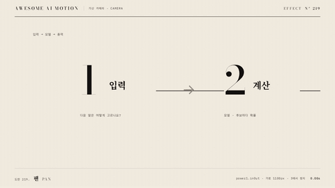

# Nº 219 팬 · Pan



[MP4](clip.mp4) · [HTML](index.html)

**확대율을 유지한 채 가로로 긴 장면을 한 방향으로 훑는 카메라 움직임**

A camera move that scans a wide scene in one direction while keeping the scale constant.

| Family | Level | Purpose | Media | Runtime |
|---|---|---|---|---|
| 가상 카메라 · CAMERA | 기본 | 순서·흐름, 설명 | 설명 영상, 발표, 스크롤덱 | gsap |

다른 이름 / Also known as: 수평 팬, 가로 카메라 이동, Pan stations, 정거장 팬, Horizontal Gallery, 가로 갤러리 팬, Camera Pan, 카메라 팬

## 선택 기준 / Selection

공간에 놓인 단계의 순서와 흐름을 보여준다 / Shows the sequence and flow of stages arranged across a space.

- 긴 프로세스 도해를 차례로 훑을 때 / When scanning a long process diagram in sequence
- 가로로 놓인 장면의 마지막 대상에서 멈출 때 / When stopping on the final subject in a horizontal scene

좋은 예 / Good: 입력, 계산, 출력 도해를 오른쪽으로 훑고 3 출력에서 멈춘 뒤 주홍으로 강조한다
나쁜 예 / Bad: 이동 도중 방향을 여러 번 바꾸거나 마지막 단계가 잘린 채 멈춘다
주의 / Avoid: 이동 도중 방향을 여러 번 바꾸거나 마지막 단계가 잘린 채 멈춘다 · 최종 상태를 0.5초 미만으로 유지하지 않는다

## 파라미터 / Parameters

| Parameter | Default | Range | Note |
|---|---|---|---|
| 이동 거리 | -1100px | -600~-1400px | 3번 정거장 시작 위치에 맞춤 |
| 정거장 간격 | 550px | 420~650px | 서로 독립된 화면 위치 |
| 동작 시간 | 2.0s | 1.5~2.1s | 3에서 2.3초에 정지 |
| 이징 | power1.inOut | none / power1.inOut | 단방향 이동 유지 |

## 구현 / Implementation (GSAP)

```js
tl.to('#strip', {x: -1100, duration: 2.0, ease: 'power1.inOut'}, .3);
tl.to('#s3 .num, #s3 .t-m', {color: 'var(--verm)', duration: .15}, 2.3);
tl.to('#note', {opacity: 1, duration: .15}, 2.3);
```

## 프롬프트 / Prompts

### 한국어 · Claude Code
```text
<대상>에 팬 효과를 GSAP 코어로 만들어줘. 입력, 계산, 출력 도해를 오른쪽으로 훑고 3 출력에서 멈춘 뒤 주홍으로 강조한다 3초 클립에서 0.3초까지 시작 상태를 유지하고 다음 기본값을 적용해: 이동 거리 -1100px, 정거장 간격 550px, 동작 시간 2.0s, 이징 power1.inOut. 마지막 0.5초 이상은 완성 상태로 정지하고 시간 제어는 paused 타임라인 하나로 해.
```

### 한국어 · Codex
```text
<파일>의 scene 내부에 팬를 적용해. 이동 거리는 -1100px. 정거장 간격는 550px. 동작 시간는 2.0s. 이징는 power1.inOut. 0.23초, 1.23초, 2.9초를 캡처해 시작 상태와 중간 변화, 입력, 계산, 출력 도해를 오른쪽으로 훑고 3 출력에서 멈춘 뒤 주홍으로 강조한다의 최종 상태를 확인해. 2.5초와 2.9초의 장면이 같은지, 의도한 카메라 프레임 외의 잘림과 라벨 겹침이 없는지 검증해.
```

### English · Claude Code
```text
Create a Pan effect on <target> using GSAP core. Scan the input, computation, and output diagram to the right, stop at 3 Output, and highlight it in vermilion. In a 3-second clip, hold the initial state until 0.3 seconds and apply these defaults: translation -1100px, stop spacing 550px, duration 2.0s, ease power1.inOut. Hold the completed state for at least the final 0.5 seconds, and control timing with a single paused timeline.
```

### English · Codex
```text
Apply Pan inside the scene in <file>. Use these settings: translation -1100px, stop spacing 550px, duration 2.0s, ease power1.inOut. Capture at 0.23, 1.23, and 2.9 seconds to check the initial state, intermediate changes, and the final state: Scan the input, computation, and output diagram to the right, stop at 3 Output, and highlight it in vermilion. Verify that the scenes at 2.5 and 2.9 seconds match, with no clipping beyond the intended camera frame or overlapping labels.
```

예시 / Example: 팬를 `.hero`에 적용해. / Apply Pan to `.hero`.

## 적용 / Application

- HyperFrames: 장면 내부 래퍼를 하나의 paused GSAP 타임라인으로 움직이고 seek 시 같은 좌표를 재현한다.
- ReelForge: 장면 내부 요소의 transform 키프레임에 위 기본값을 적용하고 3초 끝까지 최종 상태를 유지한다.
- Scrolline Deck: 0.3~2.5초 동작 구간을 스크롤 진행률 0.1~0.83에 대응시키고 끝 구간은 최종 상태로 둔다.

조합 / Pair with: [패럴랙스 · Parallax](../parallax/) · [선 그리기 · Line Draw](../line-draw/) · [점진적 공개 · Progressive Disclosure](../progressive-disclosure/)

출처 / Sources: [GSAP Timeline.to()](https://gsap.com/docs/v3/GSAP/Timeline/to()/) (공식 API 문서 참조) · [heygen-com/hyperframes](https://raw.githubusercontent.com/heygen-com/hyperframes/main/registry/components/pan-stations/registry-item.json) (Apache-2.0) · [helpx.adobe.com](https://helpx.adobe.com/after-effects/desktop/work-with-layers/camera-layer/cameras-lights-points-interest.html) (unknown) · motion dictionary 2-transitions-camera.md#22. 팬 · Pan (own) · motion dictionary 2-transitions-camera.md#23. 틸트 · Tilt (own)

[목록 / Catalog](../../references/catalog.md) · [index.json](../../index.json)
