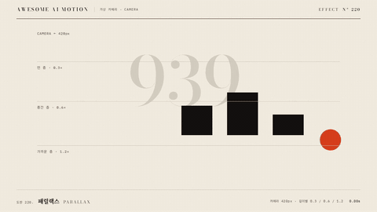

# Nº 220 패럴랙스 · Parallax



[MP4](clip.mp4) · [HTML](index.html)

**카메라가 이동할 때 가까운 층은 빠르게, 먼 층은 느리게 흘러 깊이를 만드는 움직임**

A motion effect that creates depth by moving nearer layers faster and distant layers more slowly as the camera moves.

| Family | Level | Purpose | Media | Runtime |
|---|---|---|---|---|
| 가상 카메라 · CAMERA | 중급 | 강조, 설명 | 설명 영상, 발표, 스크롤덱 | gsap |

다른 이름 / Also known as: 시차, 다층 이동, Layered Word Depth Drift, 단어 깊이 이동, 2.5D Parallax, 2.5D 패럴랙스, Multiplane, Depth Parallax

## 선택 기준 / Selection

평면 소재 사이에 거리와 공간감을 만든다 / Creates a sense of distance and space between flat elements.

- 배경과 전경의 거리를 보여줄 때 / When showing the distance between foreground and background
- 스크롤 장면에서 여러 깊이의 소재를 이동시킬 때 / When moving elements at multiple depths in a scrolling scene

좋은 예 / Good: 939 배경은 72px, 먹 블록은 144px, 가까운 주홍 점은 288px 이동한다
나쁜 예 / Bad: 모든 층을 같은 거리로 옮겨 깊이 차이가 사라진다
주의 / Avoid: 모든 층을 같은 거리로 옮겨 깊이 차이가 사라진다 · 최종 상태를 0.5초 미만으로 유지하지 않는다

## 파라미터 / Parameters

| Parameter | Default | Range | Note |
|---|---|---|---|
| 카메라 이동 | 240px | 160~300px | 각 층 이동의 기준 |
| 깊이 배율 | 0.3 / 0.6 / 1.2 | 0.2~1.4 | 가까울수록 크게 |
| 이동 시간 | 2.1s | 1.5~2.2s | 0.3초 시작 후 2.4초 정지 |
| 이징 | none | none | 층간 속도 비율 유지 |

## 구현 / Implementation (GSAP)

```js
[ ['#far', .3], ['#mid', .6], ['#near', 1.2] ].forEach(([s, ratio]) => {
  tl.to(s, {x: -240 * ratio, duration: 2.1, ease: 'none'}, .3);
});
tl.to('#note', {opacity: 1, duration: .1}, 2.4);
```

## 프롬프트 / Prompts

### 한국어 · Claude Code
```text
<대상>에 패럴랙스 효과를 GSAP 코어로 만들어줘. 939 배경은 72px, 먹 블록은 144px, 가까운 주홍 점은 288px 이동한다 3초 클립에서 0.3초까지 시작 상태를 유지하고 다음 기본값을 적용해: 카메라 이동 240px, 깊이 배율 0.3 / 0.6 / 1.2, 이동 시간 2.1s, 이징 none. 마지막 0.5초 이상은 완성 상태로 정지하고 시간 제어는 paused 타임라인 하나로 해.
```

### 한국어 · Codex
```text
<파일>의 scene 내부에 패럴랙스를 적용해. 카메라 이동는 240px. 깊이 배율는 0.3 / 0.6 / 1.2. 이동 시간는 2.1s. 이징는 none. 0.23초, 1.23초, 2.9초를 캡처해 시작 상태와 중간 변화, 939 배경은 72px, 먹 블록은 144px, 가까운 주홍 점은 288px 이동한다의 최종 상태를 확인해. 2.5초와 2.9초의 장면이 같은지, 의도한 카메라 프레임 외의 잘림과 라벨 겹침이 없는지 검증해.
```

### English · Claude Code
```text
Create a Parallax effect on <target> using GSAP core. Move the 939 background by 72px, the ink-black blocks by 144px, and the nearby vermilion dots by 288px. In a 3-second clip, hold the initial state until 0.3 seconds and apply these defaults: camera travel 240px, depth multipliers 0.3 / 0.6 / 1.2, movement duration 2.1s, ease none. Hold the completed state for at least the final 0.5 seconds, and control timing with a single paused timeline.
```

### English · Codex
```text
Apply Parallax inside the scene in <file>. Use these settings: camera travel 240px, depth multipliers 0.3 / 0.6 / 1.2, movement duration 2.1s, ease none. Capture at 0.23, 1.23, and 2.9 seconds to check the initial state, intermediate changes, and the final state: Move the 939 background by 72px, the ink-black blocks by 144px, and the nearby vermilion dots by 288px. Verify that the scenes at 2.5 and 2.9 seconds match, with no clipping beyond the intended camera frame or overlapping labels.
```

예시 / Example: 패럴랙스를 `.hero`에 적용해. / Apply Parallax to `.hero`.

## 적용 / Application

- HyperFrames: 장면 내부 래퍼를 하나의 paused GSAP 타임라인으로 움직이고 seek 시 같은 좌표를 재현한다.
- ReelForge: 장면 내부 요소의 transform 키프레임에 위 기본값을 적용하고 3초 끝까지 최종 상태를 유지한다.
- Scrolline Deck: 0.3~2.5초 동작 구간을 스크롤 진행률 0.1~0.83에 대응시키고 끝 구간은 최종 상태로 둔다.

조합 / Pair with: [팬 · Pan](../pan/) · [켄 번스 · Ken Burns](../ken-burns/) · [모션 위계 · Motion Hierarchy](../motion-hierarchy/)

출처 / Sources: [GSAP Timeline.to()](https://gsap.com/docs/v3/GSAP/Timeline/to()/) (공식 API 문서 참조) · [pixel-point/animate-text](https://github.com/pixel-point/animate-text) (unknown) · [helpx.adobe.com](https://helpx.adobe.com/after-effects/desktop/work-with-layers/3d-layers/3d-layers.html) (unknown) · [heygen-com/hyperframes](https://github.com/heygen-com/hyperframes/blob/HEAD/skills/hyperframes-animation/techniques.md) (Apache-2.0) · [basementstudio/scrollytelling](https://github.com/basementstudio/scrollytelling) (MIT) · [iart-ai/webgl-animation-skills](https://github.com/iart-ai/webgl-animation-skills/blob/HEAD/skills/threejs-animation/SKILL.md) (MIT) · [pixel-point/animate-text](https://github.com/pixel-point/animate-text/blob/HEAD/skills/animate-text/references/catalog.md#additional-bundled-specs) (unknown) · [heygen-com/hyperframes](https://raw.githubusercontent.com/heygen-com/hyperframes/main/registry/components/camera-rig-depth-stack/registry-item.json) (Apache-2.0)

[목록 / Catalog](../../references/catalog.md) · [index.json](../../index.json)
