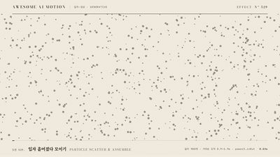

# Nº 529 입자 흩어졌다 모이기 · Particle Scatter & Assemble



[MP4](clip.mp4) · [HTML](index.html)

**화면 전체에 흩어져 떠 있던 입자 수백 개가 날아와 큰 숫자 하나의 모양을 이룬다**

Hundreds of particles floating across the frame fly in and assemble into one large number.

| Family | Level | Purpose | Media | Runtime |
|---|---|---|---|---|
| 입자·생성 · GENERATIVE | 고급 | 주목 끌기, 강조, 데이터 증명, 브랜딩 | 숏폼, 발표, 설명 영상, 데이터 스토리 | canvas |

다른 이름 / Also known as: 입자 조립, 파티클 모으기, Particle morph to text, Particle text formation, 입자 글자 형성

## 선택 기준 / Selection

흩어진 낱개가 모여 하나의 답이 된다는 느낌. 데이터가 결론으로 수렴하는 순간을 한 장면으로 보여 준다 / Scattered pieces converging into a single answer, showing data resolving into a conclusion in one shot.

- 영상 첫 장면에서 핵심 숫자나 로고를 크게 등장시킬 때 / Reveal a key number or logo at full scale in an opening shot.
- 흩어진 표본이 하나의 결론 수치로 모이는 흐름을 보여 줄 때 / Show scattered samples converging into one result figure.
- 장 전환 뒤 제목 숫자를 세울 때 / Set up a chapter number after a transition.

좋은 예 / Good: 점 900개가 화면 가득 떠 있다가 먼 점일수록 늦게 날아와 939를 이루고, 가운데 3만 주홍으로 바뀐다
나쁜 예 / Bad: 입자 수가 200개 아래라 모양이 안 읽히거나, 모든 입자가 같은 시간에 도착해 한 번에 뚝 붙는다
주의 / Avoid: 가는 획이 많은 글꼴을 그대로 샘플링하지 않는다(획이 끊겨 보임, 외곽선을 두껍게 그려 샘플) · 입자마다 매 프레임 Math.random 금지(시드로 미리 계산) · 도착 뒤 계속 흔들리게 두지 않는다(홀드에서 읽혀야 함)

## 파라미터 / Parameters

| Parameter | Default | Range | Note |
|---|---|---|---|
| 입자 수 | 900 | 600~1200 | 적으면 모양이 안 읽히고 많으면 무거움 |
| 비행 시간 | 0.9~1.9s | 0.7~2.2s | 이동 거리에 비례해 먼 입자가 늦게 도착 |
| 출발 지연 | 0.35~0.5s | 0.2~0.6s | 시드 난수로 입자마다 조금씩 |
| 경로 휨 | ±0.25 | 0~0.4 | 이동 벡터의 수직 방향으로 사인 곡선 |
| 카메라 줌 | 1.10 → 1.00 | 1.00~1.20 | 모이는 동안 천천히 물러남 |

이징 / Ease: `power3.inOut`

## 구현 / Implementation (GSAP)

```js
o.fillText('939', x0, base); o.strokeText('939', x0, base); // 오프스크린에 한 번
const img = o.getImageData(0, 0, W, H).data; // 알파>128 격자점 = 목표점
q.dur = .9 + 1.0 * (q.d / maxD); // 먼 입자일수록 늦게 도착
const e = ease(clamp((t - q.t0) / q.dur));
x = fx + dx * e - dy * Math.sin(Math.PI * e) * q.curl;
const pr = { p: 0 };
tl.to(pr, { p: 1, duration: 4, ease: 'none', onUpdate: () => draw(pr.p) }, 0);
```

## 프롬프트 / Prompts

### 한국어 · Claude Code
```text
<파일>에 canvas 2D로 입자 900개가 흩어졌다가 날아와 <대상> 글자를 이루는 장면을 만들어줘. 목표점은 오프스크린 캔버스에 글자를 560px로 한 번 그리고 외곽선 9px을 더한 뒤 getImageData 격자에서 뽑아. 입자 시작점과 흔들림 위상은 시드 난수로 미리 계산하고, 비행 시간은 0.9초에서 거리에 비례해 최대 1.9초, 이징 power3.inOut, 경로는 이동 방향 수직으로 ±0.25만큼 휘게 해. 그리기는 draw(p) 하나로, GSAP 프록시 tween onUpdate에서만 호출하고 끝에 0.8초 홀드.
```

### 한국어 · Codex
```text
<파일>의 오프닝에 입자 흩어졌다 모이기를 구현해. setup에서 오프스크린 캔버스로 목표 텍스트를 그려 알파>128 격자점 900개를 뽑고, 입자마다 시작점·위상·출발 지연(0.35~0.5s)·비행 시간(0.9+1.0*거리비)을 Motion.rand 시드로 배열에 저장한다. draw(p)는 p만으로 위치를 계산하고 속도가 큰 입자만 짧은 꼬리를 그린다. 0.3초·1.0초·1.7초·3.7초를 캡처해 흩어짐, 비행, 부분 조립, 완성 홀드가 순서대로 보이는지 확인해.
```

### English · Claude Code
```text
In <file>, build a canvas 2D scene where 900 particles scatter across the frame and then fly in to form <target>. Sample target points once by drawing the text at 560px on an offscreen canvas with a 9px stroke and reading getImageData on a grid. Precompute start points and drift phases with a seeded random, make flight time 0.9s plus up to 1.0s by distance, ease power3.inOut, and bend each path ±0.25 perpendicular to travel. Draw only in draw(p), called from a GSAP proxy tween onUpdate, and hold 0.8s at the end.
```

### English · Codex
```text
Implement Particle Scatter & Assemble in the opening of <file>. In setup, draw the target text on an offscreen canvas, take 900 grid points with alpha>128, and store per-particle start, phase, departure delay (0.35 to 0.5s) and flight time (0.9 + 1.0 * distance ratio) from Motion.rand. draw(p) computes positions from p alone and adds short trails only to fast particles. Capture 0.3s, 1.0s, 1.7s and 3.7s to verify scatter, flight, partial assembly and the finished hold in order.
```

예시 / Example: 입자 흩어졌다 모이기를 `.hero`에 적용해. / Apply Particle Scatter & Assemble to `.hero`.

## 적용 / Application

- HyperFrames: 캔버스 1280x580 하나에 draw(p)만 두고 paused 타임라인의 프록시 tween onUpdate로 그린다. 입자 900개 시작점·위상은 시드 난수 배열로 미리 만든다
- ReelForge: 오프닝 비트에 목표 텍스트·입자 수(900)·비행 시간(0.9~1.9s)을 파라미터로 노출하고, 도착 뒤 0.8초 홀드를 비트 길이에 포함한다
- Scrolline Deck: 진행률 p를 스크롤 진행률에 그대로 묶는다. 역스크롤하면 다시 흩어지므로 p 0.8 이후 구간을 홀드로 남긴다

조합 / Pair with: [텍스트 입자 디졸브 · Text Particle Dissolve](../text-particle-dissolve/) · [점 재배치 · Dot Regroup](../dot-regroup/) · [전술 배치 전환 · Formation Transition](../formation-transition/) · [카운트업 · Count-up](../count-up/)

출처 / Sources: [MDN, CanvasRenderingContext2D.getImageData()](https://developer.mozilla.org/en-US/docs/Web/API/CanvasRenderingContext2D/getImageData) (CC-BY-SA 2.5) · [GSAP Docs, Tween onUpdate](https://gsap.com/docs/v3/GSAP/Tween/) (개념 인용)

[목록 / Catalog](../../references/catalog.md) · [index.json](../../index.json)
