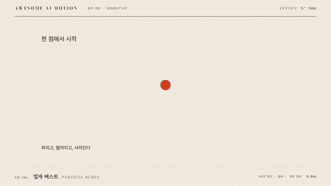

# Nº 506 입자 버스트 · Particle Burst



[MP4](clip.mp4) · [HTML](index.html)

**한 점에서 입자 여러 개가 사방으로 터져 나가 중력에 떨어지며 사라지는 효과**

Particles explode outward from a single point, fall under gravity, and fade out.

| Family | Level | Purpose | Media | Runtime |
|---|---|---|---|---|
| 입자·생성 · GENERATIVE | 중급 | 주목 끌기, 강조, 피드백 | 숏폼, 제품 시연, 웹 UI | canvas |

다른 이름 / Also known as: 입자 폭발, Confetti burst, 색종이 폭발, 색종이 분출, Confetti cannon, Confetti explosion, Confetti, Cool Mode, ClickSpark, Click Burst, cool-mode

## 선택 기준 / Selection

성공, 완료, 축하 같은 순간의 에너지를 보여주고 시선을 그 지점에 모은다 / Shows the energy of a success or completion moment and gathers the eye at that spot.

- 버튼 클릭, 결제 완료, 목표 달성 같은 성취 순간을 표시할 때 / To mark an achievement like a click, payment done, or goal reached
- 로고나 숫자가 나타나는 지점에 폭발적 강조를 줄 때 / To add an explosive accent where a logo or number appears

좋은 예 / Good: 체크 아이콘이 나타나는 순간 입자 80개가 1.2초 동안 퍼졌다가 중력에 떨어지며 페이드된다
나쁜 예 / Bad: 입자 500개를 1초 넘게 화면 전체에 흩뿌려 핵심 텍스트를 가리거나, 매번 다른 무작위 궤적을 쓴다
주의 / Avoid: 입자 수 150개 초과 금지(가독성과 렌더 비용) · 핵심 글자 위에서 입자 opacity 0.6 이하 유지

## 파라미터 / Parameters

| Parameter | Default | Range | Note |
|---|---|---|---|
| 입자 수 | 80개 | 40~150개 | 시드 고정 |
| 수명 | 1200ms | 800~1800ms | 끝 300ms 페이드 |
| 초기 속도 | 240~620px/s | 200~800px/s | 각도는 360도 균등 분산 |
| 중력 | 600px/s² | 400~900px/s² | 아래 방향 |
| 크기 | 4~9px | 3~12px | 수명에 따라 0.4배로 축소 |

이징 / Ease: `power2.out`

## 구현 / Implementation (GSAP)

```js
function mulberry(a){return()=>{a|=0;a=a+0x6D2B79F5|0;let t=Math.imul(a^a>>>15,1|a);t^=t+Math.imul(t^t>>>7,61|t)^t;return((t^t>>>14)>>>0)/4294967296}}
const r=mulberry(7),P=[...Array(80)].map(()=>({a:r()*6.283,v:240+r()*380,s:4+r()*5}));
// draw(p): x=cx+cos(a)*v*t, y=cy+sin(a)*v*t+300*t*t, alpha=1-t/1.2
```

## 프롬프트 / Prompts

### 한국어 · Claude Code
```text
<대상>이 나타나는 순간 입자 버스트를 넣어줘. canvas에 입자 80개를 원점에서 360도로 균등하게 발사해. 초기 속도는 240~620px/s, 중력 600px/s², 수명 1.2초, 마지막 0.3초는 페이드, 크기는 4~9px에서 0.4배로 줄어들게. 난수는 시드 고정으로 매번 같은 궤적, 위치는 progress 값의 순수 함수로 그려서 seek 가능하게 해.
```

### 한국어 · Codex
```text
<파일>에 particle-burst canvas를 구현해. 입자 80개, 수명 1200ms, 중력 600px/s², 속도 240~620px/s, seed 7. 트리거 후 0.2초, 0.6초, 1.3초를 캡처해 입자가 퍼졌다가 낙하하고 1.3초에 캔버스가 비었는지 확인해. 같은 시점을 두 번 렌더해 픽셀이 동일한지도 비교해.
```

### English · Claude Code
```text
Add a particle burst to <target> at the moment it appears. On a canvas, launch 80 particles from the origin evenly over 360 degrees at 240-620px/s, gravity 600px/s^2, lifetime 1.2s with the last 0.3s fading, size 4-9px shrinking to 0.4x. Use a fixed seed so trajectories repeat, and draw positions as a pure function of progress so it is seekable.
```

### English · Codex
```text
Implement a particle-burst canvas in <file>: 80 particles, lifetime 1200ms, gravity 600px/s^2, speed 240-620px/s, seed 7. Capture 0.2s, 0.6s, and 1.3s after the trigger to check the spread, the fall, and an empty canvas at 1.3s. Render the same time twice and compare pixels for identity.
```

예시 / Example: 입자 버스트를 `.hero`에 적용해. / Apply Particle Burst to `.hero`.

## 적용 / Application

- HyperFrames: canvas draw를 tl.eventCallback이 아니라 타임라인 진행값 t의 순수 함수로 그린다. 입자 배열은 시드로 고정해 seek해도 같은 궤적이 나온다
- ReelForge: 씬 워커 브리프에 count, lifetimeMs, gravity, seed, origin(x,y)를 싣는다. 색 팔레트는 브랜드 토큰에서 가져온다
- Scrolline Deck: 트리거 진행률 구간(예: 0.42~0.55)에서만 t를 0~1로 매핑한다. 구간 밖으로 스크롤하면 입자는 즉시 사라진 상태로 둔다

조합 / Pair with: [스프링 오버슛 · Spring & Overshoot](../spring-overshoot/) · [블룸 펄스 · Bloom Pulse](../bloom-pulse/) · [불티 분사 · Spark Spray](../spark-spray/) · [불꽃놀이 · Firework Bloom](../firework/)

출처 / Sources: [heygen-com/hyperframes](https://raw.githubusercontent.com/heygen-com/hyperframes/main/registry/components/confetti/registry-item.json) (Apache-2.0) · [heygen-com/hyperframes](https://raw.githubusercontent.com/heygen-com/hyperframes/main/registry/components/caption-particle-burst/registry-item.json) (Apache-2.0) · local/HyperFrames-skills (`claude-skill:hyperframes-animation/rules/particle-burst.md`) (unknown) · local/music-to-video (`claude-skill:music-to-video/references/motion-primitive-catalog.md#particle-burst`) (unknown) · local/music-to-video (`claude-skill:music-to-video/references/motion-primitives/particle-burst/scene.html`) (unknown)

[목록 / Catalog](../../references/catalog.md) · [index.json](../../index.json)
