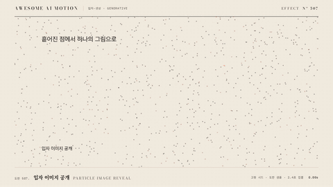

# Nº 507 입자 이미지 공개 · Particle image reveal



[MP4](clip.mp4) · [HTML](index.html)

**흩어진 입자가 모여 이미지의 형태와 색을 이루며 공개되는 효과**

Scattered particles gather into the shape and color of an image and reveal it.

| Family | Level | Purpose | Media | Runtime |
|---|---|---|---|---|
| 입자·생성 · GENERATIVE | 고급 | 주목 끌기, 전환, 브랜딩 | 숏폼, 발표, 웹 UI | canvas |

## 선택 기준 / Selection

조각난 것이 하나로 조립된다는 인상을 주고, 이미지나 로고를 극적으로 등장시킨다 / Suggests something assembled from fragments and gives a logo or image a dramatic entrance.

- 로고나 제품 이미지를 인트로에서 극적으로 공개할 때 / To reveal a logo or product image dramatically in an intro
- 화면 전환에서 입자가 모여 새 장면의 형태가 되게 할 때 / To have particles converge into the next scene during a transition

좋은 예 / Good: 입자 1000개가 화면 가장자리에서 2초 동안 모여 로고 윤곽과 색을 이루고 마지막 0.4초에 원본 이미지로 교차된다
나쁜 예 / Bad: 입자를 너무 오래 흩어둬 무엇을 공개하는지 알 수 없거나, 입자 색이 이미지와 달라 최종 프레임에서 튄다
주의 / Avoid: 입자 도착 후 원본으로 교차하는 구간을 반드시 둔다(입자만으로 끝내지 않기) · 입자 수 2500개 초과 금지

## 파라미터 / Parameters

| Parameter | Default | Range | Note |
|---|---|---|---|
| 총 지속 | 2000ms | 1400~3000ms | 마지막 400ms는 원본 교차 |
| 입자 수 | 1000개 | 600~2500개 | 이미지 픽셀 샘플링, 시드 고정 |
| 시작 분산 | 반경 900px | 600~1200px | 목표점 주변 무작위 |
| 도착 시간차 | 0~600ms | 300~900ms | 입자마다 시드 지연 |
| 트레일 감쇠 | 500ms | 300~700ms | 도착 속도에 비례 |

이징 / Ease: `power3.out`

## 구현 / Implementation (GSAP)

```js
// pts: 이미지 샘플링 결과 [{tx,ty,c,sx,sy,d}] 시드 고정
function draw(p){ctx.clearRect(0,0,1920,1080);
 for(const q of pts){const k=gsap.parseEase('power3.out')(gsap.utils.clamp(0,1,(p*2-q.d)/(1.4)));
 ctx.fillStyle=q.c;ctx.fillRect(q.sx+(q.tx-q.sx)*k,q.sy+(q.ty-q.sy)*k,3,3);}}
tl.to({p:0},{p:1,duration:2,onUpdate(){draw(this.targets()[0].p)}},t);
```

## 프롬프트 / Prompts

### 한국어 · Claude Code
```text
<이미지>를 입자로 공개하는 장면을 만들어줘. 이미지를 3px 격자로 샘플링해 입자 1000개를 만들고, 각 입자는 목표 픽셀 색을 가진 채 반경 900px 바깥 무작위(시드 고정) 위치에서 출발해. 2초 동안 power3.out으로 목표에 모이고 도착 시간차는 0~0.6초, 마지막 0.4초에 원본 이미지가 opacity 0에서 1로 교차해. 진행값 p의 순수 함수로 그려 seek 가능하게 해.
```

### 한국어 · Codex
```text
<파일>에 particle-image-reveal을 구현해. 입자 1000개, 총 2000ms, ease power3.out, 도착 지연 0~600ms, 마지막 400ms 원본 교차, seed 고정. 0.3초, 1.0초, 1.7초, 2.2초를 캡처해 흩어짐, 수렴, 교차 뒤 원본 일치를 확인해. 2.2초 프레임과 원본 이미지의 색 차이가 눈에 띄지 않는지도 봐.
```

### English · Claude Code
```text
Build a particle reveal for <image>. Sample it on a 3px grid into 1000 particles carrying the target pixel color, starting at seeded random positions outside a 900px radius. Converge over 2s with power3.out, arrival delay 0-0.6s, then cross-fade to the original image over the last 0.4s. Draw as a pure function of progress p so it is seekable.
```

### English · Codex
```text
Implement particle-image-reveal in <file>: 1000 particles, total 2000ms, ease power3.out, arrival delay 0-600ms, 400ms crossfade to the original, fixed seed. Capture at 0.3s, 1.0s, 1.7s, and 2.2s to verify scatter, convergence, and that the final frame matches the source image without visible color shift.
```

예시 / Example: 입자 이미지 공개를 `.hero`에 적용해. / Apply Particle image reveal to `.hero`.

## 적용 / Application

- HyperFrames: 이미지 샘플링은 빌드 시 한 번 하고 배열을 고정한다. draw는 진행값 p의 순수 함수로 두고 paused 타임라인에서 p만 보간해 seek를 지원한다
- ReelForge: 브리프에 imageSrc, particleCount, durationMs, handoffMs, seed를 싣는다. 샘플링은 워커 시작 시 1회 수행한다
- Scrolline Deck: 입자 도착 진행률을 스크롤 진행률에 그대로 매핑해 역방향 스크롤로 다시 흩어지게 한다. 교차 구간은 마지막 20%

조합 / Pair with: [텍스트 입자 디졸브 · Text Particle Dissolve](../text-particle-dissolve/) · [디픽셀 리빌 · Depixelate Reveal](../depixelate-reveal/) · [입자 버스트 · Particle Burst](../particle-burst/) · [마스크 리빌 · Mask Reveal](../mask-reveal/)

출처 / Sources: [heygen-com/hyperframes](https://raw.githubusercontent.com/heygen-com/hyperframes/main/registry/components/particle-image-reveal/registry-item.json) (Apache-2.0)

[목록 / Catalog](../../references/catalog.md) · [index.json](../../index.json)
