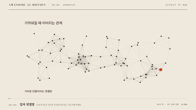

# Nº 533 입자 연결망 · Connected Particle Network



[MP4](clip.mp4) · [HTML](index.html)

**움직이는 점 사이에서 가까운 것끼리 선이 이어지고 멀어지면 사라지는 입자 연결망**

Moving dots connect with nearby ones by lines that vanish as they drift apart.

| Family | Level | Purpose | Media | Runtime |
|---|---|---|---|---|
| 입자·생성 · GENERATIVE | 기본 | 분위기, 설명 | 웹 UI, 설명 영상, 발표 | canvas |

다른 이름 / Also known as: 연결 입자 네트워크, Constellation background, Linked particles, 3D 연결점

## 선택 기준 / Selection

관계가 계속 생기고 바뀌는 네트워크. 연결성과 데이터 흐름의 전형적 비유 / A network where relationships keep forming and changing. The classic metaphor for connectivity and data flow.

- AI·네트워크·연결이 주제인 히어로 배경을 만들 때 / Build a hero background themed on AI, networks or connection.
- 노드 사이의 관계가 생기고 끊어지는 개념을 추상적으로 보여 줄 때 / Abstractly show relations forming and breaking between nodes.

좋은 예 / Good: 점 100개가 초당 12px로 천천히 떠다니고 120px 안에 들어온 점끼리 최대 불투명도 0.35 선으로 이어진다
나쁜 예 / Bad: 연결 반경이 300px 이상이라 선이 그물처럼 화면을 덮거나, 점이 너무 빨라 선이 번쩍인다
주의 / Avoid: 연결 반경 200px 초과 금지 · 선 불투명도 0.4 초과 금지

## 파라미터 / Parameters

| Parameter | Default | Range | Note |
|---|---|---|---|
| 점 수 | 100 | 60~160 | 시드 배열 |
| 연결 반경 | 120px | 90~180px | 1920x1080 기준 |
| 속도 | 12px/s | 8~20px/s | 고정 방향 배열 |
| 선 최대 불투명도 | 0.35 | 0.2~0.4 | 거리 반비례 |
| 지속 | 6s | 4~10s | 루프 길이 |

이징 / Ease: `none`

## 구현 / Implementation (GSAP)

```js
const pts = seedPoints(9, 100), u = { t: 0 };
tl.to(u, { t: 6, duration: 6, ease: 'none', onUpdate() {
  const P = pts.map(p => [(p.x + p.vx * 12 * u.t + 1920) % 1920, (p.y + p.vy * 12 * u.t + 1080) % 1080]);
  for (const [i, j, d] of pairsWithin(P, 120)) line(P[i], P[j], 0.35 * (1 - d / 120));
} }, 0);
```

## 프롬프트 / Prompts

### 한국어 · Claude Code
```text
<대상> 배경에 입자 연결망을 넣어줘. 시드 9로 고정한 점 100개가 각자 정해진 방향으로 초당 12px 떠다니고 화면 밖으로 나가면 반대편으로 돌아오게 해. 거리 120px 이내의 점끼리 선을 잇되 불투명도는 0.35*(1-d/120)로 거리에 따라 옅어지게 해. 점 반경 2px, 6초 루프.
```

### 한국어 · Codex
```text
<파일>의 캔버스에 점 100개(시드 9)를 만들고 위치를 (p+v*12*t) mod 화면으로 계산해. 120px 격자 해시로 근접 쌍을 찾아 알파 0.35*(1-d/120) 선을 그려. t는 6초 선형 tween. 0초·3초·6초 캡처로 연결선이 생기고 사라지며 화면이 그물처럼 덮이지 않는지 확인해.
```

### English · Claude Code
```text
Add a connected particle network to the background of <target>. 100 points fixed by seed 9 drift in set directions at 12px per second and wrap to the opposite side when they leave. Join points within 120px by lines whose opacity is 0.35*(1-d/120), point radius 2px, 6-second loop.
```

### English · Codex
```text
In the canvas of <file>, create 100 points (seed 9) and compute position as (p+v*12*t) mod the frame. Find near pairs with a 120px grid hash and draw lines at alpha 0.35*(1-d/120). Tween t linearly over 6 s. Capture 0 s, 3 s and 6 s to confirm lines form and dissolve and the frame is not covered like a mesh.
```

예시 / Example: 입자 연결망를 `.hero`에 적용해. / Apply Connected Particle Network to `.hero`.

## 적용 / Application

- HyperFrames: 점 위치를 t의 함수로 계산해 프레임 간 상태를 없앤다. 근접 쌍 검색은 120px 격자 해시로 캔버스 100점에서 매 프레임 가볍게 돈다
- ReelForge: 씬 브리프에 점 100, 반경 120px, 속도 12px/s, 선 알파 0.35, 시드 9를 싣는다
- Scrolline Deck: 진행률로 t를 움직이면 스크롤 방향에 따라 점이 앞뒤로 간다. 점 수를 60으로 낮춰 스크럽 프레임 비용을 줄인다

조합 / Pair with: [포스 레이아웃 정착 · Force-directed Layout Settling](../force-layout-settling/) · [시간별 네트워크 변화 · Temporal Network Transition](../temporal-network/) · [랜덤 워크 · Random Walk](../random-walk/) · [회전 지구 연결 호 · Rotating Globe Connections](../globe-connection-arcs/)

출처 / Sources: [tsparticles/presets](https://github.com/tsparticles/presets/blob/HEAD/presets/links/README.md) (MIT) · [processing/p5.js-website](https://p5js.org/examples/Classes-And-Objects-Connected-Particles/) (MIT) · [iart-ai/webgl-animation-skills](https://github.com/iart-ai/webgl-animation-skills/blob/HEAD/skills/particle-system/SKILL.md) (MIT)

[목록 / Catalog](../../references/catalog.md) · [index.json](../../index.json)
