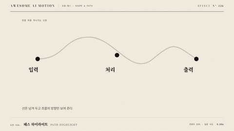

# Nº 426 패스 하이라이트 · Path Highlight



[MP4](clip.mp4) · [HTML](index.html)

**전체 선 중 짧고 밝은 구간만 경로를 따라 지나가는 강조**

Only a short bright stretch travels along the full line.

| Family | Level | Purpose | Media | Runtime |
|---|---|---|---|---|
| 도형·패스 · SHAPE & PATH | 중급 | 순서·흐름, 강조 | 설명 영상, 데이터 스토리, 웹 UI | svg |

다른 이름 / Also known as: Passing path highlight, 패스를 따라 흐르는 강조, ShowPassingFlash, ShowPassingFlashWithThinningStrokeWidth, VShowPassingFlash, FlashAround, ShowPassingFlashAround, Pulsing Border Energy, 맥동 테두리 에너지

## 선택 기준 / Selection

연결의 방향과 흐름을 읽게 한다. 선 전체를 다시 그리지 않고 신호만 흐른다 / Shows the direction and flow of a connection without redrawing the line.

- 데이터 파이프라인·네트워크 연결에서 흐름 방향을 보여 줄 때 / When showing flow direction in a data pipeline or network
- 카드나 패널 테두리를 따라 빛이 도는 표현이 필요할 때 / When light should circle the border of a card or panel

좋은 예 / Good: 회색 선 위에서 전체 길이의 15%인 밝은 조각이 0.9초 동안 처음부터 끝까지 지나간다
나쁜 예 / Bad: 밝은 구간이 너무 길어 선 전체가 켜진 것처럼 보이거나, 방향과 반대로 흐른다
주의 / Avoid: 밝은 구간은 전체의 10~25% · 기저 선과 대비 3:1 이상 · 방향은 정보 흐름 방향과 일치

## 파라미터 / Parameters

| Parameter | Default | Range | Note |
|---|---|---|---|
| 길이 | 0.9s | 0.6~1.5s | 한 번 통과 시간 |
| 구간 비율 | 15% | 10~25% | 전체 길이 대비 |
| 선 두께 | 5px | 3~8px | 1920x1080 기준 |
| 이징 | none | none | 일정 속도 |

## 구현 / Implementation (GSAP)

```js
gsap.set('.flow', { strokeDasharray: '0.15 0.85', strokeDashoffset: 0.15 });
tl.to('.flow', { strokeDashoffset: -1, duration: 0.9, ease: 'none' }, 0.4);
```

## 프롬프트 / Prompts

### 한국어 · Claude Code
```text
GSAP으로 <대상> 선을 따라 흐르는 밝은 구간을 넣어줘. path에 pathLength=1을 주고 strokeDasharray '0.15 0.85', 선 두께 5px, 밝은색으로 두고 0.4초부터 0.9초 동안 strokeDashoffset을 0.15에서 -1로 linear 이동시켜. 기저 선은 어두운 회색으로 그대로 둬. paused 타임라인으로 만들어.
```

### 한국어 · Codex
```text
<파일>의 <대상>에 path-highlight를 적용해. .flow에 pathLength=1, dasharray '0.15 0.85', dashoffset 0.15→-1, 0.9s, ease none, position 0.4. 0.4초·0.85초·1.3초를 캡처해 밝은 조각이 경로 시작, 중간, 끝에 있는지 확인해.
```

### English · Claude Code
```text
Add a bright travelling segment along the <target> line with GSAP. Set pathLength=1, strokeDasharray '0.15 0.85', stroke width 5px, a bright color, and from 0.4s over 0.9s animate strokeDashoffset from 0.15 to -1 linearly. Keep the base line dark gray. Paused timeline.
```

### English · Codex
```text
Apply path-highlight to <target> in <file>. On .flow set pathLength=1, dasharray '0.15 0.85', dashoffset 0.15 to -1, 0.9s, ease none, position 0.4. Capture at 0.4s, 0.85s and 1.3s to check the bright piece is at the start, the middle and the end.
```

예시 / Example: 패스 하이라이트를 `.hero`에 적용해. / Apply Path Highlight to `.hero`.

## 적용 / Application

- HyperFrames: path에 pathLength=1을 주면 dasharray를 비율로 쓸 수 있다. 무한 반복 대신 유한 횟수로 두고 seek가 되게 한다
- ReelForge: 브리프에 경로 ID, 구간 비율, 통과 시간, 횟수를 싣는다. 닫힌 테두리 순환은 시작점을 지정한다
- Scrolline Deck: scrub에서는 진행률 p를 dashoffset 0.15-1.15p에 직접 매핑한다. linear, 스프링 없음

조합 / Pair with: [경로 순차 강조 · Route Highlight](../route-highlight/) · [점선 흐름 · Dashed Flow](../dashed-flow/) · [경로 신호 빔 · Path Beam](../path-beam/)

출처 / Sources: [ManimCommunity/manim](https://github.com/ManimCommunity/manim/blob/main/manim/animation/indication.py) (MIT) · [paper-design/shaders](https://shaders.paper.design/pulsing-border) (Apache-2.0) · [3b1b/manim](https://github.com/3b1b/manim/blob/master/manimlib/animation/indication.py) (MIT)

[목록 / Catalog](../../references/catalog.md) · [index.json](../../index.json)
