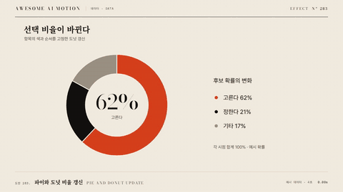

# Nº 283 파이와 도넛 비율 갱신 · Pie and Donut Update



[MP4](clip.mp4) · [HTML](index.html)

**부채꼴의 시작각과 끝각이 움직여 각 항목의 몫이 바뀐다.**

Shares update by interpolating the start and end angles of each pie or donut slice.

| Family | Level | Purpose | Media | Runtime |
|---|---|---|---|---|
| 데이터 · DATA | 중급 | 설명, 비교 | 설명 영상, 데이터 스토리, 스크롤덱 | svg |

다른 이름 / Also known as: Pie and donut value update

## 선택 기준 / Selection

총합 안에서 구성비가 커지고 줄어드는 모습을 본다. / Makes changes in composition within a fixed total visible.

- 총합 안에서 구성비가 커지고 줄어드는 모습을 본다. 이때 항목 ID와 척도를 유지한다. / Use when you need to explain pie and donut update while preserving item identities and chart scales.
- 매출 구성비 30%가 45%로 바뀌며 같은 색의 조각이 넓어진다. / Use when the audience needs to follow the intermediate states rather than only compare final snapshots.

좋은 예 / Good: 매출 구성비 30%가 45%로 바뀌며 같은 색의 조각이 넓어진다.
나쁜 예 / Bad: 항목 색과 순서를 동시에 바꿔 전후 대응을 잃는다.
주의 / Avoid: 항목 색과 순서를 동시에 바꿔 전후 대응을 잃는다. · 재생 중 임의 난수와 벽시계로 데이터나 좌표를 바꾸지 않는다.

## 파라미터 / Parameters

| Parameter | Default | Range | Note |
|---|---|---|---|
| 지속 시간 | 0.8s | 0.6~1.2s | 시점 또는 전환 한 회 기준 |
| 내부 반지름 | 110px | 0~180px | 0이면 파이 |
| 외부 반지름 | 240px | 180~320px | 모든 항목에 같은 척도 |
| 이징 | power2.inOut | power2.inOut | none은 선형 진행 |

## 구현 / Implementation (GSAP)

```js
const tl = gsap.timeline({paused:true});
const state = {p:0};
tl.to(state, {p:1, duration:0.8, ease:'power2.inOut', onUpdate:()=>{
  slices.forEach((s,i)=>s.setAttribute('d',arcPath(lerp(before[i].a,after[i].a,state.p),lerp(before[i].b,after[i].b,state.p),110,240)));
}});
```

## 프롬프트 / Prompts

### 한국어 · Claude Code
```text
<대상>에 파이와 도넛 비율 갱신을 적용해줘. 동일 항목의 두 각도와 내외 반지름을 보간해 SVG 경로를 다시 계산한다. 입력 좌표와 ID 대응을 먼저 준비하고 snippet의 렌더 함수는 이 규칙으로 구현한다. 지속 시간 0.8s; 내부 반지름 110px; 외부 반지름 240px; 이징 power2.inOut로 구현하고 GSAP 코어 paused 타임라인 하나로 seek를 지원해. 매출 구성비 30%가 45%로 바뀌며 같은 색의 조각이 넓어진다.
```

### 한국어 · Codex
```text
<파일>의 데이터 차트 갱신 구간에 파이와 도넛 비율 갱신을 적용해. 동일 항목의 두 각도와 내외 반지름을 보간해 SVG 경로를 다시 계산한다. 입력 좌표와 ID 대응을 먼저 준비하고 snippet의 렌더 함수는 이 규칙으로 구현한다. 지속 시간 0.8s; 내부 반지름 110px; 외부 반지름 240px; 이징 power2.inOut를 사용해. 0.2초, 0.4초, 0.8초 시점을 캡처해 부채꼴의 시작각과 끝각이 움직여 각 항목의 몫이 바뀐다. 항목 대응과 최종 수치를 확인하고 역방향 seek에서도 같은 화면인지 검증해.
```

### English · Claude Code
```text
Apply Pie and Donut Update to <target>. Use a 0.8s transition with power2.inOut easing and preserve item IDs, colors, and chart scales. Implement the geometry renderer used in the snippet with explicit before and after data; use a single paused GSAP core timeline and derive every frame from its playhead. Shares update by interpolating the start and end angles of each pie or donut slice.
```

### English · Codex
```text
Apply Pie and Donut Update in the chart update section of <file>. Use the card parameter defaults, a 0.8s transition, and power2.inOut easing; implement the snippet geometry helpers from fixed input data. Capture at 0.2s, 0.4s, and 0.8s to verify item correspondence, the intermediate geometry, and final values. Seek backward and forward to confirm identical output at identical times.
```

예시 / Example: 파이와 도넛 비율 갱신를 `.hero`에 적용해. / Apply Pie and Donut Update to `.hero`.

## 적용 / Application

- HyperFrames: paused 타임라인에 0.8초 전환을 넣고 seek마다 입력 상태에서 좌표와 경로를 다시 계산한다. 동일 항목의 두 각도와 내외 반지름을 보간해 SVG 경로를 다시 계산한다. 입력 좌표와 ID 대응을 먼저 준비하고 snippet의 렌더 함수는 이 규칙으로 구현한다.
- ReelForge: 씬 워커 브리프에 지속 시간 0.8s; 내부 반지름 110px; 외부 반지름 240px; 이징 power2.inOut와 항목 ID, 축 범위, 전후 데이터를 싣는다. 매출 구성비 30%가 45%로 바뀌며 같은 색의 조각이 넓어진다.
- Scrolline Deck: 진행률 0~1을 0.8초 타임라인에 매핑한다. scrub은 누적 상태 없이 같은 진행률에 같은 좌표를 내며 스프링 대신 power2.out 또는 선형 보간을 쓴다.

조합 / Pair with: [객체 유지 갱신 · Object-constant Update](../object-constant-update/) · [주석 등장 · Annotation Callout](../annotation-callout/) · [차트 단계 전환 · Staged Chart Transition](../staged-chart-transition/)

출처 / Sources: [apache/echarts](https://echarts.apache.org/handbook/en/basics/release-note/5-2-0/) (Apache-2.0) · [Heer & Robertson 2007](https://sites.stat.columbia.edu/gelman/communication/HeerRobertson2007.pdf) (unknown)

[목록 / Catalog](../../references/catalog.md) · [index.json](../../index.json)
