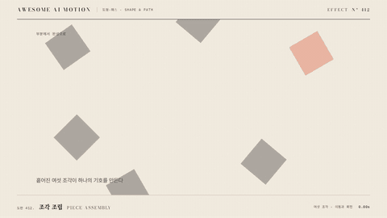

# Nº 412 조각 조립 · Piece Assembly



[MP4](clip.mp4) · [HTML](index.html)

**떨어져 있던 도형 조각들이 이동하고 회전해 하나의 로고나 빈틈 없는 배열을 완성하는 움직임**

Loose shapes move and rotate until they lock into a single logo or a gap-free arrangement.

| Family | Level | Purpose | Media | Runtime |
|---|---|---|---|---|
| 도형·패스 · SHAPE & PATH | 기본 | 설명, 브랜딩 | 설명 영상, 숏폼, 발표 | svg |

다른 이름 / Also known as: Logo part assembly, 로고 조각 조립, Mosaic Pack, 타일 패킹

## 선택 기준 / Selection

부분이 모여 전체를 이루는 과정이 보이고 완성 순간에 정리된 느낌이 남는다 / Shows a whole being made from parts, and the finish lands as a moment of order.

- 로고 아웃트로에서 마크가 완성될 때 / A logo outro where the mark completes.
- 모듈 조각이 하나의 시스템으로 맞물릴 때 / Modules clicking together into one system.
- 타일 여러 개가 빈틈 없이 배열되는 것을 보일 때 / Tiles packing into a seamless layout.

좋은 예 / Good: 조각 8개가 ±30도 기울어진 채 화면 바깥에서 60ms 간격으로 들어와 1.2초 안에 로고 자리에 정확히 붙는다
나쁜 예 / Bad: 조각이 모두 같은 방향에서 같은 시각에 들어와 한 덩어리로 보이거나, 도착 후 미세하게 어긋난 채 끝난다
주의 / Avoid: 도착 후 좌표와 회전은 정확히 최종값이어야 한다 · 조각 수는 12개 이하로 유지한다 · 최종 프레임에서 조각 사이 틈을 0.5px 이하로 한다

## 파라미터 / Parameters

| Parameter | Default | Range | Note |
|---|---|---|---|
| 총 시간 | 1.2s | 0.8~1.8s | 마지막 조각 기준 |
| 조각 간격 | 60ms | 40~100ms | stagger |
| 시작 회전 | ±30deg | ±15~45deg | 도착 시 0 |
| 시작 거리 | 220px | 140~360px | 최종 위치 기준 |
| 이징 | power3.out | power2~expo.out |  |

## 구현 / Implementation (GSAP)

```js
pieces.forEach((p, i) => {
  const s = i % 2 ? 1 : -1;
  tl.from(p, { x: s * (220 + i * 12), y: -160 + i * 30, rotation: s * 30, opacity: 0, duration: 0.9, ease: 'power3.out' }, 0.2 + i * 0.06);
});
// .from은 최종 위치가 마크업의 정적 위치가 되므로 도착 정밀도가 보장됨
```

## 프롬프트 / Prompts

### 한국어 · Claude Code
```text
GSAP으로 <로고 SVG>의 조각을 차례로 맞춰 줘. 각 조각은 최종 위치를 마크업에 두고 from으로 x 좌우 220px 이상, 회전 ±30도, opacity 0에서 시작해 0.9초 power3.out으로 도착시켜. 시작 지연은 0.2초에 조각 번호*60ms. 도착 후 0.6초 정지하고 paused 타임라인으로 작성해.
```

### 한국어 · Codex
```text
<파일>의 조각들에 piece-assembly를 적용해. i번째 조각을 tl.from(p, {x:±(220+i*12), y:-160+i*30, rotation:±30, opacity:0, duration:0.9, ease:'power3.out'}, 0.2+i*0.06)로 건다. 0.4초는 일부만 도착, 2.0초는 최종 프레임인지 캡처한 뒤 마크업 원본과 픽셀 차이가 0인지 확인해.
```

### English · Claude Code
```text
Use GSAP to assemble the pieces of <logo SVG>. Keep each piece's final position in the markup and animate with from: x offset 220px or more to either side, rotation +/-30 degrees, opacity 0, over 0.9 seconds with power3.out. Delay each piece 0.2 seconds plus index*60ms, then hold 0.6 seconds. Paused timeline.
```

### English · Codex
```text
Apply piece-assembly to the pieces in <file>. Tween piece i with tl.from(p, {x:+/-(220+i*12), y:-160+i*30, rotation:+/-30, opacity:0, duration:0.9, ease:'power3.out'}, 0.2+i*0.06). Capture 0.4s (partly arrived) and 2.0s (final), and confirm the final frame has zero pixel diff against the static markup.
```

예시 / Example: 조각 조립를 `.hero`에 적용해. / Apply Piece Assembly to `.hero`.

## 적용 / Application

- HyperFrames: SVG 조각의 최종 위치는 마크업에 두고 from 트윈만 쓴다. paused 타임라인에서 seek해도 최종 프레임이 마크업과 같다
- ReelForge: 브리프에 로고 SVG 조각 수, 간격 60ms, 시작 회전 ±30을 싣는다. 조각 그룹은 id로 받는다
- Scrolline Deck: 진행률에 따라 조각을 인덱스 순서로 도착시키고 마지막 10%는 정지 구간으로 남긴다

조합 / Pair with: [스태거 · Stagger](../stagger/) · [3D 조립 · Depth Assemble](../depth-assemble/) · [스플릿 로고 리빌 · Split Logo Reveal](../split-lockup/)

출처 / Sources: [heygen-com/hyperframes](https://raw.githubusercontent.com/heygen-com/hyperframes/main/registry/blocks/logo-outro/registry-item.json) (Apache-2.0) · local/music-to-video (`claude-skill:music-to-video/references/motion-primitive-catalog.md#mosaic-pack`) (unknown) · [heygen-com/hyperframes](https://raw.githubusercontent.com/heygen-com/hyperframes/main/registry/components/wordmark-tiles/registry-item.json) (Apache-2.0) · local/music-to-video (`claude-skill:music-to-video/references/motion-primitives/mosaic-pack/scene.html`) (unknown) · local/HyperFrames-skills (`claude-skill:hyperframes-animation/blueprints/logo-assemble-lockup.md`) (unknown)

[목록 / Catalog](../../references/catalog.md) · [index.json](../../index.json)
