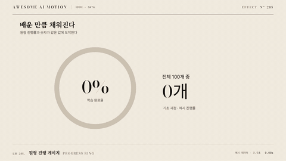

# Nº 285 원형 진행 게이지 · Progress Ring



[MP4](clip.mp4) · [HTML](index.html)

**원형 선이 목표 비율까지 채워지고 끝점이나 숫자가 같이 움직인다.**

A circular stroke fills to a target ratio with a synchronized label.

| Family | Level | Purpose | Media | Runtime |
|---|---|---|---|---|
| 데이터 · DATA | 중급 | 데이터 증명, 비교 | 설명 영상, 발표, 데이터 스토리 | svg |

다른 이름 / Also known as: progress-ring-radial, stat-bars-and-fills

## 선택 기준 / Selection

완료율과 구성비를 직관적으로 읽는다. / Makes progress and proportions easy to read.

- 75% 완료율까지 원과 숫자를 동시에 채운다. / Show completion or a share of a total.
- 완료율과 구성비를 직관적으로 읽는다. 기준값과 대상을 함께 표시할 때. / Keep the encoded values, labels, and visual state synchronized.

좋은 예 / Good: 75% 완료율까지 원과 숫자를 동시에 채운다.
나쁜 예 / Bad: 75% 숫자와 완전히 닫힌 원을 함께 표시한다.
주의 / Avoid: 전체 기준값과 단위를 명시한다.

## 파라미터 / Parameters

| Parameter | Default | Range | Note |
|---|---|---|---|
| 지속 | 1000ms | 600~1500ms | 비율과 숫자 동기화 |
| 목표 비율 | 75% | 0~100% | 실제 완료율 사용 |
| 시작 각도 | -90deg | -90~0deg | 12시 방향 권장 |
| 반지름 | 120px | 80~180px | 1920x1080 기준 |

이징 / Ease: `power2.out`

## 구현 / Implementation (GSAP)

```js
const tl=gsap.timeline({paused:true}),s={p:0},C=2*Math.PI*120;
gsap.set(ring,{strokeDasharray:C,strokeDashoffset:C,rotation:-90,transformOrigin:'50% 50%'});
tl.to(s,{p:0.75,duration:1,ease:'power2.out',onUpdate:()=>{
 ring.style.strokeDashoffset=C*(1-s.p);
 label.textContent=Math.round(s.p*100)+'%';
}});
```

## 프롬프트 / Prompts

### 한국어 · Claude Code
```text
<파일>의 <대상>에 원형 진행 게이지을 적용해. SVG 원 둘레의 dashoffset을 비율로 계산하고 숫자와 같은 진행값을 쓴다. 지속 1000ms; 목표 비율 75%; 시작 각도 -90deg; 반지름 120px을 적용한다. GSAP 코어의 paused 타임라인 하나로 seek 가능하게 만들고 임의 난수와 타이머를 쓰지 마.
```

### 한국어 · Codex
```text
<파일>의 설명 장면에서 <대상>에 원형 진행 게이지을 적용해. SVG 원 둘레의 dashoffset을 비율로 계산하고 숫자와 같은 진행값을 쓴다. 지속 1000ms; 목표 비율 75%; 시작 각도 -90deg; 반지름 120px을 적용한다. 0초, 0.5초, 1초를 캡처해 시작 상태, 중간 진행, 최종 상태를 확인하고 같은 시각으로 다시 seek했을 때 좌표와 라벨이 같은지 검증해.
```

### English · Claude Code
```text
Implement Progress Ring on <target> in <file>. Fill the ring to 75% over 1000ms with a 120px radius and a minus 90 degree starting angle. Derive both dash offset and percentage label from the same ratio. Use one paused GSAP core timeline, support seeking, and avoid random values and timers.
```

### English · Codex
```text
Implement Progress Ring on <target> in <file>. Fill the ring to 75% over 1000ms with a 120px radius and a minus 90 degree starting angle. Derive both dash offset and percentage label from the same ratio. Use one paused GSAP core timeline, support seeking, and avoid random values and timers. Capture at 0s, 0.5s, and 1s to check the initial state, intermediate motion, and final state. Seek to each time again and verify identical geometry and labels.
```

예시 / Example: 원형 진행 게이지를 `.hero`에 적용해. / Apply Progress Ring to `.hero`.

## 적용 / Application

- HyperFrames: paused 타임라인에 원형 진행 게이지 상태를 넣고 seek 시 1초의 좌표와 색을 다시 계산한다.
- ReelForge: 씬 워커 브리프에 지속 1000ms; 목표 비율 75%; 시작 각도 -90deg; 반지름 120px을 싣고 75% 완료율까지 원과 숫자를 동시에 채운다.
- Scrolline Deck: 진행률 0~1을 1초 구간에 매핑한다. scrub에서는 스프링 대신 power2.out을 쓰고 역방향에서도 라벨과 도형을 함께 갱신한다.

조합 / Pair with: [카운트업 · Count-up](../count-up/) · [부분 아이콘 채우기 · Fractional Icon Fill](../fractional-icon-fill/)

출처 / Sources: gongnyang/reelforge (`gongnyang/reelforge:skills/reelforge/references/grammar/06-shapes-strokes.md#progress-ring-radial`) (Apache-2.0) · gongnyang/reelforge (`gongnyang/reelforge:skills/reelforge/references/gallery/gallery-index.json`) (Apache-2.0) · gongnyang/reelforge (`gongnyang/reelforge:skills/reelforge/references/gallery/fragments/data/progress-ring.html`) (Apache-2.0) · gongnyang/reelforge (`gongnyang/reelforge:skills/reelforge/references/gallery/fragments/data/progress-ring.meta.json`) (Apache-2.0) · local/hyperframes-animation (`claude-skill:hyperframes-animation/rules/stat-bars-and-fills.md`) (unknown)

[목록 / Catalog](../../references/catalog.md) · [index.json](../../index.json)
