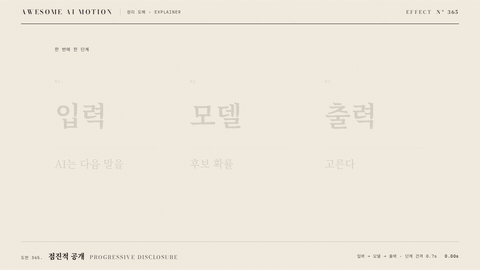

# Nº 365 점진적 공개 · Progressive Disclosure



[MP4](clip.mp4) · [HTML](index.html)

**새 단계가 켜질 때 이전 단계를 옅게 남기는 순차 공개 움직임**

A sequential reveal that leaves earlier stages dimmed as each new stage becomes active.

| Family | Level | Purpose | Media | Runtime |
|---|---|---|---|---|
| 원리 도해 · EXPLAINER | 기본 | 설명, 순서·흐름 | 설명 영상, 발표, 스크롤덱 | gsap |

다른 이름 / Also known as: 단계별 공개, Stepwise Reveal, Agent status theater, 작업 상태 연출, 작업 상태 시연, Multi Step Loader, 다단계 상태 로더

## 선택 기준 / Selection

복잡한 흐름을 한 번에 한 단계씩 따라간다 / Helps viewers follow a complex flow one step at a time.

- 입력부터 출력까지 처리 순서를 설명할 때 / When explaining the processing sequence from input to output
- 여러 단계 중 현재 단계에 시선을 모을 때 / When directing attention to the current stage in a multistep process

좋은 예 / Good: 입력, 모델, 출력 순서로 켜지고 출력만 주홍으로 남는다
나쁜 예 / Bad: 세 단계를 동시에 진하게 공개해 현재 단계가 사라진다
주의 / Avoid: 이전 단계를 완전히 지워 관계를 잃지 않는다 · 단계별 색을 여러 개 추가하지 않는다

## 파라미터 / Parameters

| Parameter | Default | Range | Note |
|---|---|---|---|
| 단계 수 | 3 | 3~5 | 한 화면의 처리 흐름 |
| 단계 간격 | 0.7s | 0.5~0.9s | 읽기 시간 |
| 활성 공개 | 0.3s | 0.2~0.4s | opacity 상승 |
| 이전 단계 opacity | 0.25 | 0.2~0.4 | 관계 유지 |
| 초기 opacity | 0.12 | 0~0.15 | 아직 안 켜진 단계 |

이징 / Ease: `power3.out`

## 구현 / Implementation (GSAP)

```js
const tl = Motion.timeline();
tl.to('#input',{opacity:1,duration:.3},.3);
tl.to('#a1',{scaleX:1,duration:.3},.7);
tl.to('#input',{opacity:.25,duration:.3},1).to('#model',{opacity:1,duration:.3},1);
tl.to('#a2',{scaleX:1,duration:.3},1.4);
tl.to('#model',{opacity:.25,duration:.3},1.7).to('#output',{opacity:1,color:'var(--verm)',duration:.35},1.7);
```

## 프롬프트 / Prompts

### 한국어 · Claude Code
```text
<대상>에 입력, 모델, 출력 3단계 도해를 배치하고 초기 opacity를 0.12로 둔다. 0.3초, 1초, 1.7초에 각 단계 opacity를 1로 0.3초 power3.out 공개한다. 새 단계가 켜지면 이전 단계는 opacity 0.25로 낮추고 출력만 주홍으로 만든다. 단계 사이 헤어라인 화살표는 0.7초와 1.4초에 scaleX 0에서 1로 그린다. 3초 타임라인 하나로 만들고 마지막 0.6초는 정지한다.
```

### 한국어 · Codex
```text
<파일>의 <대상>에 <대상>에 입력, 모델, 출력 3단계 도해를 배치하고 초기 opacity를 0.12로 둔다. 0.3초, 1초, 1.7초에 각 단계 opacity를 1로 0.3초 power3.out 공개한다. 새 단계가 켜지면 이전 단계는 opacity 0.25로 낮추고 출력만 주홍으로 만든다. 단계 사이 헤어라인 화살표는 0.7초와 1.4초에 scaleX 0에서 1로 그린다. 0.24초, 1.25초, 2.9초를 캡처해 한 단계씩 활성화, 이전 단계 흐려짐, 출력의 주홍 강조를 확인한다. 시간은 GSAP 타임라인만 사용한다.
```

### English · Claude Code
```text
Arrange a 3-stage input, model, and output diagram in <target> with initial opacity 0.12. Reveal each stage to opacity 1 over 0.3 seconds with power3.out at 0.3, 1, and 1.7 seconds. When a new stage becomes active, dim the previous stage to opacity 0.25 and make only the output vermilion. Draw the hairline arrows between stages by changing scaleX from 0 to 1 at 0.7 and 1.4 seconds. Use a single 3-second timeline and hold still for the final 0.6 seconds.
```

### English · Codex
```text
In <target> in <file>, Arrange a 3-stage input, model, and output diagram in <target> with initial opacity 0.12. Reveal each stage to opacity 1 over 0.3 seconds with power3.out at 0.3, 1, and 1.7 seconds. When a new stage becomes active, dim the previous stage to opacity 0.25 and make only the output vermilion. Draw the hairline arrows between stages by changing scaleX from 0 to 1 at 0.7 and 1.4 seconds. Capture at 0.24, 1.25, and 2.9 seconds to check one-stage-at-a-time activation, dimming of earlier stages, and vermilion emphasis on the output. Use only a GSAP timeline for timing.
```

예시 / Example: 점진적 공개를 `.hero`에 적용해. / Apply Progressive Disclosure to `.hero`.

## 적용 / Application

- HyperFrames: 3초 paused GSAP 타임라인 하나로 구성하고 Motion.ready()로 seek를 노출한다. 단계마다 opacity를 올리면서 이전 단계의 opacity를 0.25로 낮추고 연결선을 scaleX로 공개한다.
- ReelForge: 3초 장면 안의 요소를 분리하고 transform과 opacity 트랙으로 같은 순서를 구현한다. 단계마다 opacity를 올리면서 이전 단계의 opacity를 0.25로 낮추고 연결선을 scaleX로 공개한다.
- Scrolline Deck: 0.3~2.4초 동작을 스크롤 진행률 10~80%로 매핑하고 끝 20%를 완성 상태로 둔다. 단계마다 opacity를 올리면서 이전 단계의 opacity를 0.25로 낮추고 연결선을 scaleX로 공개한다.

조합 / Pair with: [스태거 · Stagger](../stagger/) · [주석 등장 · Annotation Callout](../annotation-callout/) · [모션 위계 · Motion Hierarchy](../motion-hierarchy/)

출처 / Sources: [GSAP Timeline 공식 문서](https://gsap.com/docs/v3/GSAP/Timeline/) (개념 참고) · [heygen-com/hyperframes](https://raw.githubusercontent.com/heygen-com/hyperframes/main/registry/components/state-chip-rail/registry-item.json) (Apache-2.0) · [heygen-com/hyperframes](https://raw.githubusercontent.com/heygen-com/hyperframes/main/registry/components/onboarding-stepper-flow/registry-item.json) (Apache-2.0) · [ui.aceternity.com](https://ui.aceternity.com/components/multi-step-loader) (unknown) · [DavidHDev/react-bits](https://github.com/DavidHDev/react-bits) (MIT + Commons Clause v1.0) · [ui.aceternity.com](https://ui.aceternity.com/components/sticky-scroll-reveal) (unknown) · motion dictionary 1-principles.md#6. 모션 위계·코레오그래피 (own) · [Heer & Robertson 2007](https://sites.stat.columbia.edu/gelman/communication/HeerRobertson2007.pdf) (unknown)

[목록 / Catalog](../../references/catalog.md) · [index.json](../../index.json)
