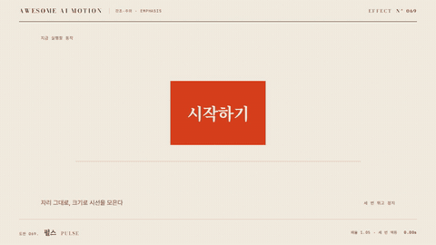

# Nº 069 펄스 · Pulse



[MP4](clip.mp4) · [HTML](index.html)

**요소가 제자리에서 살짝 커졌다 원래 크기로 돌아오는 맥동**

A short scale beat where an element grows slightly and returns to its size in place.

| Family | Level | Purpose | Media | Runtime |
|---|---|---|---|---|
| 강조·주의 · EMPHASIS | 기본 | 주목 끌기, 강조 | 웹 UI, 제품 시연, 숏폼 | css |

다른 이름 / Also known as: 크기 맥동, Heartbeat, 심장 박동, Scale and color indication, 크기와 색 맥동 강조, Indicate

## 선택 기준 / Selection

대상이 살아 있고 눌러 볼 수 있다는 신호. 위치를 옮기지 않고 시선만 끌어온다 / Signals the element is alive and clickable. It draws the eye without moving anything.

- 버튼·배지처럼 지금 눌러야 할 요소에 시선을 끌 때 / When pulling attention to a button or badge that should be pressed now
- 알림 점이나 녹화 표시처럼 활성 상태를 알릴 때 / When showing an active state such as a notification dot or record indicator
- 설명 도중 특정 아이콘을 한 번 짚을 때 / When pointing at one icon during an explanation

좋은 예 / Good: CTA 버튼이 1초 주기로 scale 1.05까지 커졌다 돌아오며 세 번 뛰고 멈춘다
나쁜 예 / Bad: scale 1.3 이상으로 커져 주변 글자를 가리거나, 화면 전체 요소가 동시에 무한 반복한다
주의 / Avoid: scale 1.08 초과 금지(주변 요소와 겹침) · 한 화면에 동시에 맥동하는 요소는 1개로 제한 · 반복은 3회 이내로 끝내고 정지한다

## 파라미터 / Parameters

| Parameter | Default | Range | Note |
|---|---|---|---|
| 주기 | 1.0s | 0.6~1.4s | 커짐과 복귀를 합친 한 번의 길이 |
| 최대 배율 | 1.05 | 1.03~1.08 | 1.08을 넘기면 경계가 겹침 |
| 반복 횟수 | 3회 | 2~4회 | 무한 반복은 데코용에만 |
| 이징 | sine.inOut | sine~power2.inOut | 왕복이 매끄럽게 이어지는 곡선 |

## 구현 / Implementation (GSAP)

```js
tl.to('.cta', { scale: 1.05, duration: 0.5, ease: 'sine.inOut', yoyo: true, repeat: 5 }, 0.4);
```

## 프롬프트 / Prompts

### 한국어 · Claude Code
```text
GSAP으로 <대상> 버튼에 펄스를 넣어줘. 0.4초에 시작해 scale 1에서 1.05까지 0.5초에 커지고 같은 시간에 돌아오는 왕복을 3번 반복해. 이징은 sine.inOut, 반복 뒤에는 원래 크기로 정지해. transform만 쓰고 paused 타임라인에 넣어 seek가 되게 해.
```

### 한국어 · Codex
```text
<파일>의 <대상>에 pulse를 적용해. tween은 scale 1.05, duration 0.5, yoyo true, repeat 5, ease sine.inOut, position 0.4로 건다. 무한 반복과 Math.random은 쓰지 않는다. 0.4초·0.9초·3.6초 시점을 캡처해 시작 크기, 최대 크기(1.05), 종료 후 크기 1.0을 각각 확인해.
```

### English · Claude Code
```text
Add a pulse to <target> with GSAP. Start at 0.4s, scale from 1 to 1.05 over 0.5s and back, repeated 3 times. Ease sine.inOut, then hold at the original size. Use transforms only, on a paused timeline so it can be seeked.
```

### English · Codex
```text
Apply pulse to <target> in <file>. Tween scale 1.05, duration 0.5, yoyo true, repeat 5, ease sine.inOut, position 0.4. No infinite repeat and no Math.random. Capture at 0.4s, 0.9s and 3.6s and check the start size, the peak size (1.05) and that the final size is 1.0.
```

예시 / Example: 펄스를 `.hero`에 적용해. / Apply Pulse to `.hero`.

## 적용 / Application

- HyperFrames: repeat는 유한 값으로 두고 paused 타임라인 하나에 넣는다. yoyo 왕복이 끝나는 시각(0.4+0.5×6=3.4s)을 클립 길이 안에 둔다
- ReelForge: 씬 워커 브리프에 대상 셀렉터·주기·최대 배율·반복 횟수를 싣고 무한 반복은 금지한다
- Scrolline Deck: scrub에서는 반복 대신 진행률 0.3~0.5 구간에 한 번만 맥동시킨다. 스프링 없이 sine.inOut

조합 / Pair with: [통통 튀기 · Bounce Attention](../bounce-attention/) · [핫스팟 펄스 · Hotspot Pulse](../hotspot-pulse/) · [임계값 경고 펄스 · Threshold Pulse](../threshold-pulse/)

출처 / Sources: [animate-css/animate.css](https://github.com/animate-css/animate.css) (Hippocratic-2.1) · [ManimCommunity/manim](https://github.com/ManimCommunity/manim/blob/main/manim/animation/indication.py) (MIT) · [animista.net](https://animista.net/play) (BSD-2-Clause (FreeBSD)) · [IanLunn/Hover](https://github.com/IanLunn/Hover) (MIT personal/open-source + paid commercial) · [loadingio/css-spinner](https://github.com/loadingio/css-spinner) (CC0 loaders (README; root LICENSE absent))

[목록 / Catalog](../../references/catalog.md) · [index.json](../../index.json)
