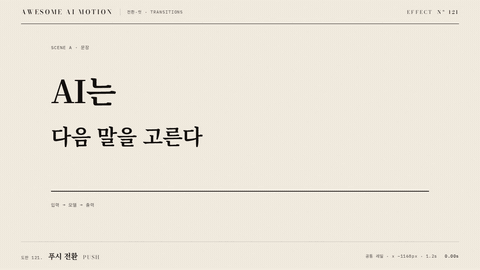

# Nº 121 푸시 전환 · Push



[MP4](clip.mp4) · [HTML](index.html)

**새 장면이 들어오는 만큼 기존 장면을 같은 방향으로 밀어내는 전환**

An incoming scene pushes the existing scene out by the same amount in the same direction.

| Family | Level | Purpose | Media | Runtime |
|---|---|---|---|---|
| 전환·컷 · TRANSITIONS | 기본 | 전환, 순서·흐름 | 설명 영상, 숏폼, 발표, 스크롤덱 | gsap |

다른 이름 / Also known as: 밀어내기 전환, Push transition, 밀기 전환, slideTransition, slide(), Push scene transition, 밀어내는 장면 전환

## 선택 기준 / Selection

두 장면이 연결된 공간처럼 이어진다 / Makes two scenes feel like adjoining spaces.

- 순서가 있는 단계 사이를 이동할 때 / Move between ordered steps.
- 옆에 놓인 장면으로 넘어가는 공간 관계를 보여줄 때 / Show the spatial relationship when moving to an adjacent scene.

좋은 예 / Good: B가 오른쪽에서 들어오는 동안 A가 같은 속도로 왼쪽으로 나간다
나쁜 예 / Bad: A는 멈춰 있는데 B만 덮어서 푸시가 슬라이드 오버레이처럼 보인다
주의 / Avoid: 장면마다 다른 이징을 쓰지 않는다 · 이동 거리가 달라 틈이 생기지 않도록 한다

## 파라미터 / Parameters

| Parameter | Default | Range | Note |
|---|---|---|---|
| 전환 시작 | 0.35s | 0.3~0.8s | 준비 상태 유지 |
| 전환 지속 | 1.2s | 0.7~1.5s | 두 장면 이동 확인 |
| 이동 거리 | −1168px | 장면 폭 1배 | 두 장면을 붙인 레일의 이동 |
| 이징 | power2.inOut | power1~power3.inOut | 같은 부모에서 가속과 감속 공유 |

## 구현 / Implementation (GSAP)

```js
const tl = Motion.timeline();
tl.to('#rail', {x:-1168, duration:1.2, ease:'power2.inOut'}, 0.35);
tl.to('.lead', {opacity:1, duration:0.2}, 1.7);
```

## 프롬프트 / Prompts

### 한국어 · Claude Code
```text
<대상>의 장면 A와 B를 폭 1168px씩 하나의 레일에 나란히 붙여 푸시 전환을 만들어줘. B를 x 1168px에 놓고 부모 레일만 0.35초부터 1.2초 동안 x −1168px로 power2.inOut 이동해. 1.9초부터 3초까지 완성 장면을 정지해.
```

### 한국어 · Codex
```text
<파일>의 장면 전환을 공통 레일 기반 푸시로 바꿔. 폭 1168px 장면 두 개를 좌우로 붙이고 레일 x를 0.35초부터 1.2초 동안 −1168px로 power2.inOut 이동해. 0.23초, 0.73초, 1.23초, 2.9초를 캡처해 A와 B가 틈 없이 같이 움직이고 마지막에 B만 남는지 확인해.
```

### English · Claude Code
```text
Create a push transition for <target> by placing scenes A and B side by side on one rail, each 1168px wide. Place B at x 1168px and animate only the parent rail to x -1168px starting at 0.35 seconds over 1.2 seconds with power2.inOut. Hold the completed scene from 1.9 to 3 seconds.
```

### English · Codex
```text
Change the scene transition in <file> to a push using a shared rail. Place two 1168px-wide scenes side by side and animate the rail x to -1168px starting at 0.35 seconds over 1.2 seconds with power2.inOut. Capture at 0.23, 0.73, 1.23, and 2.9 seconds to verify that A and B move together without gaps and only B remains at the end.
```

예시 / Example: 푸시 전환를 `.hero`에 적용해. / Apply Push to `.hero`.

## 적용 / Application

- HyperFrames: 장면 둘을 같은 좌표에 배치하고 하나의 paused GSAP 타임라인으로 전환한다. 전환 뒤 완성 장면을 홀드한다
- ReelForge: 전환 비트의 시작 시각과 지속 시간을 고정하고 장면 레이어 두 개를 함께 렌더한다
- Scrolline Deck: 전환 구간의 진행률을 하나의 타임라인에 연결하고 양 끝에 읽기 위한 정지 구간을 둔다

조합 / Pair with: [와이프 · Wipe](../wipe/) · [팬 · Pan](../pan/) · [이징 · Easing](../easing-curves/)

출처 / Sources: [GSAP CSS transform documentation](https://gsap.com/docs/v3/GSAP/CorePlugins/CSS/) (개념 인용) · [heygen-com/hyperframes](https://raw.githubusercontent.com/heygen-com/hyperframes/main/registry/components/directional-wipe/registry-item.json) (Apache-2.0) · [heygen-com/hyperframes](https://raw.githubusercontent.com/heygen-com/hyperframes/main/registry/components/page-slide/registry-item.json) (Apache-2.0) · [heygen-com/hyperframes](https://raw.githubusercontent.com/heygen-com/hyperframes/main/registry/blocks/transitions-push/registry-item.json) (Apache-2.0) · [pixel-point/animate-text](https://raw.githubusercontent.com/pixel-point/animate-text/master/skills/animate-text/assets/specs/shared-axis-x.json) (unknown) · [gl-transitions/gl-transitions](https://github.com/gl-transitions/gl-transitions/blob/master/transitions/Directional.glsl) (MIT) · [ibelick/motion-primitives](https://motion-primitives.com/docs/transition-panel) (MIT) · [shadcn-ui/ui](https://github.com/shadcn-ui/ui) (MIT)

[목록 / Catalog](../../references/catalog.md) · [index.json](../../index.json)
