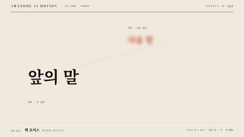

# Nº 222 랙 포커스 · Rack Focus



[MP4](clip.mp4) · [HTML](index.html)

**위치를 움직이지 않고 앞뒤 대상의 선명함을 교환하는 초점 이동**

A focus shift that swaps sharpness between foreground and background subjects without changing their positions.

| Family | Level | Purpose | Media | Runtime |
|---|---|---|---|---|
| 가상 카메라 · CAMERA | 기본 | 강조, 설명 | 설명 영상, 발표, 스크롤덱 | gsap |

다른 이름 / Also known as: 초점 이동, 포커스 풀, rack-focus-reference, depth-of-field-blur, Focus pull, Rack Focus Layers, 레이어 초점 전환

## 선택 기준 / Selection

시선의 우선순위를 앞 대상에서 뒤 대상으로 옮긴다 / Shifts visual priority from the foreground subject to the background subject.

- 전경과 배경 사이에 주의를 넘길 때 / When transferring attention between foreground and background
- 장면 이동 없이 두 대상의 중요도를 바꿀 때 / When changing the relative emphasis of two subjects without moving the scene

좋은 예 / Good: 큰 앞의 말은 0px에서 8px로 흐려지고 작은 다음 말은 8px에서 0px로 선명해진다
나쁜 예 / Bad: 모든 글자를 동시에 흐리게 만들어 읽을 초점이 사라진다
주의 / Avoid: 모든 글자를 동시에 흐리게 만들어 읽을 초점이 사라진다 · 최종 상태를 0.5초 미만으로 유지하지 않는다

## 파라미터 / Parameters

| Parameter | Default | Range | Note |
|---|---|---|---|
| 흐림 반경 | 8px | 4~10px | 선명함 차이가 보이는 값 |
| 선명 반경 | 0px | 0~1px | 도착 초점은 읽을 수 있게 |
| 초점 이동 | 1.8s | 1.0~2.0s | 두 tween 동시 시작 |
| 이징 | power1.inOut | none / power1.inOut | 연속적인 초점 교환 |

## 구현 / Implementation (GSAP)

```js
tl.set('#front', {filter: 'blur(0px)'}, 0);
tl.set('#back', {filter: 'blur(8px)'}, 0);
tl.to('#front', {filter: 'blur(8px)', duration: 1.8, ease: 'power1.inOut'}, .3);
tl.to('#back', {filter: 'blur(0px)', duration: 1.8, ease: 'power1.inOut'}, .3);
tl.to('#note', {opacity: 1, duration: .2}, 2.1);
```

## 프롬프트 / Prompts

### 한국어 · Claude Code
```text
<대상>에 랙 포커스 효과를 GSAP 코어로 만들어줘. 큰 앞의 말은 0px에서 8px로 흐려지고 작은 다음 말은 8px에서 0px로 선명해진다 3초 클립에서 0.3초까지 시작 상태를 유지하고 다음 기본값을 적용해: 흐림 반경 8px, 선명 반경 0px, 초점 이동 1.8s, 이징 power1.inOut. 마지막 0.5초 이상은 완성 상태로 정지하고 시간 제어는 paused 타임라인 하나로 해.
```

### 한국어 · Codex
```text
<파일>의 scene 내부에 랙 포커스를 적용해. 흐림 반경는 8px. 선명 반경는 0px. 초점 이동는 1.8s. 이징는 power1.inOut. 0.23초, 1.23초, 2.9초를 캡처해 시작 상태와 중간 변화, 큰 앞의 말은 0px에서 8px로 흐려지고 작은 다음 말은 8px에서 0px로 선명해진다의 최종 상태를 확인해. 2.5초와 2.9초의 장면이 같은지, 의도한 카메라 프레임 외의 잘림과 라벨 겹침이 없는지 검증해.
```

### English · Claude Code
```text
Create a Rack Focus effect on <target> using GSAP core. Blur the large "previous word" from 0px to 8px and sharpen the small "next word" from 8px to 0px. In a 3-second clip, hold the initial state until 0.3 seconds and apply these defaults: blur radius 8px, sharp radius 0px, focus-shift duration 1.8s, ease power1.inOut. Hold the completed state for at least the final 0.5 seconds, and control timing with a single paused timeline.
```

### English · Codex
```text
Apply Rack Focus inside the scene in <file>. Use these settings: blur radius 8px, sharp radius 0px, focus-shift duration 1.8s, ease power1.inOut. Capture at 0.23, 1.23, and 2.9 seconds to check the initial state, intermediate changes, and the final state: Blur the large "previous word" from 0px to 8px and sharpen the small "next word" from 8px to 0px. Verify that the scenes at 2.5 and 2.9 seconds match, with no clipping beyond the intended camera frame or overlapping labels.
```

예시 / Example: 랙 포커스를 `.hero`에 적용해. / Apply Rack Focus to `.hero`.

## 적용 / Application

- HyperFrames: 장면 내부 래퍼를 하나의 paused GSAP 타임라인으로 움직이고 seek 시 같은 좌표를 재현한다.
- ReelForge: 장면 내부 요소의 filter blur 키프레임에 위 기본값을 적용하고 3초 끝까지 최종 상태를 유지한다.
- Scrolline Deck: 0.3~2.5초 동작 구간을 스크롤 진행률 0.1~0.83에 대응시키고 끝 구간은 최종 상태로 둔다.

조합 / Pair with: [모션 위계 · Motion Hierarchy](../motion-hierarchy/) · [크로스페이드 · Crossfade](../crossfade/) · [스포트라이트 · Spotlight](../spotlight/)

출처 / Sources: [GSAP Timeline.to()](https://gsap.com/docs/v3/GSAP/Timeline/to()/) (공식 API 문서 참조) · [heygen-com/hyperframes](https://raw.githubusercontent.com/heygen-com/hyperframes/main/registry/components/focus-rack/registry-item.json) (Apache-2.0) · [helpx.adobe.com](https://helpx.adobe.com/after-effects/desktop/work-with-layers/camera-layer/cameras-lights-points-interest.html) (unknown) · [heygen-com/hyperframes](https://github.com/heygen-com/hyperframes/blob/HEAD/skills/hyperframes-animation/rules/depth-of-field-blur.md) (Apache-2.0) · motion dictionary 2-transitions-camera.md#25. 랙 포커스 · Rack Focus / Focus Pull (own)

[목록 / Catalog](../../references/catalog.md) · [index.json](../../index.json)
