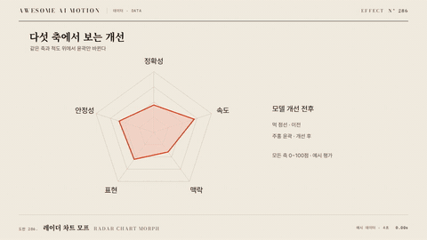

# Nº 286 레이더 차트 모프 · Radar Chart Morph



[MP4](clip.mp4) · [HTML](index.html)

**고정된 축을 따라 꼭짓점이 중심에서 목표값으로 이동하거나 새 값으로 바뀌며 다각형 윤곽을 만든다.**

Vertices move along fixed radial axes to form or update a radar profile.

| Family | Level | Purpose | Media | Runtime |
|---|---|---|---|---|
| 데이터 · DATA | 중급 | 비교, 데이터 증명 | 설명 영상, 데이터 스토리, 발표 | svg |

다른 이름 / Also known as: Radar Grow, 레이더 영역 성장, Radar profile morph, 방사 다변량 윤곽 갱신

## 선택 기준 / Selection

다차원 성능의 강약을 비교한다. / Compares strengths and weaknesses across multiple dimensions.

- 동일 척도의 다섯 축에서 두 프로필을 비교할 때 / Compare two profiles on five consistently scaled axes.
- 제품 변경 전후의 성능 윤곽을 보여줄 때 / Update a performance profile after a product change.

좋은 예 / Good: 다섯 축의 눈금을 유지하고 목표 반경으로 1.2초 동안 성장시킨다.
나쁜 예 / Bad: 프로필마다 축 최대값을 바꿔 같은 면적이 같은 성능처럼 보인다.
주의 / Avoid: 축 순서나 척도를 전환 도중 바꾸지 않는다.

## 파라미터 / Parameters

| Parameter | Default | Range | Note |
|---|---|---|---|
| 축 수 | 5개 | 3~8개 | 축 순서를 고정한다. |
| 전환 시간 | 1200ms | 800~1600ms | 꼭짓점이 동시에 도착한다. |
| 최대 반경 | 300px | 220~380px | 값을 0~1로 정규화한다. |
| 비교 계열 | 2개 | 1~3개 | 윤곽선과 라벨을 구분한다. |
| 이징 | power2.out | none \| power2.out \| power2.inOut | 끝점을 넘지 않는 이징을 쓴다. |

## 구현 / Implementation (GSAP)

```js
const tl=gsap.timeline({paused:true}), state={p:0};
const values=[0.8,0.6,0.9,0.5,0.7];
tl.to(state,{p:1,duration:1.2,ease:'power2.out',onUpdate:()=>{
  const points=values.map((v,i)=>{const a=i*2*Math.PI/5-Math.PI/2;return [400+Math.cos(a)*300*v*state.p,400+Math.sin(a)*300*v*state.p].join(',');});
  document.querySelector('.radar').setAttribute('points',points.join(' '));
}});
```

## 프롬프트 / Prompts

### 한국어 · Claude Code
```text
<파일>의 <대상>에 레이더 차트 모프를 구현해. 고정된 축을 따라 꼭짓점이 중심에서 목표값으로 이동하거나 새 값으로 바뀌며 다각형 윤곽을 만든다. 축 수 5개, 전환 시간 1200ms, 최대 반경 300px, 비교 계열 2개, 이징 power2.out를 적용하고 GSAP 코어의 paused 타임라인 하나로 seek 가능하게 작성해. 축 순서나 척도를 전환 도중 바꾸지 않는다.
```

### 한국어 · Codex
```text
<파일>의 <대상> 장면에 레이더 차트 모프를 적용해. 축 수 5개, 전환 시간 1200ms, 최대 반경 300px, 비교 계열 2개, 이징 power2.out를 사용하고 다음 동작을 구현해: SVG 축별 반경값에 진행값을 곱해 polygon 정점을 보간한다. 플러그인과 Math.random 없이 작성하고 0.3초·0.72초·1.2초를 캡처해 초기 상태, 중간 변화, 최종 상태가 연속적이며 다음 예시와 맞는지 확인해: 다섯 축의 눈금을 유지하고 목표 반경으로 1.2초 동안 성장시킨다.
```

### English · Claude Code
```text
Implement Radar Chart Morph for <target> in <file>. Vertices move along fixed radial axes to form or update a radar profile. Use axis count: 5; transition duration: 1200ms; maximum radius: 300px; series count: 2; easing: power2.out in a single paused GSAP core timeline that supports seeking. Keep axis order and scales fixed.
```

### English · Codex
```text
Apply Radar Chart Morph to the <target> scene in <file> using axis count: 5; transition duration: 1200ms; maximum radius: 300px; series count: 2; easing: power2.out. Vertices move along fixed radial axes to form or update a radar profile. Use prepared data or geometry with GSAP core, no plugins, and no Math.random; capture at 0.3, 0.72, 1.2 seconds to verify continuous intermediate geometry, correct endpoints, and identical output after repeated seeks. Keep axis order and scales fixed.
```

예시 / Example: 레이더 차트 모프를 `.hero`에 적용해. / Apply Radar Chart Morph to `.hero`.

## 적용 / Application

- HyperFrames: paused 타임라인 하나에 레이더 차트 모프 상태를 넣고 seek(t)로 1.2초 구간을 재현한다. 현재 시간에서 도형을 계산해 프레임 누적을 피한다.
- ReelForge: 씬 워커 브리프에 축 수 5개, 전환 시간 1200ms, 최대 반경 300px, 비교 계열 2개, 이징 power2.out를 싣고 입력 자료와 초기 도형 좌표를 고정한다. 다섯 축의 눈금을 유지하고 목표 반경으로 1.2초 동안 성장시킨다.
- Scrolline Deck: 진행률 0~1을 1.2초 구간에 매핑해 같은 타임라인을 scrub한다. 시간량은 none, 시각 전환은 power2.out을 쓰고 스프링 대신 끝점을 넘지 않는 ease-out을 쓴다.

조합 / Pair with: [주석 등장 · Annotation Callout](../annotation-callout/) · [데이터 색상 전환 · Color Encoding Transition](../color-encoding-transition/)

출처 / Sources: local/bookforge (`claude-skill:bookforge/references/diagrams.md`) (MIT) · [apache/echarts](https://echarts.apache.org/handbook/en/how-to/animation/transition/) (Apache-2.0) · [chartjs/Chart.js](https://www.chartjs.org/docs/latest/configuration/animations.html) (MIT) · [Flourish](https://flourish.studio/visualisations/) (unknown)

[목록 / Catalog](../../references/catalog.md) · [index.json](../../index.json)
