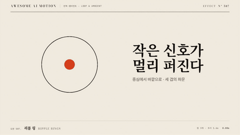

# Nº 587 리플 링 · Ripple Rings



[MP4](clip.mp4) · [HTML](index.html)

**중심에서 생긴 원들이 커지고 흐려지며 사라진다.**

Concentric rings expand and fade from a shared center.

| Family | Level | Purpose | Media | Runtime |
|---|---|---|---|---|
| 반복·앰비언트 · LOOP & AMBIENT | 기본 | 피드백, 분위기 | 설명 영상, 웹 UI, 숏폼 | gsap |

다른 이름 / Also known as: Expanding ripple rings, 확산 파문 링, Ripple Ring, 퍼지는 원형 파문, Ping, Expanding Ring

## 선택 기준 / Selection

신호 확산과 호출을 표현한다. / Communicates a spreading signal or a call for attention.

- 신호가 퍼지는 위치를 보여줄 때 / Use when presenting ripple rings in a waiting or ambient scene.
- 호출 버튼의 피드백을 표현할 때 / Use for a compact status indicator with a stable surrounding layout.

좋은 예 / Good: 세 링이 0.4초 차이로 커지고 사라져 호출 위치를 알린다.
나쁜 예 / Bad: 여러 지점에서 큰 링이 동시에 번져 초점이 사라진다.
주의 / Avoid: 여러 지점에서 큰 링이 동시에 번져 초점이 사라진다. · 정보를 읽는 동안 반복 진폭을 키우지 않는다.

## 파라미터 / Parameters

| Parameter | Default | Range | Note |
|---|---|---|---|
| 주기 | 1.6s | 1.12~2.24s | 유한 구간을 호스트 시간으로 반복 |
| 링 수 | 3 | 2~4 | 동심원 레이어 |
| 링 시간차 | 0.4s | 0.3~0.5s | 전체 구간은 2.4초 |
| 크기 범위 | 0.2~1.5 | 0.1~1.8 | 중심 앵커 |
| 이징 | power2.out | power2.out, power3.out, sine.inOut | 움직임의 가속과 감속 |

## 구현 / Implementation (GSAP)

```js
const rings = gsap.utils.toArray('.ring');
gsap.set(rings, {transformOrigin:'50% 50%'});
tl.fromTo(rings, {scale:0.2, opacity:1}, {scale:1.5, opacity:0, duration:1.6, stagger:0.4, ease:'power2.out'}, 0);
```

## 프롬프트 / Prompts

### 한국어 · Claude Code
```text
<파일>에서 <대상>에 리플 링을 적용해. 1.6초, 링 수 3; 링 시간차 0.4s; 크기 범위 0.2~1.5, 이징 power2.out로 구현해. paused 타임라인으로 seek 가능하게 하고 반복은 유한 구간의 지역 시간으로 계산해.
```

### 한국어 · Codex
```text
<파일>의 <대상> 레이어에 리플 링을 적용해. 1.6초, 링 수 3; 링 시간차 0.4s; 크기 범위 0.2~1.5, power2.out를 사용하고 0초, 0.8초, 1.6초 캡처로 시작값, 중간 변화, 완료 자세를 확인해. 동일 시점을 두 번 seek해 같은 결과인지 검증해.
```

### English · Claude Code
```text
Apply Ripple Rings to <target> in <file>. Use a 1.6s segment with power2.out; implement these explicit settings: Ring count: 3, Ring delay: 0.4s, Scale range: 0.2~1.5. Use a paused, seekable timeline and repeat through local timeline time.
```

### English · Codex
```text
Apply Ripple Rings to the <target> layer in <file> with Ring count: 3, Ring delay: 0.4s, Scale range: 0.2~1.5, using the supplied core snippet and a 1.6s segment with power2.out. Capture at 0s, 0.8s, and 1.6s to verify the initial pose, intermediate change, and final pose. Seek to the same timestamp twice and confirm identical output.
```

예시 / Example: 리플 링를 `.hero`에 적용해. / Apply Ripple Rings to `.hero`.

## 적용 / Application

- HyperFrames: paused 타임라인에 1.6초 구간을 넣고 seek로 자세를 계산한다. 반복은 호스트의 지역 시간으로 환산한다.
- ReelForge: 씬 워커 브리프에 리플 링, 1.6초, 링 수 3; 링 시간차 0.4s; 크기 범위 0.2~1.5, power2.out를 싣고 대상 레이어를 지정한다.
- Scrolline Deck: 진행률 0~1을 1.6초 구간에 매핑한다. scrub에서는 스프링 대신 ease-out으로 같은 시작값과 완료값을 보간한다.

조합 / Pair with: [페이드 슬라이드 · Fade Slide](../fade-slide/) · [상태 보간 · State Tween](../state-tween/) · [스케일 팝 · Scale Pop](../scale-pop/)

출처 / Sources: [motion.dev examples](https://motion.dev/examples/react-loading-ripple) (unknown) · [motion.dev examples](https://motion.dev/examples/react-material-design-ripple) (unknown) · [IanLunn/Hover](https://github.com/IanLunn/Hover) (MIT personal/open-source + paid commercial) · [animista.net](https://animista.net/play) (BSD-2-Clause (FreeBSD)) · [magicuidesign/magicui](https://github.com/magicuidesign/magicui) (MIT)

[목록 / Catalog](../../references/catalog.md) · [index.json](../../index.json)
