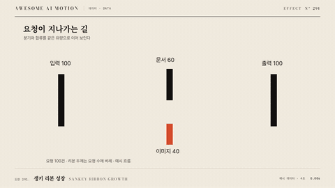

# Nº 291 생키 리본 성장 · Sankey Ribbon Growth



[MP4](clip.mp4) · [HTML](index.html)

**흐름 리본이 출발 노드에서 도착 노드 방향으로 자라며 단계별 네트워크를 드러낸다.**

Flow ribbons grow from source toward destination, revealing the network stage by stage.

| Family | Level | Purpose | Media | Runtime |
|---|---|---|---|---|
| 데이터 · DATA | 중급 | 설명, 순서·흐름 | 설명 영상, 데이터 스토리, 스크롤덱 | svg |

다른 이름 / Also known as: 생키 리본 순차 생성

## 선택 기준 / Selection

흐름의 방향과 단계 구조를 순서대로 이해한다. / Explains flow direction and the structure of successive stages.

- 흐름의 방향과 단계 구조를 순서대로 이해한다. 이때 항목 ID와 척도를 유지한다. / Use when you need to explain sankey ribbon growth while preserving item identities and chart scales.
- 유입, 분류, 도착 열을 차례로 공개해 자금 흐름을 설명한다. / Use when the audience needs to follow the intermediate states rather than only compare final snapshots.

좋은 예 / Good: 유입, 분류, 도착 열을 차례로 공개해 자금 흐름을 설명한다.
나쁜 예 / Bad: 리본을 동일 두께로 만들어 유량 차이를 지운다.
주의 / Avoid: 리본을 동일 두께로 만들어 유량 차이를 지운다. · 재생 중 임의 난수와 벽시계로 데이터나 좌표를 바꾸지 않는다.

## 파라미터 / Parameters

| Parameter | Default | Range | Note |
|---|---|---|---|
| 지속 시간 | 0.6s | 0.45~0.9s | 시점 또는 전환 한 회 기준 |
| 열 시작 간격 | 750ms | 600~1000ms | 600ms 공개 뒤 150ms 간격 |
| 노드 폭 | 24px | 16~32px | 리본 최종 폭은 값 비례 |
| 이징 | none | none | none은 선형 진행 |

## 구현 / Implementation (GSAP)

```js
const tl = gsap.timeline({paused:true});
columnClips.forEach((rect,i)=>{
  gsap.set(rect,{attr:{width:0}});
  tl.to(rect,{attr:{width:columnWidths[i]},duration:0.6,ease:'none'},i*0.75);
});
```

## 프롬프트 / Prompts

### 한국어 · Claude Code
```text
<대상>에 생키 리본 성장을 적용해줘. SVG 리본 경로를 출발점 기준 클립으로 공개하고 노드를 단계별로 나타낸다. 입력 좌표와 ID 대응을 먼저 준비하고 snippet의 렌더 함수는 이 규칙으로 구현한다. 지속 시간 0.6s; 열 시작 간격 750ms; 노드 폭 24px; 이징 none로 구현하고 GSAP 코어 paused 타임라인 하나로 seek를 지원해. 유입, 분류, 도착 열을 차례로 공개해 자금 흐름을 설명한다.
```

### 한국어 · Codex
```text
<파일>의 데이터 차트 갱신 구간에 생키 리본 성장을 적용해. SVG 리본 경로를 출발점 기준 클립으로 공개하고 노드를 단계별로 나타낸다. 입력 좌표와 ID 대응을 먼저 준비하고 snippet의 렌더 함수는 이 규칙으로 구현한다. 지속 시간 0.6s; 열 시작 간격 750ms; 노드 폭 24px; 이징 none를 사용해. 0.15초, 0.3초, 0.6초 시점을 캡처해 흐름 리본이 출발 노드에서 도착 노드 방향으로 자라며 단계별 네트워크를 드러낸다. 항목 대응과 최종 수치를 확인하고 역방향 seek에서도 같은 화면인지 검증해.
```

### English · Claude Code
```text
Apply Sankey Ribbon Growth to <target>. Use a 0.6s transition with none easing and preserve item IDs, colors, and chart scales. Implement the geometry renderer used in the snippet with explicit before and after data; use a single paused GSAP core timeline and derive every frame from its playhead. Flow ribbons grow from source toward destination, revealing the network stage by stage.
```

### English · Codex
```text
Apply Sankey Ribbon Growth in the chart update section of <file>. Use the card parameter defaults, a 0.6s transition, and none easing; implement the snippet geometry helpers from fixed input data. Capture at 0.15s, 0.3s, and 0.6s to verify item correspondence, the intermediate geometry, and final values. Seek backward and forward to confirm identical output at identical times.
```

예시 / Example: 생키 리본 성장를 `.hero`에 적용해. / Apply Sankey Ribbon Growth to `.hero`.

## 적용 / Application

- HyperFrames: paused 타임라인에 0.6초 전환을 넣고 seek마다 입력 상태에서 좌표와 경로를 다시 계산한다. SVG 리본 경로를 출발점 기준 클립으로 공개하고 노드를 단계별로 나타낸다. 입력 좌표와 ID 대응을 먼저 준비하고 snippet의 렌더 함수는 이 규칙으로 구현한다.
- ReelForge: 씬 워커 브리프에 지속 시간 0.6s; 열 시작 간격 750ms; 노드 폭 24px; 이징 none와 항목 ID, 축 범위, 전후 데이터를 싣는다. 유입, 분류, 도착 열을 차례로 공개해 자금 흐름을 설명한다.
- Scrolline Deck: 진행률 0~1을 0.6초 타임라인에 매핑한다. scrub은 누적 상태 없이 같은 진행률에 같은 좌표를 내며 스프링 대신 power2.out 또는 선형 보간을 쓴다.

조합 / Pair with: [객체 유지 갱신 · Object-constant Update](../object-constant-update/) · [주석 등장 · Annotation Callout](../annotation-callout/) · [차트 단계 전환 · Staged Chart Transition](../staged-chart-transition/)

출처 / Sources: [d3/d3-sankey](https://github.com/d3/d3-sankey) (BSD-3-Clause) · [the-pudding/sankey-nba](https://github.com/the-pudding/sankey-nba) (MIT)

[목록 / Catalog](../../references/catalog.md) · [index.json](../../index.json)
