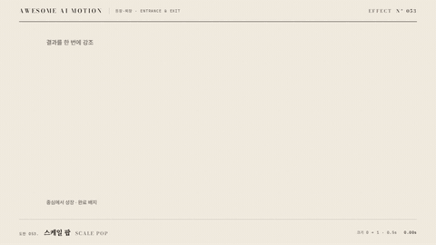

# Nº 053 스케일 팝 · Scale Pop



[MP4](clip.mp4) · [HTML](index.html)

**요소가 작은 크기에서 제 크기로 커져 멈춘다. 반대로 축소되어 사라질 수 있다.**

An element grows from a small scale to its final size.

| Family | Level | Purpose | Media | Runtime |
|---|---|---|---|---|
| 등장·퇴장 · ENTRANCE & EXIT | 기본 | 주목 끌기, 전환 | 설명 영상, 웹 UI, 숏폼 | gsap |

다른 이름 / Also known as: Scale pop entrance, 스케일 팝 등장, spring-pop-entrance, overlay-pop, Scale In and Out, 스케일 등장과 퇴장, Zoom Reveal, Grow Reveal, Grow from anchor, 앵커에서 자라기, GrowFromPoint, GrowFromCenter, GrowFromEdge, ShrinkToCenter

## 선택 기준 / Selection

새 요소의 도착을 분명하게 알린다. / Clearly marks the arrival of a new element.

- 새 배지나 숫자를 등장시킬 때 / Use when presenting scale pop in a content reveal scene.
- 작은 팝업의 도착을 알릴 때 / Use for a focused title, image, or card with a clearly visible final state.

좋은 예 / Good: 완료 배지가 0.5초 동안 중심에서 커진다.
나쁜 예 / Bad: 긴 본문 전체를 0에서 확대해 읽기를 방해한다.
주의 / Avoid: 긴 본문 전체를 0에서 확대해 읽기를 방해한다. · 완료 자세에서 내용이 가려지지 않게 한다.

## 파라미터 / Parameters

| Parameter | Default | Range | Note |
|---|---|---|---|
| 지속 | 0.5s | 0.35~0.7s | 0초부터 시작하는 공개 구간 |
| 시작 크기 | 0 | 0~0.85 | 중심에서 성장 |
| 앵커 | 50% 50% | 중앙 또는 가장자리 | 성장 방향 기준 |
| 이징 | power3.out | power2.out, power3.out, sine.inOut | 움직임의 가속과 감속 |

## 구현 / Implementation (GSAP)

```js
gsap.set('.target', {transformOrigin:'50% 50%'});
tl.fromTo('.target', {scale:0}, {scale:1, duration:0.5, ease:'power3.out'}, 0);
tl.set('.target', {scale:1}, 0.5);
```

## 프롬프트 / Prompts

### 한국어 · Claude Code
```text
<파일>에서 <대상>에 스케일 팝을 적용해. 0.5초, 시작 크기 0; 앵커 50% 50%, 이징 power3.out로 구현해. paused 타임라인으로 seek 가능하게 하고 완료 자세를 유지해.
```

### 한국어 · Codex
```text
<파일>의 <대상> 레이어에 스케일 팝을 적용해. 0.5초, 시작 크기 0; 앵커 50% 50%, power3.out를 사용하고 0초, 0.25초, 0.5초 캡처로 시작값, 중간 변화, 완료 자세를 확인해. 동일 시점을 두 번 seek해 같은 결과인지 검증해.
```

### English · Claude Code
```text
Apply Scale Pop to <target> in <file>. Use a 0.5s segment with power3.out; implement these explicit settings: Initial scale: 0, Transform origin: 50% 50%. Use a paused, seekable timeline and hold the final pose.
```

### English · Codex
```text
Apply Scale Pop to the <target> layer in <file> with Initial scale: 0, Transform origin: 50% 50%, using the supplied core snippet and a 0.5s segment with power3.out. Capture at 0s, 0.25s, and 0.5s to verify the initial pose, intermediate change, and final pose. Seek to the same timestamp twice and confirm identical output.
```

예시 / Example: 스케일 팝를 `.hero`에 적용해. / Apply Scale Pop to `.hero`.

## 적용 / Application

- HyperFrames: paused 타임라인에 0.5초 구간을 넣고 seek로 자세를 계산한다. 시작값과 완료값을 명시한다.
- ReelForge: 씬 워커 브리프에 스케일 팝, 0.5초, 시작 크기 0; 앵커 50% 50%, power3.out를 싣고 대상 레이어를 지정한다.
- Scrolline Deck: 진행률 0~1을 0.5초 구간에 매핑한다. scrub에서는 스프링 대신 ease-out으로 같은 시작값과 완료값을 보간한다.

조합 / Pair with: [페이드 슬라이드 · Fade Slide](../fade-slide/) · [스태거 · Stagger](../stagger/)

출처 / Sources: [heygen-com/hyperframes](https://raw.githubusercontent.com/heygen-com/hyperframes/main/registry/components/number-pop-in/registry-item.json) (Apache-2.0) · [heygen-com/hyperframes](https://raw.githubusercontent.com/heygen-com/hyperframes/main/registry/blocks/instagram-follow/registry-item.json) (Apache-2.0) · [heygen-com/hyperframes](https://raw.githubusercontent.com/heygen-com/hyperframes/main/registry/blocks/tiktok-follow/registry-item.json) (Apache-2.0) · [heygen-com/hyperframes](https://raw.githubusercontent.com/heygen-com/hyperframes/main/registry/blocks/reddit-post/registry-item.json) (Apache-2.0) · [heygen-com/hyperframes](https://raw.githubusercontent.com/heygen-com/hyperframes/main/registry/blocks/x-post/registry-item.json) (Apache-2.0)

[목록 / Catalog](../../references/catalog.md) · [index.json](../../index.json)
