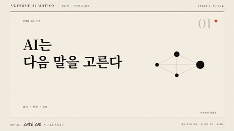

# Nº 142 스케일 스왑 · Scale Swap



[MP4](clip.mp4) · [HTML](index.html)

**기존 장면이 기준점으로 줄어드는 동안 새 장면이 커져 그 자리를 잇는 전환**

The old element shrinks toward a pivot while the new one grows in to take its place.

| Family | Level | Purpose | Media | Runtime |
|---|---|---|---|---|
| 전환·컷 · TRANSITIONS | 기본 | 전환, 강조 | 웹 UI, 숏폼, 제품 시연 | gsap |

다른 이름 / Also known as: 축소 확대 교체, 축소와 팝 교체, scale-swap-transition, Anchored scale replacement, 앵커 확대 축소 교체

## 선택 기준 / Selection

같은 자리에서 상태가 바뀌어도 이어진다는 감각. 튀어나오는 팝 느낌 / Different states continue in the same spot, with a small pop.

- 아이콘, 카드, 버튼 같은 요소가 다른 상태로 바뀔 때 / Change an icon, card, or button into another state.
- 한 장면이 다른 장면으로 같은 위치에서 교체될 때 / Swap one scene for another in the same position.

좋은 예 / Good: 앞 요소가 0.55초 동안 scale 1에서 0.2로 줄며 사라지고, 뒤 요소가 0.2에서 1로 커지며 50% 시점에 교차한다
나쁜 예 / Bad: 앞 요소가 0으로 완전히 줄어 빈 구간이 생기거나, 오버슈트를 1.3배 넘게 줘서 통통 튀는 느낌이 과하다
주의 / Avoid: scale 0까지 줄이지 않는다(0.2 아래 금지) · 오버슈트를 쓰려면 scale 1.05 이하로 제한한다

## 파라미터 / Parameters

| Parameter | Default | Range | Note |
|---|---|---|---|
| 전체 지속 | 0.55s | 0.35~0.8s | 교차는 50% |
| 원점 | 50% 50% | 요소 중심 또는 클릭점 | 두 요소 동일 |
| 앞 scale | 1→0.2 | 0.1~0.5 | opacity 1→0 동반 |
| 뒤 scale | 0.2→1 | 0.2~0.6에서 시작 | opacity 0→1 동반 |

이징 / Ease: `back.out(1.4)`

## 구현 / Implementation (GSAP)

```js
tl.to('.a', { scale: 0.2, opacity: 0, duration: 0.55, ease: 'power2.in', transformOrigin: '50% 50%' }, 0)
  .fromTo('.b', { scale: 0.2, opacity: 0, transformOrigin: '50% 50%' },
    { scale: 1, opacity: 1, duration: 0.55, ease: 'back.out(1.4)' }, 0.275);
```

## 프롬프트 / Prompts

### 한국어 · Claude Code
```text
<대상A>를 <대상B>로 스케일 스왑해줘. 둘은 같은 위치에 겹쳐 두고 transformOrigin 50% 50%. A는 0.55초 동안 scale 1에서 0.2, opacity 1에서 0 (power2.in), B는 0.275초부터 0.55초 동안 scale 0.2에서 1, opacity 0에서 1 (back.out(1.4)). paused 타임라인으로 만들어.
```

### 한국어 · Codex
```text
<파일>의 상태 교체에 scale swap을 적용해. 앞 요소 scale 1에서 0.2와 opacity 0 (0.55s, power2.in), 뒤 요소 scale 0.2에서 1과 opacity 1 (0.275초 시점부터 0.55s, back.out(1.4)). 0.3초에 두 요소가 함께 보이는지, 0.83초에 뒤 요소가 scale 1인지 캡처로 확인해.
```

### English · Claude Code
```text
Scale-swap <targetA> for <targetB>. Stack them in the same spot with transformOrigin 50% 50%. A goes scale 1 to 0.2 and opacity 1 to 0 over 0.55 seconds (power2.in). B starts at 0.275 seconds and goes scale 0.2 to 1 and opacity 0 to 1 over 0.55 seconds (back.out(1.4)). Use one paused timeline.
```

### English · Codex
```text
Apply a scale swap to the state change in <file>. Outgoing element scale 1 to 0.2 with opacity to 0 (0.55s, power2.in); incoming element scale 0.2 to 1 with opacity to 1 (starts at 0.275s, 0.55s, back.out(1.4)). Capture at 0.3 seconds to confirm both are visible together, and at 0.83 seconds to confirm the incoming element is at scale 1.
```

예시 / Example: 스케일 스왑를 `.hero`에 적용해. / Apply Scale Swap to `.hero`.

## 적용 / Application

- HyperFrames: 형제 요소를 같은 위치에 겹치고 transform, opacity만 쓴다. back.out은 seek에서도 결정론적이다
- ReelForge: 씬 워커 브리프에 originX, originY, fromScale, overshoot를 싣는다. 오브젝트 씬의 상태 교체 비트에 붙인다
- Scrolline Deck: scrub에서는 back.out 대신 power3.out으로 바꿔 오버슈트 진동을 없앤다. 진행률 0.5에서 교차한다

조합 / Pair with: [스케일 팝 · Scale Pop](../scale-pop/) · [크로스페이드 · Crossfade](../crossfade/) · [스퀴즈 전환 · Squeeze Transition](../squeeze-transition/)

출처 / Sources: [heygen-com/hyperframes](https://raw.githubusercontent.com/heygen-com/hyperframes/main/registry/components/morph-swap/registry-item.json) (Apache-2.0) · [heygen-com/hyperframes](https://raw.githubusercontent.com/heygen-com/hyperframes/main/registry/components/icon-swap/registry-item.json) (Apache-2.0) · [gl-transitions/gl-transitions](https://github.com/gl-transitions/gl-transitions/blob/master/transitions/Slides.glsl) (MIT) · [mifi/editly](https://github.com/mifi/editly#transition-types) (MIT) · local/HyperFrames-skills (`claude-skill:hyperframes-animation/rules/scale-swap-transition.md`) (unknown)

[목록 / Catalog](../../references/catalog.md) · [index.json](../../index.json)
