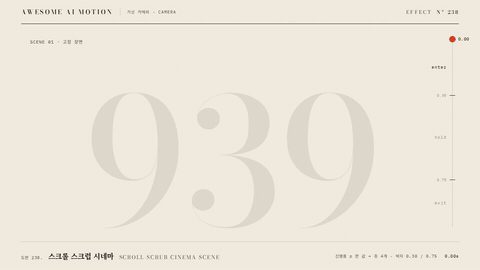

# Nº 238 스크롤 스크럽 시네마 · Scroll-scrub Cinema Scene



[MP4](clip.mp4) · [HTML](index.html)

**고정된 장면 하나에서 스크롤 진행률 p 하나가 제목 마스크, 도해 조립, 배경 숫자 패럴랙스를 함께 움직인다.**

In one pinned scene, a single scroll progress value p drives a title mask reveal, an assembling diagram, and a parallaxing background number together.

| Family | Level | Purpose | Media | Runtime |
|---|---|---|---|---|
| 가상 카메라 · CAMERA | 고급 | 순서·흐름, 설명, 주목 끌기 | 스크롤덱, 웹 UI, 발표, 데이터 스토리 | gsap |

다른 이름 / Also known as: 스크롤 연동 장면, Scroll-linked scene, Pinned scrub scene, 스크롤텔링 장면, ScrollTrigger scrub

## 선택 기준 / Selection

보는 사람이 스크롤하는 만큼만 장면이 진행된다는 감각. 여러 층이 한 값에 묶여 있어 멈추면 같이 멈추고 되돌리면 같이 되돌아간다. / The scene advances only as far as the viewer scrolls. Every layer is bound to one value, so they stop together and rewind together.

- 스크롤덱에서 한 장면을 고정해 두고 안쪽 요소를 단계별로 조립할 때 / Use when a scroll deck pins one scene and assembles its parts step by step.
- 스크롤 연동 장면을 영상으로 보여 주거나 시안으로 설명할 때 / Use when showing or pitching a scroll-linked scene as video.
- 제목·도해·배경 층의 속도 차이로 깊이를 주고 싶을 때 / Use when speed differences between title, diagram, and background layers should add depth.

좋은 예 / Good: 진행률 0~0.30에서 제목이 마스크로 올라오고 부품이 모이기 시작하며, 0.30~0.75에는 장면이 고정된 채 화살표가 그려지고 5% 밀려 들어가며, 0.75~1에서 층마다 1.0·1.12·1.24배속으로 위로 빠지고 다음 장면이 올라온다.
나쁜 예 / Bad: 층마다 따로 시간 기반 애니메이션을 걸어 스크롤을 멈춰도 계속 움직이거나, 진행률을 선형으로 매핑해 사람 손 같은 멈칫이 없다.
주의 / Avoid: 층마다 다른 시간축 금지(모두 p 하나만 읽는다) · 배경 층 속도 0.5배 초과 금지(전경과 구분이 안 된다) · 박자 경계 없이 전 구간 균등 매핑 금지

## 파라미터 / Parameters

| Parameter | Default | Range | Note |
|---|---|---|---|
| 박자 경계 | 0.30 / 0.75 | 0.20~0.35 / 0.65~0.80 | enter / hold / exit |
| 배경 숫자 이동 | y 170px, x 70px | 120~240px | 전 구간, 전경 대비 약 0.35배속 |
| 퇴장 층 속도비 | 1.00 / 1.12 / 1.24 | 1.0~1.4 | 도해 부품별, 520px 기준 |
| 홀드 밀기 | scale 1.05 | 1.02~1.08 | 0.30~0.75 구간, 퇴장에서 풀림 |
| 진행 곡선 | 구간 6개 · 멈칫 0.45s 2회 | 멈칫 0.3~0.6s | 휠 두 번, 멈칫, 긴 굴림, 멈칫, 끝까지 |

이징 / Ease: `power2.inOut`

## 구현 / Implementation (GSAP)

```js
const S = { p: 0 };
const seg = (p, a, b) => Math.max(0, Math.min(1, (p - a) / (b - a)));
function draw(p) {
  bg.style.transform = `translate(${-70 * p}px, ${130 - 170 * p}px)`;
  l1.style.transform = `translateY(${110 * (1 - out3(seg(p, .02, .20))) - 110 * io2(seg(p, .76, .86))}%)`;
  nMo.style.transform = `translate(${sc.x * (1 - k)}px, ${sc.y * (1 - k) - 520 * seg(p, .78, 1) * 1.12}px)`;
}
[[0, .17, .5, 'power2.out'], [.17, .29, .45, 'power2.inOut'], [.29, .30, .45, 'sine.inOut'], [.30, .735, 1.1, 'power2.inOut'], [.735, .75, .45, 'sine.inOut'], [.75, 1, 1, 'power3.inOut']]
  .forEach(([a, b, d, ease]) => { tl.fromTo(S, { p: a }, { p: b, duration: d, ease, immediateRender: false, onUpdate: () => draw(S.p) }, at); at += d; });
```

## 프롬프트 / Prompts

### 한국어 · Claude Code
```text
<대상> 장면을 스크롤 스크럽 시네마로 만들어줘. 진행률 p 하나(0~1)를 받는 draw(p) 함수에서 모든 층을 갱신하고, 박자는 enter 0~0.30, hold 0.30~0.75, exit 0.75~1. 제목은 0.02~0.27에서 yPercent 110→0 마스크로 올라오고 0.76~0.90에 위로 빠지게, 도해 부품 3개는 시드 난수로 흩어진 자리에서 0.10~0.56에 power3.out으로 모이고 화살표는 0.44~0.70에 그려지게 해. 배경 큰 숫자 939는 전 구간 y 170px만 움직여 패럴랙스를 주고, 퇴장에서는 부품이 1.0·1.12·1.24배속으로 520px 위로 빠지며 다음 장면이 380px 아래에서 올라오게 해. 오른쪽에 얇은 진행 레일과 0.30·0.75 눈금, 박자 라벨을 작게 둬.
```

### 한국어 · Codex
```text
<파일>에 스크롤 스크럽 장면을 구현해. 영상용이면 프록시 {p}를 fromTo 6구간(0→.17 0.5s, .17→.29 0.45s, 멈칫 .29→.30 0.45s, .30→.735 1.1s, 멈칫 .735→.75 0.45s, .75→1 1.0s)으로 굴리고, 페이지용이면 ScrollTrigger pin+scrub 진행률을 같은 draw(p)에 넘겨. Math.random 대신 Motion.rand(939)로 흩어진 좌표를 미리 계산해. 1.2초(p 0.29)·2.9초(p 0.74)·4.8초(p 1.0)를 캡처해 멈칫 구간에서 모든 층이 함께 멈추는지, 역방향 seek 후 같은 시점 그림이 같은지 확인해.
```

### English · Claude Code
```text
Turn the <target> scene into a scroll-scrub cinema scene. Update every layer inside one draw(p) function that takes a single progress value p from 0 to 1, with beats enter 0 to 0.30, hold 0.30 to 0.75, exit 0.75 to 1. Reveal the title with a yPercent 110 to 0 mask between 0.02 and 0.27 and push it out upward between 0.76 and 0.90; gather three diagram parts from seeded scattered positions between 0.10 and 0.56 with power3.out, and draw the arrows between 0.44 and 0.70. Move the giant background number 939 only 170px in y across the whole range for parallax; on exit, move the parts 520px up at 1.0, 1.12, and 1.24 speed while the next scene rises from 380px below. Add a thin progress rail on the right with ticks at 0.30 and 0.75 and small beat labels.
```

### English · Codex
```text
Implement a scroll-scrub scene in <file>. For video, drive a proxy {p} with six fromTo segments (0 to .17 over 0.5s, .17 to .29 over 0.45s, hesitation .29 to .30 over 0.45s, .30 to .735 over 1.1s, hesitation .735 to .75 over 0.45s, .75 to 1 over 1.0s); for a page, pass ScrollTrigger pin plus scrub progress into the same draw(p). Precompute scattered coordinates with Motion.rand(939) instead of Math.random. Capture 1.2s (p 0.29), 2.9s (p 0.74), and 4.8s (p 1.0) to confirm every layer pauses together during the hesitations and that seeking backward gives an identical frame at the same time.
```

예시 / Example: 스크롤 스크럽 시네마를 `.hero`에 적용해. / Apply Scroll-scrub Cinema Scene to `.hero`.

## 적용 / Application

- HyperFrames: 스크롤이 없으니 프록시 {p} 하나를 구간 6개 fromTo로 굴려 사람 손 곡선을 만든다. 모든 층은 draw(p)에서만 갱신하고 오른쪽에 레일(500px)과 0.30·0.75 눈금을 둔다.
- ReelForge: 씬 브리프에 박자 경계 0.30·0.75, 배경 층 이동 170px, 퇴장 속도비 1.0·1.12·1.24를 싣고 진행 곡선은 구간 배열 하나로 넘긴다.
- Scrolline Deck: ScrollTrigger pin + scrub:true(또는 0.5)로 진행률을 받아 같은 draw(p)를 부른다. Lenis가 멈칫을 만들어 주므로 곡선은 넣지 않고 장면 높이를 300vh로 잡는다.

조합 / Pair with: [고정 장면 스크롤리텔링 · Pinned Scrollytelling](../pinned-scrollytelling/) · [스크롤 프레임 스크럽 · Scroll Frame Scrubbing](../scroll-frame-scrub/) · [패럴랙스 · Parallax](../parallax/) · [마스크 리빌 · Mask Reveal](../mask-reveal/)

출처 / Sources: [GSAP ScrollTrigger docs](https://gsap.com/docs/v3/Plugins/ScrollTrigger/) (개념 인용)

[목록 / Catalog](../../references/catalog.md) · [index.json](../../index.json)
