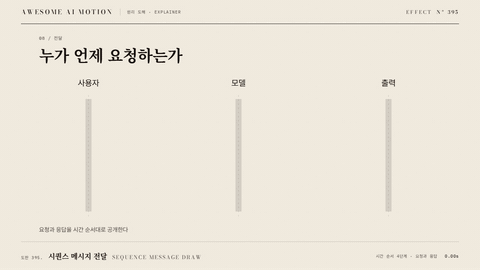

# Nº 395 시퀀스 메시지 전달 · Sequence Message Draw



[MP4](clip.mp4) · [HTML](index.html)

**행위자 사이의 화살표가 시간 순서대로 그려지고 수신 지점이 강조된다.**

Message arrows draw between actors in chronological order, highlighting each receiver.

| Family | Level | Purpose | Media | Runtime |
|---|---|---|---|---|
| 원리 도해 · EXPLAINER | 중급 | 설명, 순서·흐름 | 설명 영상, 스크롤덱, 웹 UI | svg |

## 선택 기준 / Selection

누가 언제 누구에게 요청하고 응답하는지 이해한다. / Shows who sends each request and response, and when.

- 클라이언트와 서버의 요청 응답을 설명할 때 / Explain a client, server, and database exchange.
- 여러 역할을 거치는 승인 절차를 보여줄 때 / Trace an approval request through several roles.

좋은 예 / Good: 네 행위자 사이에서 요청선을 0.4초에 그리고 0.6초 간격으로 다음 메시지를 공개한다.
나쁜 예 / Bad: 모든 화살표를 동시에 그려 요청과 응답의 순서가 사라진다.
주의 / Avoid: 응답 방향과 메시지 순서를 뒤바꾸지 않는다.

## 파라미터 / Parameters

| Parameter | Default | Range | Note |
|---|---|---|---|
| 행위자 수 | 4개 | 2~6개 | 가로 간격을 일정하게 둔다. |
| 메시지 간격 | 600ms | 450~900ms | 메시지 시작 시각의 차이다. |
| 선 그리기 | 400ms | 250~550ms | 수신점까지 선을 공개한다. |
| 이징 | none | none \| power2.out \| power2.inOut | 데이터의 시간 진행은 none을 유지한다. |

## 구현 / Implementation (GSAP)

```js
const tl = gsap.timeline({paused:true});
document.querySelectorAll('.message').forEach((line,i)=>{
  const length=line.getTotalLength();
  tl.fromTo(line,{strokeDasharray:length,strokeDashoffset:length},{strokeDashoffset:0,duration:0.4,ease:'none'},i*0.6);
  tl.fromTo(line.dataset.receiver,{opacity:0.4},{opacity:1,duration:0.2},i*0.6+0.4);
});
```

## 프롬프트 / Prompts

### 한국어 · Claude Code
```text
<파일>의 <대상>에 시퀀스 메시지 전달를 구현해. 행위자 사이의 화살표가 시간 순서대로 그려지고 수신 지점이 강조된다. 행위자 수 4개, 메시지 간격 600ms, 선 그리기 400ms, 이징 none를 적용하고 GSAP 코어의 paused 타임라인 하나로 seek 가능하게 작성해. 응답 방향과 메시지 순서를 뒤바꾸지 않는다.
```

### 한국어 · Codex
```text
<파일>의 <대상> 장면에 시퀀스 메시지 전달를 적용해. 행위자 수 4개, 메시지 간격 600ms, 선 그리기 400ms, 이징 none를 사용하고 다음 동작을 구현해: SVG 수평 메시지선을 순서대로 draw하고 HTML 수신 노드 강조를 연결한다. 플러그인과 Math.random 없이 작성하고 0.55초·1.32초·2.2초를 캡처해 초기 상태, 중간 변화, 최종 상태가 연속적이며 다음 예시와 맞는지 확인해: 네 행위자 사이에서 요청선을 0.4초에 그리고 0.6초 간격으로 다음 메시지를 공개한다.
```

### English · Claude Code
```text
Implement Sequence Message Draw for <target> in <file>. Message arrows draw between actors in chronological order, highlighting each receiver. Use actor count: 4; message spacing: 600ms; line duration: 400ms; easing: none in a single paused GSAP core timeline that supports seeking. Preserve message chronology and response direction.
```

### English · Codex
```text
Apply Sequence Message Draw to the <target> scene in <file> using actor count: 4; message spacing: 600ms; line duration: 400ms; easing: none. Message arrows draw between actors in chronological order, highlighting each receiver. Use prepared data or geometry with GSAP core, no plugins, and no Math.random; capture at 0.55, 1.32, 2.2 seconds to verify continuous intermediate geometry, correct endpoints, and identical output after repeated seeks. Preserve message chronology and response direction.
```

예시 / Example: 시퀀스 메시지 전달를 `.hero`에 적용해. / Apply Sequence Message Draw to `.hero`.

## 적용 / Application

- HyperFrames: paused 타임라인 하나에 시퀀스 메시지 전달 상태를 넣고 seek(t)로 2.2초 구간을 재현한다. 현재 시간에서 도형을 계산해 프레임 누적을 피한다.
- ReelForge: 씬 워커 브리프에 행위자 수 4개, 메시지 간격 600ms, 선 그리기 400ms, 이징 none를 싣고 입력 자료와 초기 도형 좌표를 고정한다. 네 행위자 사이에서 요청선을 0.4초에 그리고 0.6초 간격으로 다음 메시지를 공개한다.
- Scrolline Deck: 진행률 0~1을 2.2초 구간에 매핑해 같은 타임라인을 scrub한다. 시간량은 none, 시각 전환은 power2.out을 쓰고 스프링 대신 끝점을 넘지 않는 ease-out을 쓴다.

조합 / Pair with: [선 그리기 · Line Draw](../line-draw/) · [강조점 순회 · Focus Handoff](../focus-handoff/)

출처 / Sources: local/bookforge (`claude-skill:bookforge/references/diagrams.md`) (MIT)

[목록 / Catalog](../../references/catalog.md) · [index.json](../../index.json)
