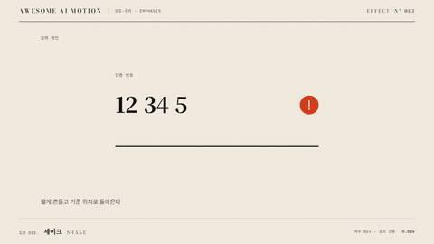

# Nº 083 셰이크 · Shake



[MP4](clip.mp4) · [HTML](index.html)

**요소가 기준 위치나 각도의 양쪽을 오가다가 멈춘다**

An element oscillates on both sides of its rest position or angle, then stops.

| Family | Level | Purpose | Media | Runtime |
|---|---|---|---|---|
| 강조·주의 · EMPHASIS | 기본 | 주목 끌기, 피드백 | 웹 UI, 제품 시연, 숏폼 | gsap |

다른 이름 / Also known as: Wiggle oscillation, 좌우 흔들림, CustomWiggle, Wobble, Shake and Vibrate, 흔들기와 진동, Wiggle indication, 좌우 흔들기 강조, Wiggle, WiggleOutThenIn, 사용자 진동

## 선택 기준 / Selection

주의를 끌거나 거부, 불안정, 오류를 표현한다. 작은 요소에 국소적으로 쓰는 시선 신호다 / Draws attention or signals refusal, instability or error. A local eye-catching cue for small elements.

- 입력 오류나 거부 상태를 폼 필드가 흔들려 알릴 때 / Shake a form field to signal an input error.
- 알림 아이콘이 주의를 끌어야 할 때 / Get a notification icon noticed.

좋은 예 / Good: 600ms 동안 위치 진폭 6px로 4번 왕복하고 감쇠 0.6으로 줄며 멈춘다
나쁜 예 / Bad: 감쇠 없이 계속 진동하거나 진폭 30px로 흔들어 화면이 무너진 것처럼 보인다
주의 / Avoid: 진폭 10px 초과 금지 · 한 화면에서 동시에 여러 요소가 흔들리지 않게 한다

## 파라미터 / Parameters

| Parameter | Default | Range | Note |
|---|---|---|---|
| 지속 | 600ms | 400~800ms |  |
| 위치 진폭 | 6px | 4~10px | 또는 회전 6도 |
| 왕복 | 4회 | 3~5회 |  |
| 감쇠 | 0.6 | 0.5~0.7 | 다음 진폭 배율 |

이징 / Ease: `sine.inOut`

## 구현 / Implementation (GSAP)

```js
const amps = [6, -3.6, 2.2, -1.3, 0]; // 감쇠 0.6
amps.forEach((x, i) => tl.to('.field', { x, duration: 0.12, ease: 'sine.inOut' }, 0.5 + i * 0.12));
```

## 프롬프트 / Prompts

### 한국어 · Claude Code
```text
<대상> 입력 필드에 셰이크를 넣어줘. x를 6, -3.6, 2.2, -1.3, 0px 순으로 0.12초씩 sine.inOut으로 옮겨 총 0.6초 동안 감쇠 진동하게 하고 시작은 0.5초야. 끝은 정확히 x 0.
```

### 한국어 · Codex
```text
<파일>의 오류 표시에 shake를 적용해. amps [6, -3.6, 2.2, -1.3, 0], 구간 0.12초, ease sine.inOut, 시작 0.5초. 0.5초, 0.62초, 0.74초, 1.1초를 캡처해 좌우 진폭이 줄고 1.1초에 x가 정확히 0인지 확인해.
```

### English · Claude Code
```text
Add a shake to the input field in <target>. Move x through 6, -3.6, 2.2, -1.3, 0px in 0.12-second sine.inOut steps for a damped 0.6-second oscillation starting at 0.5 seconds. End at exactly x 0.
```

### English · Codex
```text
Apply shake to the error state in <file>: amps [6, -3.6, 2.2, -1.3, 0], segment 0.12s, ease sine.inOut, start 0.5s. Capture at 0.5s, 0.62s, 0.74s and 1.1s and verify the amplitude decays and x is exactly 0 at 1.1s.
```

예시 / Example: 셰이크를 `.hero`에 적용해. / Apply Shake to `.hero`.

## 적용 / Application

- HyperFrames: 감쇠 진폭 배열을 순차 tween으로 쌓는다. 마지막 값 0으로 위치가 복귀한다
- ReelForge: 브리프에 진폭, 왕복 횟수, 감쇠, 대상 요소를 싣는다
- Scrolline Deck: 진행률 3% 구간에 재생한다. 배열 진폭이 0에 수렴하므로 스크럽이 멈춰도 위치가 어긋나지 않는다

조합 / Pair with: [오류 셰이크 · Error Shake](../error-shake/) · [스윙 · Swing](../swing/) · [화면 흔들림 · Screen Shake](../screen-shake/)

출처 / Sources: [greensock/GSAP](https://gsap.com/docs/v3/Eases/CustomWiggle/) (GSAP Standard License) · [animate-css/animate.css](https://github.com/animate-css/animate.css) (Hippocratic-2.1) · [ManimCommunity/manim](https://github.com/ManimCommunity/manim/blob/main/manim/animation/indication.py) (MIT) · motion dictionary 1-principles.md#4.1 곡선의 읽는 법 (own) · [CodePen GreenSock](https://codepen.io/GreenSock/pen/wzkBYZ) (unknown)

[목록 / Catalog](../../references/catalog.md) · [index.json](../../index.json)
