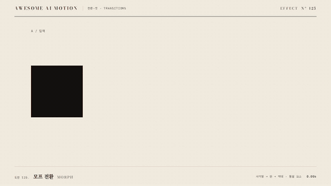

# Nº 125 모프 전환 · Morph



[MP4](clip.mp4) · [HTML](index.html)

**같은 요소의 형태와 색을 바꿔 다음 장면의 구성 요소로 이어지는 전환**

The same element changes shape and color to become a component of the next scene.

| Family | Level | Purpose | Media | Runtime |
|---|---|---|---|---|
| 전환·컷 · TRANSITIONS | 중급 | 전환, 순서·흐름 | 설명 영상, 숏폼, 발표 | gsap |

다른 이름 / Also known as: 형태 전환, Shape morph, Container Morph, 컨테이너 모프, card-morph-anchor, Optical flow morph cut, 광학 흐름 모프 컷, Universal chart mark morph

## 선택 기준 / Selection

형태가 달라져도 정보의 연결과 대상의 연속성이 유지된다 / Maintains the connection between information and the continuity of an object as its shape changes.

- 입력 도형을 출력 데이터의 막대로 연결할 때 / Transform an input shape into a bar in output data.
- 장면 사이에 같은 대상을 다른 역할로 이어갈 때 / Carry the same object across scenes in a different role.

좋은 예 / Good: 먹 사각형이 주홍 원으로 변한 뒤 가로로 늘어나 고른다 62% 막대가 된다
나쁜 예 / Bad: 사각형을 지우고 별도 원과 막대를 등장시켜 연속 변형이 사라진다
주의 / Avoid: 같은 DOM 요소를 유지한다 · 변형 중 형태를 읽을 짧은 정지를 둔다

## 파라미터 / Parameters

| Parameter | Default | Range | Note |
|---|---|---|---|
| 원 변형 시간 | 0.7s | 0.4~0.9s | 색과 모서리를 함께 변경 |
| 원 홀드 | 0.2s | 0.15~0.35s | 다음 변형 전 원을 읽는다 |
| 막대 배율 | 3.1 × 0.16 | 가로 2~4 × 세로 0.1~0.3 | 200px 원이 620×32px 막대로 변한다 |
| 막대 변형 시간 | 0.75s | 0.5~1s | 위치와 크기를 동시에 연결 |

이징 / Ease: `power2.inOut / power3.inOut`

## 구현 / Implementation (GSAP)

```js
tl.set('.morph', {x:420, borderRadius:'0%', scaleX:1, scaleY:1});
tl.to('.morph', {borderRadius:'50%', backgroundColor:'var(--verm)', duration:0.7, ease:'power2.inOut'}, 0.35);
tl.to('.morph', {x:0, scaleX:3.1, scaleY:0.16, borderRadius:'0%', duration:0.75, ease:'power3.inOut'}, 1.25);
tl.to('.b', {opacity:1, duration:0.3}, 1.75);
```

## 프롬프트 / Prompts

### 한국어 · Claude Code
```text
<대상>의 먹 사각형을 같은 DOM 요소로 주홍 원과 막대로 변형해줘. 200×200px 사각형은 0.35초부터 0.7초간 border-radius 0%에서 50%로 바꾸며 주홍으로 변하고 1.25초부터 0.75초간 x 420에서 0, scaleX 3.1, scaleY 0.16, border-radius 0%로 변해. 장면 B는 1.75초부터 0.3초간 드러내고 2.35초 이후 정지해.
```

### 한국어 · Codex
```text
<파일>에서 left 64px, top 190px인 200×200px 요소를 transform-origin 0 50%로 두고 초기 x를 420px로 설정해. 0.35초부터 0.7초간 원과 주홍색으로 변형하고 1.25초부터 0.75초간 x 0, scaleX 3.1, scaleY 0.16으로 움직여 첫 막대로 연결해. 0.23초, 0.73초, 1.23초, 1.73초, 2.9초를 캡처해 같은 요소의 크기·색·형태가 이어지고 최종 막대가 620×32px인지 확인해.
```

### English · Claude Code
```text
Transform the ink-black square in <target> into a vermilion circle and then a bar using the same DOM element. Starting at 0.35 seconds over 0.7 seconds, change the 200×200px square from border-radius 0% to 50% while turning it vermilion. Starting at 1.25 seconds over 0.75 seconds, animate x from 420 to 0, scaleX to 3.1, scaleY to 0.16, and border-radius to 0%. Reveal scene B starting at 1.75 seconds over 0.3 seconds, and hold after 2.35 seconds.
```

### English · Codex
```text
In <file>, place a 200×200px element at left 64px and top 190px with transform-origin 0 50% and initial x 420px. Starting at 0.35 seconds over 0.7 seconds, morph it into a vermilion circle. Starting at 1.25 seconds over 0.75 seconds, animate to x 0, scaleX 3.1, and scaleY 0.16 to connect it to the first bar. Capture at 0.23, 0.73, 1.23, 1.73, and 2.9 seconds to verify continuity of the same element's size, color, and shape, and a final bar size of 620×32px.
```

예시 / Example: 모프 전환를 `.hero`에 적용해. / Apply Morph to `.hero`.

## 적용 / Application

- HyperFrames: 장면 안쪽 래퍼를 paused GSAP 타임라인 하나로 움직인다. 3초 길이에서 마지막 0.5초 이상을 홀드한다.
- ReelForge: 전환 전후 장면을 동시에 배치하고 이동·마스크·색 변화의 시작과 끝을 같은 시간축에 둔다.
- Scrolline Deck: 전환 시간을 스크롤 진행률로 환산한다. 역방향 seek에도 시작 상태가 복원되게 초기값을 타임라인에 둔다.

조합 / Pair with: [매치컷 · Match Cut](../match-cut/) · [스쿼시 앤 스트레치 · Squash & Stretch](../squash-stretch/) · [막대 성장 · Bar Grow](../bar-grow/)

출처 / Sources: [GSAP Timeline 공식 문서](https://gsap.com/docs/v3/GSAP/Timeline/) (공식 문서 개념 참조) · [Adobe](https://helpx.adobe.com/uk/premiere/desktop/add-video-effects/apply-video-transitions/apply-morph-cut-to-smoothen-jump-cuts.html) (unknown) · [Blackmagic Design](https://www.blackmagicdesign.com/products/davinciresolve/edit) (unknown) · [apache/echarts](https://echarts.apache.org/handbook/en/basics/release-note/5-2-0/) (Apache-2.0) · [Heer & Robertson 2007](https://sites.stat.columbia.edu/gelman/communication/HeerRobertson2007.pdf) (unknown) · [heygen-com/hyperframes](https://raw.githubusercontent.com/heygen-com/hyperframes/main/registry/components/modal-morph/registry-item.json) (Apache-2.0) · [greensock/GSAP](https://gsap.com/docs/v3/Plugins/Flip/) (GSAP Standard License) · [motiondivision/motion](https://motion.dev/docs/react-layout-animations) (MIT)

[목록 / Catalog](../../references/catalog.md) · [index.json](../../index.json)
