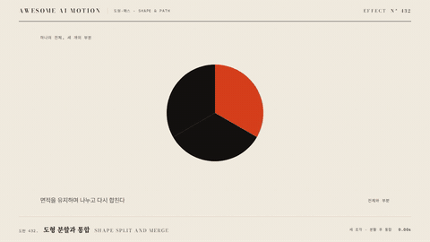

# Nº 432 도형 분할과 통합 · Shape Split and Merge



[MP4](clip.mp4) · [HTML](index.html)

**하나의 도형이 여러 작은 도형으로 갈라지거나, 여러 도형이 하나로 합쳐진다**

One shape splits into several smaller shapes, or several shapes merge into one.

| Family | Level | Purpose | Media | Runtime |
|---|---|---|---|---|
| 도형·패스 · SHAPE & PATH | 중급 | 설명, 비교 | 설명 영상, 발표, 데이터 스토리 | svg |

다른 이름 / Also known as: SVG Shape Split and Merge, SVG 도형 분할과 합체, One-to-many morph, Many-to-one morph

## 선택 기준 / Selection

부분과 전체의 관계, 분류와 통합을 보여 준다. 하나의 전체가 어떤 조각으로 이뤄졌는지 설명한다 / Shows part-whole relationships, classification and consolidation, explaining what pieces a whole is made of.

- 전체가 세 개의 구성 요소로 나뉘는 과정을 설명할 때 / Explain a whole dividing into three components.
- 여러 항목이 하나의 범주로 합쳐지는 것을 보여 줄 때 / Show several items merging into one category.

좋은 예 / Good: 도형 하나가 1600ms 동안 power3.inOut으로 3개로 갈라져 36px 간격으로 벌어진다. 대응점 100개로 형태가 매끄럽다
나쁜 예 / Bad: 조각이 페이드로 나타나 갈라지는 인상이 없거나, 조각마다 시작 시각이 달라 어수선하다
주의 / Avoid: 조각 총 면적이 원래 도형과 비슷하게 유지되게 한다 · 목표 도형은 5개 이하

## 파라미터 / Parameters

| Parameter | Default | Range | Note |
|---|---|---|---|
| 지속 | 1600ms | 1200~2000ms |  |
| 목표 도형 | 3개 | 2~5개 |  |
| 간격 | 36px | 24~60px | 분리 후 벌어짐 |
| 대응점 | 100개 | 60~200개 | 경로 점 수 |

이징 / Ease: `power3.inOut`

## 구현 / Implementation (GSAP)

```js
const u = { p: 0 };
tl.to(u, { p: 1, duration: 1.6, ease: 'power3.inOut', onUpdate: () => {
  parts.forEach((pt, i) => pt.setAttribute('d', lerpPath(src[i], dst[i], u.p))); } }, 0.3);
// src[i]: 원본 도형을 3분할한 경로, dst[i]: 벌어진 위치의 각 조각
```

## 프롬프트 / Prompts

### 한국어 · Claude Code
```text
<대상> 원 하나를 3개 조각으로 나누는 애니메이션을 SVG 경로로 만들어줘. 원본을 세 부채꼴로 분할한 경로를 100점으로 리샘플링해 1.6초 동안 power3.inOut으로 36px씩 벌어지게 해. 조각은 처음부터 원 안에 있고 합쳐 보면 원과 같아야 해.
```

### 한국어 · Codex
```text
<파일>에 shape split를 구현해. 경로 100점, p 0→1 / 1.6s / power3.inOut, 시작 0.3초, 조각 3개 간격 36px. 0.3초에 조각 합이 원본과 같은지, 1.0초에 벌어지는 중인지, 1.9초에 간격이 36px인지 캡처해서 확인해.
```

### English · Claude Code
```text
Animate a circle in <target> splitting into 3 pieces using SVG paths. Divide the original into three sectors resampled to 100 points and spread each 36px apart over 1.6 seconds with power3.inOut. The pieces start inside the circle and must sum to the original circle.
```

### English · Codex
```text
Implement shape split in <file>: 100 path points, p 0 to 1 / 1.6s / power3.inOut, start 0.3s, 3 pieces spaced 36px. Capture at 0.3s to verify the pieces sum to the original, at 1.0s mid-spread, and at 1.9s to verify the spacing is 36px.
```

예시 / Example: 도형 분할과 통합를 `.hero`에 적용해. / Apply Shape Split and Merge to `.hero`.

## 적용 / Application

- HyperFrames: SVG 경로를 같은 점 수로 리샘플링해 p로 보간한다. 단일 tween이라 seek 안전
- ReelForge: 씬 브리프에 원본 도형 경로, 조각 경로, 간격을 싣는다
- Scrolline Deck: 진행률을 p에 선형으로 매핑한다. 역스크롤은 합침이 되므로 두 방향이 자연스럽다

조합 / Pair with: [모프 전환 · Morph](../shape-morph/) · [집계 분할과 합치기 · Aggregate Split and Merge](../aggregate-split-merge/) · [점 재배치 · Dot Regroup](../dot-regroup/)

출처 / Sources: [veltman/flubber](https://github.com/veltman/flubber) (MIT)

[목록 / Catalog](../../references/catalog.md) · [index.json](../../index.json)
