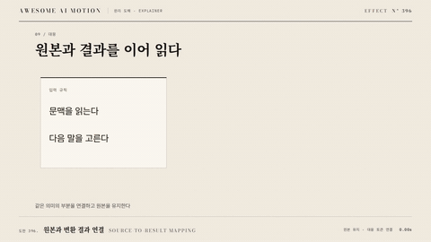

# Nº 396 원본과 변환 결과 연결 · Source-to-result Mapping



[MP4](clip.mp4) · [HTML](index.html)

**원본 코드가 유지된 채 반대편에 변환된 코드가 나타나고 대응 부분이 연결된다.**

The source remains visible as transformed code appears with linked corresponding tokens.

| Family | Level | Purpose | Media | Runtime |
|---|---|---|---|---|
| 원리 도해 · EXPLAINER | 중급 | 설명, 순서·흐름 | 설명 영상, 스크롤덱, 발표 | gsap |

다른 이름 / Also known as: Source-to-compiled representation, 소스에서 변환 결과 공개

## 선택 기준 / Selection

고수준 표현이 실행 가능한 형태로 바뀌는 관계를 이해한다. / Explains how a high-level representation becomes an executable form.

- 원본과 변환 결과 연결으로 원인과 결과를 설명할 때 / Explain causes and results using source-to-result mapping.
- 대응하는 요소를 같은 화면에서 순서대로 읽게 할 때 / Present corresponding elements in a readable sequence within the same view.

좋은 예 / Good: 원본 타입 선언과 변환 결과의 대응 토큰을 같은 색으로 밝힌다.
나쁜 예 / Bad: 줄 번호만 연결해 다른 의미의 토큰을 대응시킨다.
주의 / Avoid: 줄 번호만 연결해 다른 의미의 토큰을 대응시킨다. · 설명 라벨과 대응 색을 동작 중에 바꾸지 않는다.

## 파라미터 / Parameters

| Parameter | Default | Range | Note |
|---|---|---|---|
| 기본 지속 | 0.7s | 0.49~0.98s | 첫 동작 또는 후보의 기본 단계 길이 |
| 대응 강조 | 350ms | 200~500ms | 같은 의미 키로 양쪽을 연결한다 |
| 이징 | power2.out | none \| power2.out \| power2.inOut | 주파수 변화는 선형으로 두고 위치 변화는 완만하게 연결한다. |

## 구현 / Implementation (GSAP)

```js
const tl = gsap.timeline({paused:true});
tl.fromTo(compiled,{opacity:0,x:24},{opacity:1,x:0,duration:0.7,ease:"power2.out"});
tl.to([sourceToken,resultToken],{backgroundColor:"#335577",duration:0.35},0.7);
tl.fromTo(connector,{scaleX:0},{scaleX:1,transformOrigin:"0% 50%",duration:0.35},0.7);
```

## 프롬프트 / Prompts

### 한국어 · Claude Code
```text
<파일>에서 <대상>에 원본과 변환 결과 연결을 적용해. 원본 코드가 유지된 채 반대편에 변환된 코드가 나타나고 대응 부분이 연결된다. 자체 양쪽 코드 렌더와 의미 대응표로 토큰 강조를 순차 갱신한다. 기본 지속은 0.7s, 대응 강조은 350ms, 이징은 power2.out로 설정한다. 하나의 paused GSAP 타임라인으로 구성하고 seek할 때 좌표와 표시 상태를 다시 계산해.
```

### 한국어 · Codex
```text
<파일>의 설명 장면에서 <대상>에 원본과 변환 결과 연결을 적용해. 기본 지속은 0.7s, 대응 강조은 350ms, 이징은 power2.out로 설정한다. 0초, 0.35초, 0.7초 시점을 캡처해 초기 상태, 중간 대응 관계, 첫 동작의 완료 상태를 확인해. 원본과 결과의 의미 대응 및 라벨 가독성을 검증해.
```

### English · Claude Code
```text
Apply Source-to-result Mapping to <target> in <file>. The source remains visible as transformed code appears with linked corresponding tokens. Use a base duration of 0.7s and power2.out; use a 700ms result reveal followed by a 350ms paired token highlight and preserve semantic correspondence. Build one paused GSAP timeline and recompute geometry and visibility when seeking.
```

### English · Codex
```text
Implement Source-to-result Mapping in the explanatory scene of <file> for <target>, using 0.7s and power2.out with a 700ms result reveal followed by a 350ms paired token highlight. Capture at 0, 0.35, and 0.7 seconds to check the initial state, intermediate correspondence, and completion of the first motion. Verify matching source and result elements and readable labels.
```

예시 / Example: 원본과 변환 결과 연결를 `.hero`에 적용해. / Apply Source-to-result Mapping to `.hero`.

## 적용 / Application

- HyperFrames: 원본과 변환 결과 연결의 계산 상태와 표시를 paused 타임라인 하나에 묶는다. seek 시 onUpdate에서 좌표를 재계산하고 0초 초기 상태도 설정한다.
- ReelForge: 씬 워커 브리프에 원본과 변환 결과 연결, 기본 지속 0.7s, 대응 강조 350ms, 대응 요소의 키와 읽기 순서를 적는다.
- Scrolline Deck: 진행률 0~1을 전체 단계 시간에 매핑해 scrub한다. 대응 강조 350ms를 유지하고 스프링 대신 power2.out을 사용한다.

조합 / Pair with: [대응 기호 이동 · Matching Token Transform](../matching-token-transform/) · [비교 분할 · Split Compare](../split-compare/)

출처 / Sources: [code-hike/codehike](https://codehike.org/docs/code/transpile) (MIT)

[목록 / Catalog](../../references/catalog.md) · [index.json](../../index.json)
