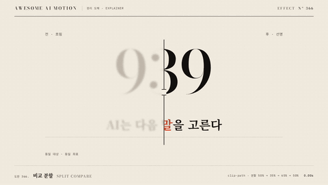

# Nº 366 비교 분할 · Split Compare



[MP4](clip.mp4) · [HTML](index.html)

**같은 대상을 전후 상태로 겹치고 움직이는 세로 경계로 비교하는 움직임**

An animation that overlays before and after states of the same subject and compares them with a moving vertical divider.

| Family | Level | Purpose | Media | Runtime |
|---|---|---|---|---|
| 원리 도해 · EXPLAINER | 기본 | 비교, 설명 | 설명 영상, 발표, 스크롤덱 | gsap |

다른 이름 / Also known as: 전후 슬라이더, Before After Split, Comparison reveal slider, 비교 경계 슬라이더, Image Comparison Wipe, 이미지 비교 쓸기, Before after wipe, 전후 비교 와이프

## 선택 기준 / Selection

분할선 위치에 따라 같은 대상의 변화가 드러난다 / Reveals changes in the same subject as the divider moves.

- 같은 대상의 처리 전후를 비교할 때 / When comparing a subject before and after processing
- 변화가 생긴 위치를 직접 대조할 때 / When directly comparing the locations where changes occur

좋은 예 / Good: 939와 같은 문장을 흐린 전 상태, 선명한 후 상태로 좌표를 맞춰 비교한다
나쁜 예 / Bad: 전후 대상의 크기와 위치가 달라 경계에서 연결이 끊어진다
주의 / Avoid: 레이어 간 기준 좌표를 다르게 하지 않는다 · 분할선을 마지막까지 움직이지 않는다

## 파라미터 / Parameters

| Parameter | Default | Range | Note |
|---|---|---|---|
| 분할 위치 | 50%, 35%, 65%, 50% | 30~70% | 양쪽 상태를 번갈아 노출 |
| 구간 지속 | 0.6s, 0.65s, 0.65s | 0.5~0.8s | 이동을 읽을 시간 |
| 완료 시각 | 2.2s | 2~2.4s | 중앙 홀드 |
| 전 상태 흐림 | 3px | 1~5px | 예시 비교 처리 |

이징 / Ease: `power2.inOut`

## 구현 / Implementation (GSAP)

```js
const tl = Motion.timeline();
const stops=[35,65,50], starts=[.3,.9,1.55], durations=[.6,.65,.65];
stops.forEach((p,i)=>{ const vars={duration:durations[i],ease:'power2.inOut'};
 tl.to('.before',{clipPath:`inset(0% ${100-p}% 0% 0%)`,...vars},starts[i]);
 tl.to('.after',{clipPath:`inset(0% 0% 0% ${p}%)`,...vars},starts[i]);
 tl.to('.divider',{x:1168*(p/100-.5),...vars},starts[i]);
});
```

## 프롬프트 / Prompts

### 한국어 · Claude Code
```text
<대상>의 전후 레이어를 동일 좌표로 겹치고 왼쪽은 blur 3px과 opacity 0.55, 오른쪽은 선명하게 둔다. 숫자 문자열 clip-path inset으로 분할 비율을 50%에서 35%, 65%, 50%로 움직인다. 0.3초, 0.9초, 1.55초에 각각 0.6초, 0.65초, 0.65초 power2.inOut 이동을 걸고 세로 분할선 x를 같은 비율로 맞춘다. 3초 타임라인 하나로 만들고 마지막 0.6초는 정지한다.
```

### 한국어 · Codex
```text
<파일>의 <대상>에 <대상>의 전후 레이어를 동일 좌표로 겹치고 왼쪽은 blur 3px과 opacity 0.55, 오른쪽은 선명하게 둔다. 숫자 문자열 clip-path inset으로 분할 비율을 50%에서 35%, 65%, 50%로 움직인다. 0.3초, 0.9초, 1.55초에 각각 0.6초, 0.65초, 0.65초 power2.inOut 이동을 걸고 세로 분할선 x를 같은 비율로 맞춘다. 0.24초, 1.25초, 2.9초를 캡처해 전후 좌표 일치, 분할선과 마스크 동기화, 마지막 중앙 홀드를 확인한다. 시간은 GSAP 타임라인만 사용한다.
```

### English · Claude Code
```text
Overlay the before and after layers of <target> at identical coordinates. Set the left side to blur 3px and opacity 0.55, and keep the right side sharp. Use a numeric-string clip-path inset to move the split ratio from 50% to 35%, 65%, and 50%. Start the moves at 0.3, 0.9, and 1.55 seconds with respective durations of 0.6, 0.65, and 0.65 seconds and ease power2.inOut. Match the vertical divider x position to the same ratio. Use a single 3-second timeline and hold still for the final 0.6 seconds.
```

### English · Codex
```text
In <target> in <file>, Overlay the before and after layers of <target> at identical coordinates. Set the left side to blur 3px and opacity 0.55, and keep the right side sharp. Use a numeric-string clip-path inset to move the split ratio from 50% to 35%, 65%, and 50%. Start the moves at 0.3, 0.9, and 1.55 seconds with respective durations of 0.6, 0.65, and 0.65 seconds and ease power2.inOut. Match the vertical divider x position to the same ratio. Capture at 0.24, 1.25, and 2.9 seconds to check matching before and after coordinates, synchronization of the divider and mask, and the final centered hold. Use only a GSAP timeline for timing.
```

예시 / Example: 비교 분할를 `.hero`에 적용해. / Apply Split Compare to `.hero`.

## 적용 / Application

- HyperFrames: 3초 paused GSAP 타임라인 하나로 구성하고 Motion.ready()로 seek를 노출한다. 두 레이어의 clip-path inset 값을 상보적으로 바꾸고 분할선 x를 같은 비율로 이동한다.
- ReelForge: 3초 장면 안의 요소를 분리하고 transform과 opacity 트랙으로 같은 순서를 구현한다. 두 레이어의 clip-path inset 값을 상보적으로 바꾸고 분할선 x를 같은 비율로 이동한다.
- Scrolline Deck: 0.3~2.4초 동작을 스크롤 진행률 10~80%로 매핑하고 끝 20%를 완성 상태로 둔다. 두 레이어의 clip-path inset 값을 상보적으로 바꾸고 분할선 x를 같은 비율로 이동한다.

조합 / Pair with: [와이프 · Wipe](../wipe/) · [랙 포커스 · Rack Focus](../rack-focus/) · [하이라이트 스윕 · Highlight Sweep](../highlight-sweep/)

출처 / Sources: [GSAP Timeline 공식 문서](https://gsap.com/docs/v3/GSAP/Timeline/) (개념 참고) · [motion.dev examples](https://motion.dev/examples/react-image-reveal-slider) (unknown) · [ui.aceternity.com](https://ui.aceternity.com/components/compare) (unknown) · [ibelick/motion-primitives](https://motion-primitives.com/docs/image-comparison) (MIT) · [magicuidesign/magicui](https://magicui.design/docs/components/code-comparison) (MIT) · [heygen-com/hyperframes](https://raw.githubusercontent.com/heygen-com/hyperframes/main/registry/components/before-after-wipe/registry-item.json) (Apache-2.0) · [heygen-com/hyperframes](https://raw.githubusercontent.com/heygen-com/hyperframes/main/registry/components/comparison-split/registry-item.json) (Apache-2.0) · [heygen-com/hyperframes](https://raw.githubusercontent.com/heygen-com/hyperframes/main/registry/components/grade-split-reveal/registry-item.json) (Apache-2.0)

[목록 / Catalog](../../references/catalog.md) · [index.json](../../index.json)
