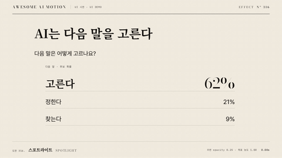

# Nº 316 스포트라이트 · Spotlight



[MP4](clip.mp4) · [HTML](index.html)

**주변 화면을 옅게 낮추고 한 영역의 농도를 유지해 괄호로 집중시키는 동작**

An animation that dims the surrounding screen while keeping one region fully opaque and framing it with brackets.

| Family | Level | Purpose | Media | Runtime |
|---|---|---|---|---|
| UI 시연 · UI DEMO | 기본 | 설명, 강조 | 제품 시연, 설명 영상, 웹 UI | gsap |

다른 이름 / Also known as: Signaling, 신호 주기, Card Focus Blur, 카드 초점 강조, Spotlight Reveal, 스포트라이트 리빌, 움직이는 스포트라이트, mask-spotlight-drift

## 선택 기준 / Selection

정보의 우선순위와 현재 읽어야 할 영역 / Shows information priority and the region to read now.

- 고른다 62%만 진하게 남기고 다른 후보와 제목은 opacity 0.25로 낮춘다 / When keeping only "picks 62%" fully opaque and dimming the other candidates and title to opacity 0.25
- 정보의 우선순위와 현재 읽어야 할 영역을 보여 줄 때 / When showing information priority and the region to read now

좋은 예 / Good: 고른다 62%만 진하게 남기고 다른 후보와 제목은 opacity 0.25로 낮춘다
나쁜 예 / Bad: 강조할 후보까지 함께 흐리게 만들거나 여러 영역에 주홍 괄호를 붙인다
주의 / Avoid: 강조할 후보까지 함께 흐리게 만들거나 여러 영역에 주홍 괄호를 붙인다 · 동작 종료 뒤 최소 0.5초 읽기 시간을 둔다

## 파라미터 / Parameters

| Parameter | Default | Range | Note |
|---|---|---|---|
| 주변 농도 | 0.25 | 0.15~0.4 | 맥락을 남기는 옅은 상태 |
| 목표 농도 | 1.00 | 0.9~1 | 강조 대상은 원래 진하기 유지 |
| 주변 전환 | 0.65s | 0.3~0.8s | opacity만 낮춘다 |
| 괄호 그리기 | 0.45s / 3px | 0.25~0.6s / 2~4px | 한 영역 둘레를 주홍으로 표시 |

이징 / Ease: `power3.out`

## 구현 / Implementation (GSAP)

```js
const tl = Motion.timeline();
tl.to('.context',{opacity:.25,duration:.65,ease:'power3.out'},.35);
tl.to('.brackets path',{strokeDashoffset:0,autoRound:false,duration:.45,ease:'power2.out'},.7);
tl.to('.lead',{opacity:1,duration:.25},1.4);
```

## 프롬프트 / Prompts

### 한국어 · Claude Code
```text
<대상> 후보 목록에서 고른다 62% 영역을 스포트라이트로 강조해줘. 목표 요소는 opacity 1로 유지하고 제목, 질문, 다른 후보를 0.35초부터 0.65초 동안 opacity 0.25로 낮춰. 0.7초부터 주홍 3px 테두리 괄호를 0.45초 동안 그리고 1.65~3초는 완성 상태로 유지해.
```

### 한국어 · Codex
```text
<파일>의 후보 목록을 context 그룹과 focus 영역으로 분리해. GSAP 타임라인에서 context만 0.35초부터 0.65초 동안 opacity 0.25로 바꾸고 focus는 1로 유지해. 주홍 SVG 괄호의 strokeDashoffset을 0.7~1.15초에 1에서 0으로 바꾸고 0.23초, 1.23초, 2.9초 캡처로 농도 대비, 한 영역의 괄호, 최종 홀드를 확인해.
```

### English · Claude Code
```text
Highlight the "picks 62%" region in the <target> candidate list with a spotlight. Keep the target element at opacity 1, and dim the title, question, and other candidates to opacity 0.25 over 0.65 seconds starting at 0.35 seconds. Starting at 0.7 seconds, draw vermilion 3px outline brackets over 0.45 seconds. Hold the completed state from 1.65 to 3 seconds.
```

### English · Codex
```text
Separate the candidate list in <file> into a context group and a focus region. In a GSAP timeline, change only context to opacity 0.25 over 0.65 seconds starting at 0.35 seconds, and keep focus at 1. Change strokeDashoffset on the vermilion SVG brackets from 1 to 0 between 0.7 and 1.15 seconds. Capture at 0.23, 1.23, and 2.9 seconds to check opacity contrast, brackets around a single region, and the final hold.
```

예시 / Example: 스포트라이트를 `.hero`에 적용해. / Apply Spotlight to `.hero`.

## 적용 / Application

- HyperFrames: 공용 하네스의 paused 타임라인에 모든 동작을 넣어 초 단위 seek로 검증한다
- ReelForge: UI 요소와 강조 요소를 분리하고 동일한 타이밍 수치를 씬 파라미터로 옮긴다
- Scrolline Deck: 3초 타임라인을 스크롤 진행률 0~1로 매핑하고 마지막 0.5초에 완성 상태를 유지한다

조합 / Pair with: [모션 위계 · Motion Hierarchy](../motion-hierarchy/) · [확대 콜아웃 · Zoom Callout](../zoom-callout/) · [하이라이트 스윕 · Highlight Sweep](../highlight-sweep/)

출처 / Sources: [GSAP Timeline 공식 문서](https://gsap.com/docs/v3/GSAP/Timeline/) (공식 문서 개념 참조) · [ui.aceternity.com](https://ui.aceternity.com/components/focus-cards) (unknown) · [DavidHDev/react-bits](https://github.com/DavidHDev/react-bits) (MIT + Commons Clause v1.0) · [magicuidesign/magicui](https://magicui.design/docs/components/magic-card) (MIT) · [ui.aceternity.com](https://ui.aceternity.com/components/spotlight) (unknown) · [ibelick/motion-primitives](https://motion-primitives.com/docs/spotlight) (MIT) · [heygen-com/hyperframes](https://raw.githubusercontent.com/heygen-com/hyperframes/main/registry/components/spotlight-card/registry-item.json) (Apache-2.0) · [Heer & Robertson 2007](https://sites.stat.columbia.edu/gelman/communication/HeerRobertson2007.pdf) (unknown)

[목록 / Catalog](../../references/catalog.md) · [index.json](../../index.json)
