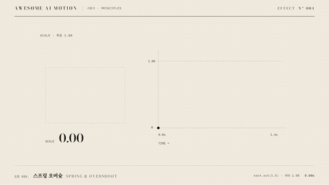

# Nº 004 스프링 오버슛 · Spring & Overshoot



[MP4](clip.mp4) · [HTML](index.html)

**목표 크기를 조금 넘었다가 되돌아와 안착하는 움직임**

An object briefly exceeds its target scale before returning and settling.

| Family | Level | Purpose | Media | Runtime |
|---|---|---|---|---|
| 기본기 · PRINCIPLES | 기본 | 주목 끌기, 피드백, 설명 | 설명 영상, 제품 시연, 웹 UI | gsap |

다른 이름 / Also known as: 오버슈트, Back easing, 목표 초과, Elastic spring slide, 스프링 슬라이드 전환, Spring Text Pop, 스프링 텍스트 팝, Impact Number Reveal

## 선택 기준 / Selection

관성과 복원력이 있는 도착을 보여준다 / Shows inertia and restoring force as the object settles.

- 작은 객체가 나타나거나 선택 상태로 안착할 때 / Reveal a small object or settle it into a selected state.
- 목표 초과와 복원을 그래프로 설명할 때 / Explain overshoot and recovery with a graph.

좋은 예 / Good: 먹 블록이 scale 0에서 1.08까지 커졌다가 1.00으로 안착하고 그래프의 초과 구간만 주홍이 된다
나쁜 예 / Bad: 크기를 1.4까지 키워 주변 문장을 덮거나 여러 번 흔들려 읽기를 방해한다
주의 / Avoid: 본문 전체에 반복 적용하지 않는다 · 초과 크기가 주변 요소와 겹치지 않게 여백을 둔다

## 파라미터 / Parameters

| Parameter | Default | Range | Note |
|---|---|---|---|
| 도착 지속 | 1.4s | 0.8~1.6s | 초과와 복귀를 모두 포함한다 |
| Back 계수 | 1.5 | 1.0~2.0 | 1.5일 때 최대 scale 1.08이다 |
| 크기 범위 | 0→1.00 | 0~1.00 | 중심을 기준으로 크기를 바꾼다 |
| 시작 시각 | 0.30s | 0.20~0.40s | 완료 뒤 3초까지 정지한다 |

이징 / Ease: `back.out(1.5)`

## 구현 / Implementation (GSAP)

```js
const state = {t:0};
const spring = t => 1 + 2.5*(t-1)**3 + 1.5*(t-1)**2;
tl.to(state, {t:1, duration:1.4, ease:'none', onUpdate:() => {
  gsap.set('#card', {scale:spring(state.t)});
  update(); // 누적 길이로 그래프 strokeDashoffset과 값 표시 동기화
}}, 0.3);
```

## 프롬프트 / Prompts

### 한국어 · Claude Code
```text
<대상>을 먹 블록으로 표현하고 0.3초부터 1.4초 동안 scale 0에서 1로 back.out(1.5) 도착을 만들어줘. 최대 크기는 1.08이며 옆 시간 그래프와 크기 숫자를 같은 프록시 값으로 갱신해. 그래프의 1.00 초과 구간만 주홍으로 그리고 2.05초부터 3초까지 완성 상태를 유지해.
```

### 한국어 · Codex
```text
<파일>의 .scene에 먹 블록과 scale 시간 그래프를 배치해. paused GSAP 타임라인의 0.3초부터 1.4초 동안 t를 0→1로 구동하고 scale=1+2.5*(t-1)^3+1.5*(t-1)^2를 적용해. SVG pathLength 1의 strokeDashoffset을 누적 경로 길이로 갱신하되 소수 값을 반올림하지 마. 0.73초에 부분 그래프, 1.14초에 최대 1.08, 2.9초에 1.00 안착과 주홍 초과 구간을 캡처해 확인해.
```

### English · Claude Code
```text
Represent <target> as an ink-black block and animate scale from 0 to 1 with back.out(1.5), starting at 0.3 seconds over 1.4 seconds. The maximum scale is 1.08. Update the adjacent time graph and scale readout from the same proxy value. Draw only the graph segment above 1.00 in vermilion, and hold the completed state from 2.05 to 3 seconds.
```

### English · Codex
```text
Place an ink-black block and a scale-over-time graph in .scene in <file>. In a paused GSAP timeline, drive t from 0 to 1 starting at 0.3 seconds over 1.4 seconds, and apply scale=1+2.5*(t-1)^3+1.5*(t-1)^2. Update strokeDashoffset on an SVG with pathLength 1 using cumulative path length, without rounding fractional values. Capture at 0.73 seconds for the partial graph, 1.14 seconds for the maximum 1.08, and 2.9 seconds for the settled 1.00 scale and vermilion overshoot segment.
```

예시 / Example: 스프링 오버슛를 `.hero`에 적용해. / Apply Spring & Overshoot to `.hero`.

## 적용 / Application

- HyperFrames: 단일 프록시 진행률로 블록 scale과 그래프를 갱신해 seek를 동기화한다
- ReelForge: 등장 비트의 scale에 back.out(1.5)를 적용하고 1.4초 뒤 값을 1에 고정한다
- Scrolline Deck: 스크롤 진행률을 back.out(1.5)에 넣고 목표 크기보다 8% 큰 영역의 여백을 확보한다

조합 / Pair with: [예비동작 · Anticipation](../anticipation/) · [스쿼시 앤 스트레치 · Squash & Stretch](../squash-stretch/) · [이징 · Easing](../easing-curves/)

출처 / Sources: [GSAP Easing 공식 문서](https://gsap.com/docs/v3/Eases/) (문서 참조) · [Adobe](https://helpx.adobe.com/premiere/desktop/add-video-effects/types-of-effects/transitions.html) (unknown) · [pixel-point/animate-text](https://github.com/pixel-point/animate-text) (unknown) · [animate-css/animate.css](https://github.com/animate-css/animate.css) (Hippocratic-2.1) · [jschr/textillate](https://github.com/jschr/textillate) (MIT) · [motion-canvas/motion-canvas](https://github.com/motion-canvas/motion-canvas) (MIT) · [heygen-com/hyperframes](https://raw.githubusercontent.com/heygen-com/hyperframes/main/registry/components/spring-pop/registry-item.json) (Apache-2.0) · [DavidHDev/react-bits](https://github.com/DavidHDev/react-bits) (MIT + Commons Clause v1.0)

[목록 / Catalog](../../references/catalog.md) · [index.json](../../index.json)
