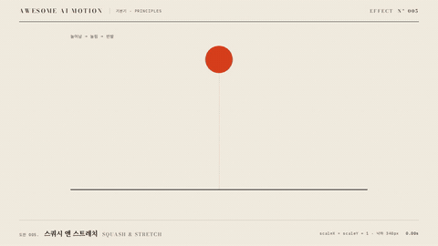

# Nº 005 스쿼시 앤 스트레치 · Squash & Stretch



[MP4](clip.mp4) · [HTML](index.html)

**속도가 붙으면 늘어나고 충돌하면 납작해지되 두 축의 배율 곱을 일정하게 유지하는 변형**

An object stretches as it gains speed and squashes on impact while keeping the product of its axis scales constant.

| Family | Level | Purpose | Media | Runtime |
|---|---|---|---|---|
| 기본기 · PRINCIPLES | 기본 | 설명, 강조, 피드백 | 설명 영상, 숏폼, 웹 UI | gsap |

다른 이름 / Also known as: 압축과 신장, 부피 유지 변형, Text Squash Stretch, 텍스트 눌림과 늘어남, Squash and stretch, 눌림과 늘어남, 스쿼시와 스트레치

## 선택 기준 / Selection

탄성, 무게, 충돌의 힘 / Conveys elasticity, weight, and the force of impact.

- 공이나 유연한 캐릭터의 충돌을 보여 줄 때 / Show the impact of a ball or flexible character.
- 작은 반발에 탄성을 더할 때 / Add elasticity to a small bounce.

좋은 예 / Good: 340px 낙하 중 세로 배율 1.55로 늘어나고 착지 순간 0.55로 눌리며 가로는 역수로 변한다
나쁜 예 / Bad: 두 축을 함께 늘려 공의 부피가 커지거나 바닥을 뚫고 내려간다
주의 / Avoid: 단단한 금속 물체에 큰 변형을 주지 않는다 · 세로와 가로 배율을 독립적으로 tween하지 않는다

## 파라미터 / Parameters

| Parameter | Default | Range | Note |
|---|---|---|---|
| 낙하 거리 | 340px | 180~400px | 바닥과 공의 하단을 맞춘다 |
| 늘어남 배율 | 1.55 | 1.2~1.7 | 세로 배율, 가로는 역수 |
| 압축 배율 | 0.55 | 0.5~0.8 | 첫 충돌의 세로 배율 |
| 압축 지속 | 0.10s | 0.07~0.15s | 충돌 직후 짧게 눌린다 |
| 반발 높이 | 210px | 100~250px | 첫 낙하보다 낮게 튄다 |

이징 / Ease: `power2.in 낙하 / power2.out 반발`

## 구현 / Implementation (GSAP)

```js
const shape = {s:1};
const deform = () => gsap.set('#ball',{scaleX:1/shape.s,scaleY:shape.s});
tl.to('#fall',{y:340,duration:.85,ease:'power2.in'},.3);
tl.to(shape,{s:1.55,duration:.55,ease:'power2.inOut',onUpdate:deform},.3);
tl.to(shape,{s:.55,duration:.1,ease:'power2.out',onUpdate:deform},1.15);
tl.to('#fall',{y:130,duration:.4,ease:'power2.out'},1.36);
tl.to(shape,{s:1.35,duration:.15,ease:'power2.out',onUpdate:deform},1.36);
```

## 프롬프트 / Prompts

### 한국어 · Claude Code
```text
GSAP으로 <대상> 공을 0.30초부터 0.85초 동안 340px 떨어뜨려줘. 세로 배율은 0.55초 동안 1.55로 늘리고 1.15초 충돌부터 0.10초 동안 0.55로 눌러. 가로 배율은 항상 세로 배율의 역수로 설정하고 하단을 변형 원점으로 해. 1.36초부터 210px 반발한 뒤 2.46초까지 바닥에서 원형으로 돌아오고 3.00초까지 정지해.
```

### 한국어 · Codex
```text
<파일>의 낙하 장면에 세로 배율 프록시를 넣고 onUpdate에서 scaleX=1/s, scaleY=s로 설정해. 0.30초부터 340px 낙하, 1.15초에 s 0.55 압축, 1.36초에 210px 반발을 적용해. 0.73초, 1.23초, 1.73초, 2.90초 캡처에서 늘어남, 바닥 압축, 반발, 최종 원형을 확인하고 배율 곱이 1인지 검증해.
```

### English · Claude Code
```text
Use GSAP to drop the <target> ball 340px starting at 0.30 seconds over 0.85 seconds. Stretch its vertical scale to 1.55 over 0.55 seconds, then squash it to 0.55 over 0.10 seconds starting at the 1.15-second impact. Always set horizontal scale to the reciprocal of vertical scale and use the bottom as the transform origin. Starting at 1.36 seconds, bounce it 210px upward, then return it to a circular shape on the floor by 2.46 seconds. Hold until 3.00 seconds.
```

### English · Codex
```text
Add a vertical-scale proxy to the falling scene in <file> and set scaleX=1/s and scaleY=s in onUpdate. Start the 340px drop at 0.30 seconds, squash to s 0.55 at 1.15 seconds, and bounce 210px upward at 1.36 seconds. Capture at 0.73, 1.23, 1.73, and 2.90 seconds to check the stretch, floor squash, bounce, and final circle. Verify that the product of the scales is 1.
```

예시 / Example: 스쿼시 앤 스트레치를 `.hero`에 적용해. / Apply Squash & Stretch to `.hero`.

## 적용 / Application

- HyperFrames: 세로 배율 프록시 하나를 tween하고 onUpdate에서 가로 역수를 설정한다. 공의 변형 원점은 하단이다
- ReelForge: 낙하, 충돌, 반발 비트마다 세로 배율을 지정하고 가로를 역수로 계산한다
- Scrolline Deck: 진행률 구간별 낙하와 압축을 계산하고 역수 배율로 부피를 유지한다

조합 / Pair with: [예비동작 · Anticipation](../anticipation/) · [아크 · Arcs](../arc-motion/) · [스프링 오버슛 · Spring & Overshoot](../spring-overshoot/)

출처 / Sources: [Twelve basic principles of animation, Squash and stretch](https://en.wikipedia.org/wiki/Twelve_basic_principles_of_animation) (개념 인용) · [codrops/LetterEffects](https://github.com/codrops/LetterEffects) (unknown) · [codrops/OnScrollTypographyAnimations](https://github.com/codrops/OnScrollTypographyAnimations) (MIT) · [codrops/OnScrollLetterAnimations](https://github.com/codrops/OnScrollLetterAnimations) (MIT) · [codrops/TextBlockTransitions](https://github.com/codrops/TextBlockTransitions) (MIT) · [heygen-com/hyperframes](https://raw.githubusercontent.com/heygen-com/hyperframes/main/registry/components/hw-box-label/registry-item.json) (Apache-2.0) · [greensock/GSAP](https://gsap.com/docs/v3/Eases/CustomBounce/) (GSAP Standard License) · [motiondesign.school](https://motiondesign.school/blog/animation-principles-in-logo-animation/) (unknown)

[목록 / Catalog](../../references/catalog.md) · [index.json](../../index.json)
