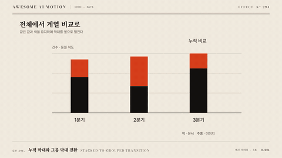

# Nº 294 누적 막대와 그룹 막대 전환 · Stacked-to-grouped Transition



[MP4](clip.mp4) · [HTML](index.html)

**쌓인 막대 조각들이 옆으로 펼쳐진 뒤 공통 기준선으로 내려온다.**

Stacked segments spread sideways, then move onto a shared baseline.

| Family | Level | Purpose | Media | Runtime |
|---|---|---|---|---|
| 데이터 · DATA | 중급 | 비교, 데이터 증명 | 설명 영상, 데이터 스토리, 발표 | svg |

다른 이름 / Also known as: Stacked-to-grouped bars

## 선택 기준 / Selection

합계와 구성 요소의 개별 크기를 연결해 비교한다. / Connects total values with comparisons between individual components.

- 범주 합계에서 구성 요소별 비교로 전환할 때 / Switch from category totals to component comparisons.
- 누적 막대와 그룹 막대가 같은 자료임을 설명할 때 / Explain how stacked and grouped bars encode the same data.

좋은 예 / Good: 조각을 가로로 0.5초 펼친 뒤 0.1초 쉬고 공통 기준선으로 0.5초 이동한다.
나쁜 예 / Bad: 가로와 세로 좌표를 동시에 크게 바꿔 조각의 대응이 사라진다.
주의 / Avoid: 전환 중 계열 색과 값 척도를 유지한다.

## 파라미터 / Parameters

| Parameter | Default | Range | Note |
|---|---|---|---|
| 가로 전환 | 500ms | 350~750ms | 폭과 x를 먼저 바꾼다. |
| 세로 전환 | 500ms | 350~750ms | y와 높이를 다음에 바꾼다. |
| 단계 간 휴지 | 100ms | 80~200ms | 가로 도착을 확인한다. |
| 그룹 간격 | 24px | 16~40px | 인접 계열을 구분한다. |
| 이징 | power2.inOut | none \| power2.out \| power2.inOut | 끝점을 넘지 않는 이징을 쓴다. |

## 구현 / Implementation (GSAP)

```js
const tl=gsap.timeline({paused:true});
document.querySelectorAll('.segment').forEach(el=>{
  const d=el.dataset;
  tl.to(el,{attr:{x:+d.groupX,width:+d.groupWidth},duration:0.5,ease:'power2.inOut'},0);
  tl.to(el,{attr:{y:+d.groupY,height:+d.groupHeight},duration:0.5,ease:'power2.inOut'},0.6);
});
```

## 프롬프트 / Prompts

### 한국어 · Claude Code
```text
<파일>의 <대상>에 누적 막대와 그룹 막대 전환를 구현해. 쌓인 막대 조각들이 옆으로 펼쳐진 뒤 공통 기준선으로 내려온다. 가로 전환 500ms, 세로 전환 500ms, 단계 간 휴지 100ms, 그룹 간격 24px, 이징 power2.inOut를 적용하고 GSAP 코어의 paused 타임라인 하나로 seek 가능하게 작성해. 전환 중 계열 색과 값 척도를 유지한다.
```

### 한국어 · Codex
```text
<파일>의 <대상> 장면에 누적 막대와 그룹 막대 전환를 적용해. 가로 전환 500ms, 세로 전환 500ms, 단계 간 휴지 100ms, 그룹 간격 24px, 이징 power2.inOut를 사용하고 다음 동작을 구현해: 각 조각의 x와 폭을 먼저 보간한 뒤 y와 높이를 보간한다. 플러그인과 Math.random 없이 작성하고 0.28초·0.66초·1.1초를 캡처해 초기 상태, 중간 변화, 최종 상태가 연속적이며 다음 예시와 맞는지 확인해: 조각을 가로로 0.5초 펼친 뒤 0.1초 쉬고 공통 기준선으로 0.5초 이동한다.
```

### English · Claude Code
```text
Implement Stacked-to-grouped Transition for <target> in <file>. Stacked segments spread sideways, then move onto a shared baseline. Use horizontal transition duration: 500ms; vertical transition duration: 500ms; pause between stages: 100ms; group spacing: 24px; easing: power2.inOut in a single paused GSAP core timeline that supports seeking. Keep series colors and value scales unchanged.
```

### English · Codex
```text
Apply Stacked-to-grouped Transition to the <target> scene in <file> using horizontal transition duration: 500ms; vertical transition duration: 500ms; pause between stages: 100ms; group spacing: 24px; easing: power2.inOut. Stacked segments spread sideways, then move onto a shared baseline. Use prepared data or geometry with GSAP core, no plugins, and no Math.random; capture at 0.28, 0.66, 1.1 seconds to verify continuous intermediate geometry, correct endpoints, and identical output after repeated seeks. Keep series colors and value scales unchanged.
```

예시 / Example: 누적 막대와 그룹 막대 전환를 `.hero`에 적용해. / Apply Stacked-to-grouped Transition to `.hero`.

## 적용 / Application

- HyperFrames: paused 타임라인 하나에 누적 막대와 그룹 막대 전환 상태를 넣고 seek(t)로 1.1초 구간을 재현한다. 현재 시간에서 도형을 계산해 프레임 누적을 피한다.
- ReelForge: 씬 워커 브리프에 가로 전환 500ms, 세로 전환 500ms, 단계 간 휴지 100ms, 그룹 간격 24px, 이징 power2.inOut를 싣고 입력 자료와 초기 도형 좌표를 고정한다. 조각을 가로로 0.5초 펼친 뒤 0.1초 쉬고 공통 기준선으로 0.5초 이동한다.
- Scrolline Deck: 진행률 0~1을 1.1초 구간에 매핑해 같은 타임라인을 scrub한다. 시간량은 none, 시각 전환은 power2.out을 쓰고 스프링 대신 끝점을 넘지 않는 ease-out을 쓴다.

조합 / Pair with: [차트 단계 전환 · Staged Chart Transition](../staged-chart-transition/) · [백분율 정규화 전환 · Percent Normalization](../percent-normalization/)

출처 / Sources: [Observable @d3](https://observablehq.com/@d3/stacked-to-grouped-bars) (unknown) · [Heer & Robertson 2007](https://sites.stat.columbia.edu/gelman/communication/HeerRobertson2007.pdf) (unknown)

[목록 / Catalog](../../references/catalog.md) · [index.json](../../index.json)
