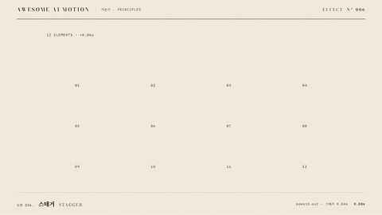

# Nº 006 스태거 · Stagger



[MP4](clip.mp4) · [HTML](index.html)

**여러 요소를 일정한 시간차로 차례로 등장시키는 움직임**

Multiple elements appear in sequence with a consistent delay between them.

| Family | Level | Purpose | Media | Runtime |
|---|---|---|---|---|
| 기본기 · PRINCIPLES | 기본 | 순서·흐름, 설명 | 설명 영상, 발표, 웹 UI | gsap |

다른 이름 / Also known as: 순차 등장, 시간차 등장, Grid card assembly, 격자 카드 조립, Spatial stagger wave, 공간 스태거 파동, Grid Ripple, 격자 파문

## 선택 기준 / Selection

요소의 순서와 하나의 묶음이라는 관계를 보여준다 / Communicates element order and their relationship as a group.

- 격자나 목록의 읽는 순서를 보여줄 때 / Show the reading order of a grid or list.
- 여러 요소의 동시 등장을 분산할 때 / Spread out the entrance of multiple elements.

좋은 예 / Good: 4열 3행의 블록 12개가 0.06초 간격으로 24px 떠오르며 나타난다
나쁜 예 / Bad: 요소마다 0.4초를 기다리게 해 목록을 읽기까지 오래 걸린다
주의 / Avoid: 큰 목록은 총 등장 시간을 1.5초 이내로 제한한다 · 읽는 순서와 다른 방향의 스태거를 피한다

## 파라미터 / Parameters

| Parameter | Default | Range | Note |
|---|---|---|---|
| 요소 간 간격 | 0.06s | 0.04~0.10s | 행 우선으로 12개를 순회한다 |
| 등장 지속 | 0.55s | 0.35~0.70s | 각 요소에 같은 지속 시간을 적용한다 |
| 세로 이동 | 24px | 16~40px | 아래에서 제자리로 이동한다 |
| 시작 시각 | 0.30s | 0.20~0.40s | 준비 후 첫 요소가 출발한다 |

이징 / Ease: `power3.out`

## 구현 / Implementation (GSAP)

```js
const tl = Motion.timeline();
tl.fromTo('.block', {y:24, opacity:0},
  {y:0, opacity:1, duration:0.55, stagger:0.06, ease:'power3.out'}, 0.3);
tl.to('#note', {opacity:1, duration:0.2}, 1.65);
Motion.ready();
```

## 프롬프트 / Prompts

### 한국어 · Claude Code
```text
<대상>을 4열 3행의 12개 먹 블록으로 배치해 스태거를 만들어줘. 0.3초에 시작하고 각 요소는 y 24px에서 0px, opacity 0에서 1로 0.55초 동안 power3.out으로 움직이며 간격은 0.06초로 해. 각 칸 아래 순번을 고정하고 마지막 칸만 주홍으로 표시하며 1.85초부터 3초까지 완성 상태를 유지해.
```

### 한국어 · Codex
```text
<파일>의 .scene에 4열 3행 블록 12개와 고정 순번을 배치해. GSAP paused 타임라인의 0.3초에 y 24→0, opacity 0→1, duration 0.55, stagger 0.06, ease power3.out을 적용해. 0.73초와 1.23초를 캡처해 행 우선 등장과 마지막 주홍 칸을 확인하고 2.9초에 잘림 없이 정지하는지 검증해.
```

### English · Claude Code
```text
Arrange <target> as 12 ink-black blocks in 4 columns and 3 rows and add a stagger. Start at 0.3 seconds. Animate each element from y 24px to 0px and opacity 0 to 1 over 0.55 seconds with power3.out and a 0.06-second stagger. Keep sequence numbers fixed below each cell, make only the last cell vermilion, and hold the completed state from 1.85 to 3 seconds.
```

### English · Codex
```text
Place 12 blocks in 4 columns and 3 rows with fixed sequence numbers in .scene in <file>. At 0.3 seconds in a paused GSAP timeline, apply y 24 to 0, opacity 0 to 1, duration 0.55, stagger 0.06, and ease power3.out. Capture at 0.73 and 1.23 seconds to check the row-major entrance order and final vermilion cell. Verify at 2.9 seconds that everything is stationary without clipping.
```

예시 / Example: 스태거를 `.hero`에 적용해. / Apply Stagger to `.hero`.

## 적용 / Application

- HyperFrames: 한 paused 타임라인에 DOM 순서대로 stagger 0.06초를 적용한다
- ReelForge: 격자 요소를 행 우선 배열로 두고 등장 시작 시각을 0.06초씩 늦춘다
- Scrolline Deck: 12개 요소의 시작 진행률을 일정하게 벌려 아래에서 위로 드러낸다

조합 / Pair with: [모션 위계 · Motion Hierarchy](../motion-hierarchy/) · [글자별 스태거 · Per-character Rise](../char-stagger/) · [오버랩 · Overlapping Action](../overlapping-action/)

출처 / Sources: [GSAP stagger 공식 문서](https://gsap.com/resources/getting-started/Staggers/) (문서 참조) · [heygen-com/hyperframes](https://raw.githubusercontent.com/heygen-com/hyperframes/main/registry/components/grid-card-assemble/registry-item.json) (Apache-2.0) · [heygen-com/hyperframes](https://raw.githubusercontent.com/heygen-com/hyperframes/main/registry/components/logo-wall/registry-item.json) (Apache-2.0) · [heygen-com/hyperframes](https://raw.githubusercontent.com/heygen-com/hyperframes/main/registry/components/trust-strip/registry-item.json) (Apache-2.0) · [heygen-com/hyperframes](https://raw.githubusercontent.com/heygen-com/hyperframes/main/registry/blocks/mk-placeholder-grid/registry-item.json) (Apache-2.0) · [heygen-com/hyperframes](https://raw.githubusercontent.com/heygen-com/hyperframes/main/registry/blocks/heygen-avatar-promo-card/registry-item.json) (Apache-2.0) · [juliangarnier/anime](https://animejs.com/documentation/utilities/stagger) (MIT) · [motion.dev examples](https://motion.dev/examples/react-staggered-grid) (unknown)

[목록 / Catalog](../../references/catalog.md) · [index.json](../../index.json)
