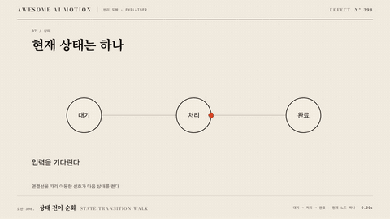

# Nº 398 상태 전이 순회 · State Transition Walk



[MP4](clip.mp4) · [HTML](index.html)

**현재 노드가 켜지고 연결선을 따라 신호나 강조가 다음 노드로 이동한다. 도착한 노드가 새 활성 상태가 된다.**

A signal moves to the next node, which becomes the active state.

| Family | Level | Purpose | Media | Runtime |
|---|---|---|---|---|
| 원리 도해 · EXPLAINER | 중급 | 설명, 순서·흐름 | 설명 영상, 제품 시연, 스크롤덱 | svg |

다른 이름 / Also known as: Step Progress, 단계 진행 선, progress-bar-linear-segmented, State-machine transition pulse, 상태 머신 전이 신호

## 선택 기준 / Selection

단계 순서와 상태가 바뀌는 경로를 보여준다. / Shows order and valid transition paths.

- 주문 접수에서 결제와 배송으로 현재 상태를 한 단계씩 넘긴다. / Explain a sequence of state changes.
- 단계 순서와 상태가 바뀌는 경로를 보여준다. 기준값과 대상을 함께 표시할 때. / Keep the encoded values, labels, and visual state synchronized.

좋은 예 / Good: 주문 접수에서 결제와 배송으로 현재 상태를 한 단계씩 넘긴다.
나쁜 예 / Bad: 모든 상태를 동시에 활성 색으로 표시한다.
주의 / Avoid: 허용되지 않은 전이선은 만들지 않는다.

## 파라미터 / Parameters

| Parameter | Default | Range | Note |
|---|---|---|---|
| 상태 수 | 5 | 3~8 | 현재 상태 한 개 |
| 전이 지속 | 500ms | 300~800ms | 연결선 이동 |
| 도착 강조 | 250ms | 150~400ms | 전이 뒤 시작 |
| 상태 유지 | 700ms | 400~1200ms | 라벨 읽기 시간 |

이징 / Ease: `none`

## 구현 / Implementation (GSAP)

```js
const tl=gsap.timeline({paused:true});
steps.slice(1).forEach((step,i)=>{
 const t=i*1.45;
 tl.fromTo(step.signal,{strokeDashoffset:step.length},{strokeDashoffset:0,duration:0.5,ease:'none'},t);
 tl.to(steps[i].node,{fill:'#64748b',duration:0.25},t+0.5);
 tl.to(step.node,{fill:'#22c55e',duration:0.25},t+0.5);
});
```

## 프롬프트 / Prompts

### 한국어 · Claude Code
```text
<파일>의 <대상>에 상태 전이 순회을 적용해. SVG 연결선의 신호 위치와 노드 색을 상태 전이 시간표에 따라 함께 갱신한다. 상태 수 5; 전이 지속 500ms; 도착 강조 250ms; 상태 유지 700ms을 적용한다. GSAP 코어의 paused 타임라인 하나로 seek 가능하게 만들고 임의 난수와 타이머를 쓰지 마.
```

### 한국어 · Codex
```text
<파일>의 설명 장면에서 <대상>에 상태 전이 순회을 적용해. SVG 연결선의 신호 위치와 노드 색을 상태 전이 시간표에 따라 함께 갱신한다. 상태 수 5; 전이 지속 500ms; 도착 강조 250ms; 상태 유지 700ms을 적용한다. 0초, 3초, 6초를 캡처해 시작 상태, 중간 진행, 최종 상태를 확인하고 같은 시각으로 다시 seek했을 때 좌표와 라벨이 같은지 검증해.
```

### English · Claude Code
```text
Implement State Transition Walk on <target> in <file>. Use 5 states, 500ms transitions, 250ms arrival emphasis, and 700ms state holds. Keep exactly one current node and draw only valid transitions. Use one paused GSAP core timeline, support seeking, and avoid random values and timers.
```

### English · Codex
```text
Implement State Transition Walk on <target> in <file>. Use 5 states, 500ms transitions, 250ms arrival emphasis, and 700ms state holds. Keep exactly one current node and draw only valid transitions. Use one paused GSAP core timeline, support seeking, and avoid random values and timers. Capture at 0s, 3s, and 6s to check the initial state, intermediate motion, and final state. Seek to each time again and verify identical geometry and labels.
```

예시 / Example: 상태 전이 순회를 `.hero`에 적용해. / Apply State Transition Walk to `.hero`.

## 적용 / Application

- HyperFrames: paused 타임라인에 상태 전이 순회 상태를 넣고 seek 시 6초의 좌표와 색을 다시 계산한다.
- ReelForge: 씬 워커 브리프에 상태 수 5; 전이 지속 500ms; 도착 강조 250ms; 상태 유지 700ms을 싣고 주문 접수에서 결제와 배송으로 현재 상태를 한 단계씩 넘긴다.
- Scrolline Deck: 진행률 0~1을 6초 구간에 매핑한다. scrub에서는 스프링 대신 power2.out을 쓰고 역방향에서도 라벨과 도형을 함께 갱신한다.

조합 / Pair with: [노드 연결망 구축 · Node-link Build](../graph-build/) · [경로 신호 빔 · Path Beam](../path-beam/)

출처 / Sources: gongnyang/reelforge (`gongnyang/reelforge:skills/reelforge/references/grammar/06-shapes-strokes.md#progress-bar-linear-segmented`) (Apache-2.0) · local/ig-carousel-hub (`local:ig-carousel-hub/03_templates/motion/slot-spec.md`) (unknown) · gongnyang/reelforge (`gongnyang/reelforge:blocks/numbered/block.html`) (Apache-2.0) · local/bookforge (`claude-skill:bookforge/references/diagrams.md`) (MIT) · [motion-canvas/examples](https://github.com/motion-canvas/examples/blob/master/examples/asset-code/src/scenes/state-machine.tsx) (MIT)

[목록 / Catalog](../../references/catalog.md) · [index.json](../../index.json)
