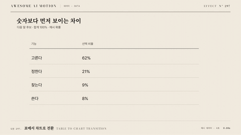

# Nº 297 표에서 차트로 전환 · Table-to-chart Transition



[MP4](clip.mp4) · [HTML](index.html)

**표의 수치가 강조된 뒤 같은 항목의 위치에서 막대나 점이 나오며 차트로 정렬된다.**

Highlighted table values become marks that move into a chart layout.

| Family | Level | Purpose | Media | Runtime |
|---|---|---|---|---|
| 데이터 · DATA | 중급 | 데이터 증명, 비교 | 데이터 스토리, 발표, 웹 UI | svg |

다른 이름 / Also known as: Table values become chart marks, 표의 값에서 차트 마크 생성

## 선택 기준 / Selection

원자료의 행과 시각적 마크가 어떻게 대응하는지 이해한다. / Shows the correspondence between source rows and visual marks.

- 원자료 행이 차트 막대로 바뀌는 과정을 설명할 때 / Use when explaining table-to-chart transition in a presentation or interactive view.
- 전후 항목의 대응을 움직임으로 설명할 때 / Use when viewers need to track corresponding items between states.

좋은 예 / Good: 표에서 막대 장면에서 표의 수치가 강조된 뒤 같은 항목의 위치에서 막대나 점이 나오며 차트로 정렬된다. 0.7s 구간으로 항목 대응을 유지한다.
나쁜 예 / Bad: 행 순서와 차트 순서를 연결 없이 동시에 뒤집는다
주의 / Avoid: 행 순서와 차트 순서를 연결 없이 동시에 뒤집는다 같은 연출을 피한다. · 모션만으로 수치를 읽게 하지 않고 라벨과 정적 요약을 함께 둔다

## 파라미터 / Parameters

| Parameter | Default | Range | Note |
|---|---|---|---|
| 기본 구간 | 0.7s | 0.49~1.05s | 후보의 주요 이동 또는 유지 시간이다 |
| 수치 강조 | 300ms | 200~450ms | 행과 마크의 ID를 대응한다 |
| 마크 생성 | 500ms | 350~700ms | 1920x1080 화면 기준 기본값이다 |
| 이징 | power2.inOut | none 또는 power2.inOut | 시간 재생은 선형, 배치 이동은 완만하게 시작하고 멈춘다 |

## 구현 / Implementation (GSAP)

```js
const tl = gsap.timeline({paused: true});
tl.to(values, {color: '#2563eb', duration: .3}, 0);
tl.fromTo(marks, {opacity: 0}, {opacity: 1, duration: .5}, .3);
rows.forEach(r => tl.to(r.mark, {attr: r.chartAttrs, duration: .7, ease: 'power2.inOut'}, .8));
```

## 프롬프트 / Prompts

### 한국어 · Claude Code
```text
<대상>에 표에서 차트로 전환 효과를 적용해. 행 ID별 HTML 위치를 SVG 시작 좌표로 사용하고 목표 차트 좌표와 크기를 보간한다. 기본 구간은 0.7초, 수치 강조은 300ms, 마크 생성은 500ms, 이징은 power2.inOut로 설정하고 값 축과 색 범위를 고정한다. GSAP 코어의 paused 타임라인 하나로 구성하고 seek 시 같은 결과를 그려줘.
```

### 한국어 · Codex
```text
<파일>의 표에서 차트로 전환 장면에 적용해. 행 ID별 HTML 위치를 SVG 시작 좌표로 사용하고 목표 차트 좌표와 크기를 보간한다. 0.7초 구간과 power2.inOut, 수치 강조 300ms, 마크 생성 500ms를 적용하고 초기 상태를 명시해. 0초, 0.35초, 0.7초를 캡처해 항목 대응과 중간 상태를 확인하고 역방향 seek 후 같은 시점의 결과가 일치하는지 검증해.
```

### English · Claude Code
```text
Apply Table-to-chart Transition to <target>. Highlighted table values become marks that move into a chart layout. Use a 0.7-second primary interval with power2.inOut easing, and preserve item IDs and reference coordinates. Set the value emphasis to 300ms and the mark creation to 500ms. Use one paused GSAP core timeline with deterministic seeking.
```

### English · Codex
```text
Implement Table-to-chart Transition in the relevant scene in <file>. Highlighted table values become marks that move into a chart layout. Use a 0.7-second primary interval with power2.inOut easing and explicit initial states. Set the value emphasis to 300ms and the mark creation to 500ms. Capture at 0, 0.35, and 0.7 seconds to verify item correspondence and intermediate states, then seek backward and confirm identical output at the same time.
```

예시 / Example: 표에서 차트로 전환를 `.hero`에 적용해. / Apply Table-to-chart Transition to `.hero`.

## 적용 / Application

- HyperFrames: paused 타임라인을 장면 시간으로 seek한다. 좌표와 표본을 미리 계산하고 onUpdate에서 전체 상태를 다시 그린다.
- ReelForge: 씬 워커 브리프에 0.7초 구간, 수치 강조 300ms, 마크 생성 500ms와 항목 ID 대응표를 싣는다.
- Scrolline Deck: 진행률 0~1을 타임라인의 전체 길이에 매핑한다. scrub에서는 스프링 대신 ease-out을 쓰고 좌표 기준을 고정한다.

조합 / Pair with: [객체 유지 갱신 · Object-constant Update](../object-constant-update/) · [주석 등장 · Annotation Callout](../annotation-callout/) · [차트 스크럽 · Chart Scrub](../chart-scrub/)

출처 / Sources: [Heer & Robertson 2007](https://sites.stat.columbia.edu/gelman/communication/HeerRobertson2007.pdf) (unknown) · [uwdata/gemini](https://github.com/uwdata/gemini) (BSD-3-Clause)

[목록 / Catalog](../../references/catalog.md) · [index.json](../../index.json)
