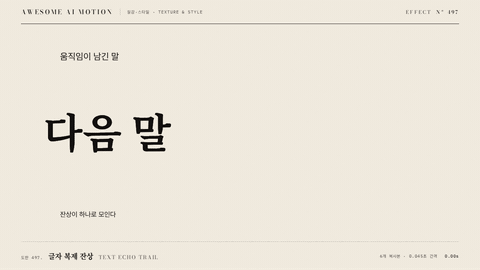

# Nº 497 글자 복제 잔상 · Text Echo Trail



[MP4](clip.mp4) · [HTML](index.html)

**움직이는 문구 뒤로 여러 복사본이 시간차로 따라오며 사라지는 잔상**

Delayed text copies trail behind a moving phrase and fade out.

| Family | Level | Purpose | Media | Runtime |
|---|---|---|---|---|
| 질감·스타일 · TEXTURE & STYLE | 중급 | 주목 끌기, 강조 | 숏폼, 설명 영상 | gsap |

다른 이름 / Also known as: Text Clone Motion Trail, 텍스트 복제 잔상, Framebuffer Text Feedback, 프레임버퍼 텍스트 피드백

## 선택 기준 / Selection

속도와 궤적이 눈에 보인다. 빠르게 움직인다는 사실이 글자로 전달된다 / Speed and trajectory become visible, so the phrase reads as fast.

- 빠르게 슬라이드해 들어오는 제목에 속도감을 더할 때 / Adding speed to a title that slides in quickly
- 전환 순간에 문구가 화면을 가로지를 때 / A phrase crossing the frame at a transition

좋은 예 / Good: 제목이 900px를 0.9초에 지나가는 동안 복사본 6개가 0.045초 간격으로 따라오며 opacity가 0.5에서 0으로 줄어든다
나쁜 예 / Bad: 복사본을 20개 이상 쌓아 문구가 번져 읽히지 않고 잔상이 정지 후에도 남는다
주의 / Avoid: 이동이 끝나면 잔상을 제거한다. 남은 잔상은 중복 글자처럼 보인다 · 복사본은 6개 이하. 글자 색을 낮은 opacity로만 쓰고 색 변화는 주지 않는다

## 파라미터 / Parameters

| Parameter | Default | Range | Note |
|---|---|---|---|
| 복사본 수 | 6 | 4~8 | 본체 제외 |
| 간격 | 0.045s | 0.03~0.06s | 뒤로 갈수록 늦게 출발 |
| 시작 opacity | 0.5 | 0.3~0.6 | 뒤로 갈수록 감소 |
| 이동 시간 | 0.9s | 0.6~1.2s | power3.out |

이징 / Ease: `power3.out`

## 구현 / Implementation (GSAP)

```js
for (let k = 0; k <= 6; k++) {
  const layer = k === 0 ? main : main.cloneNode(true);
  if (k) { layer.style.opacity = 0.5 * (1 - k / 7); stage.appendChild(layer); }
  tl.fromTo(layer, {x:-900}, {x:0, duration:0.9, ease:'power3.out'}, 0.2 + k * 0.045);
  if (k) tl.set(layer, {opacity:0}, 1.3);
}
```

## 프롬프트 / Prompts

### 한국어 · Claude Code
```text
<대상> 제목이 왼쪽 900px에서 0.9초 power3.out으로 들어올 때 뒤로 복사본 6개가 0.045초씩 늦게 따라오게 해줘. 복사본 opacity는 0.5에서 뒤로 갈수록 줄이고, 1.3초에 모두 제거해 최종에는 제목 하나만 남게 해.
```

### 한국어 · Codex
```text
<파일>에 text echo trail을 적용해. 본체와 복제 6개에 x -900에서 0을 0.9초 power3.out, 시작 지연 k*0.045, 복제 opacity 0.5*(1-k/7). 1.3초에 복제 opacity 0. 0.5초·1.0초·1.6초를 캡처해 잔상 번짐, 잔상 수렴, 잔상 제거 상태를 확인해.
```

### English · Claude Code
```text
As the title in <target> slides in from 900px left over 0.9s power3.out, add 6 trailing copies each starting 0.045s later, at opacity 0.5 decaying with index. Remove all copies at 1.3s so only one title remains.
```

### English · Codex
```text
Apply text echo trail in <file>. Main plus 6 clones with x -900 to 0 over 0.9s power3.out, start delay k*0.045, clone opacity 0.5*(1-k/7); set clone opacity 0 at 1.3s. Capture at 0.5s, 1.0s and 1.6s and verify the trail smear, its convergence, and its removal.
```

예시 / Example: 글자 복제 잔상를 `.hero`에 적용해. / Apply Text Echo Trail to `.hero`.

## 적용 / Application

- HyperFrames: 복사본의 위치 tween을 같은 함수로 만들어 지연만 바꾼다. 잔상 제거는 set으로 타임라인에 박아 seek 뒤에도 정확히 사라진다
- ReelForge: 브리프에 복사본 수 6, 간격 0.045초, 시작 opacity 0.5, 이동 900px/0.9초를 싣는다
- Scrolline Deck: 진행률에서 본체의 위치를 정하고 복사본은 진행률 지연으로 계산한다. 스크롤을 멈추면 모든 복사본이 본체 위에 겹쳐 사라지게 한다

조합 / Pair with: [모션 블러 · Motion Blur](../motion-blur/) · [대형 키네틱 타이포 스윕 · Kinetic Type Sweep](../kinetic-type-sweep/) · [글자별 스태거 · Per-character Rise](../char-stagger/)

출처 / Sources: [codrops/TextTrailEffect](https://github.com/codrops/TextTrailEffect) (unknown) · [gnikoloff/text-trail-effect](https://github.com/gnikoloff/text-trail-effect) (MIT)

[목록 / Catalog](../../references/catalog.md) · [index.json](../../index.json)
